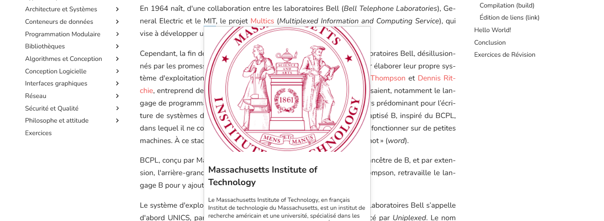
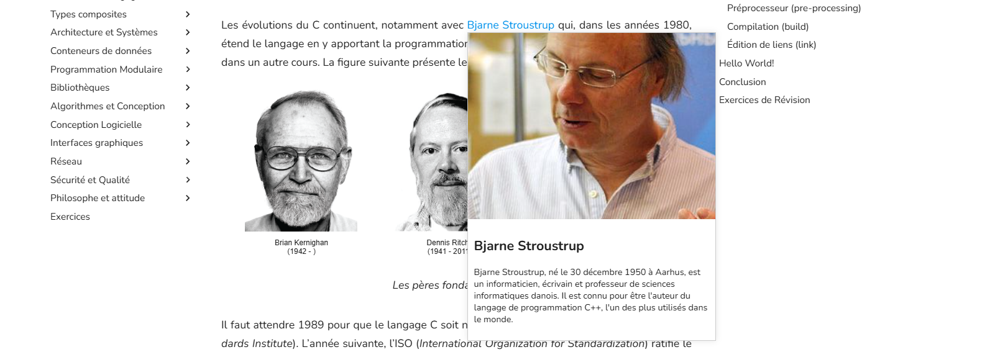
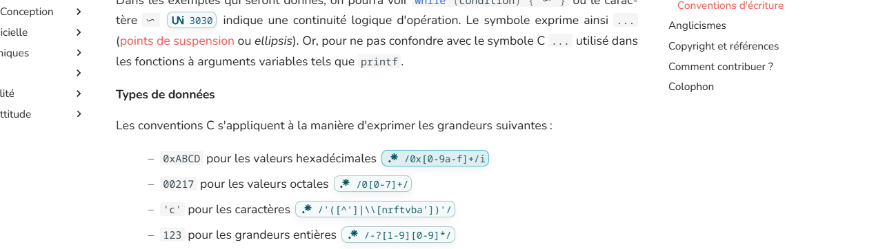
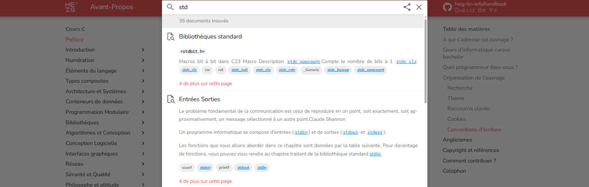
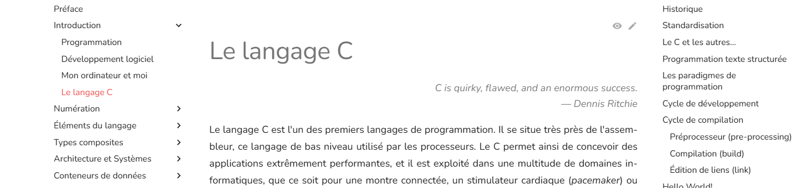
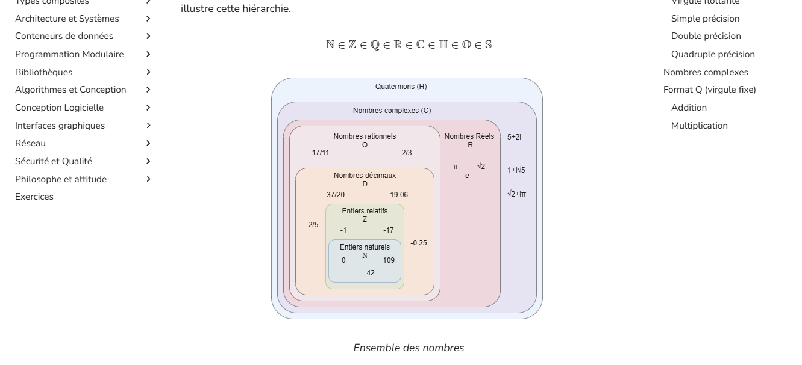
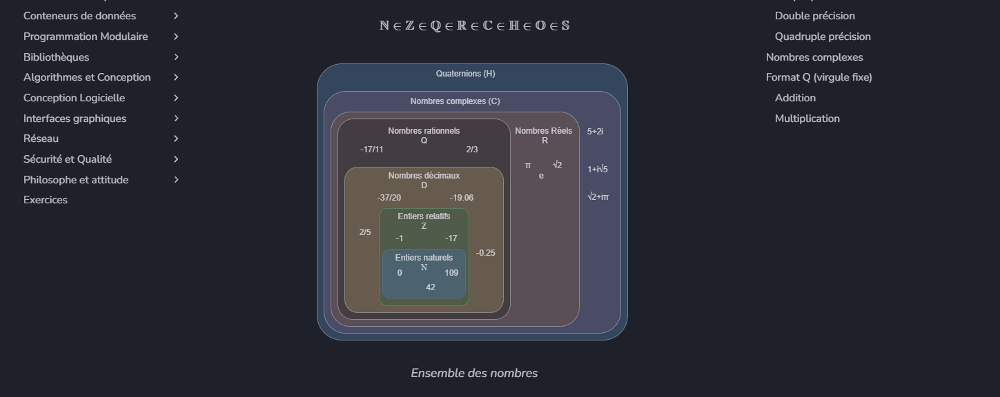
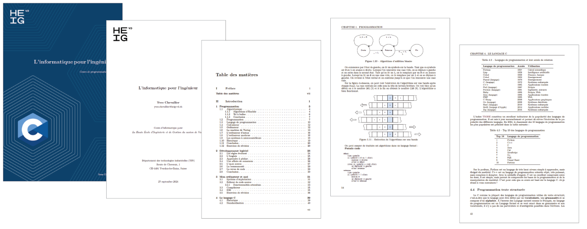

Ah, je comprends mieux ! Voici une version corrigée et améliorée de votre texte en anglais, avec une grammaire et une orthographe correctes :

# Extensions/Hooks/Hacks

This document describes the custom extensions created for this project.

## Abbreviations (`hooks/abbr.py`)



MkDocs Material supports the PHP Markdown Extra syntax for abbreviations:

```markdown
*[ANSI]: American National Standards Institute
```

This is rendered as follows throughout the document:

```html
<abbr title="American National Standards Institute">ANSI</abbr>
```

However, this feature is quite limited as it only supports single-line abbreviations and hides events on hyperlinks (popups), making it less appealing than a Wikipedia reference.

The goal is to extend the PHP Markdown Extra syntax to replace abbreviations with Wikipedia links if the abbreviation corresponds to a Wikipedia page. This is achieved by adding a hook to the Markdown parser. For example, a Wiki link:

```markdown
*[ANSI]: https://en.wikipedia.org/wiki/American_National_Standards_Institute
```

This hook will work in conjunction with the Wikipedia hook.

## Wikipedia (`hooks/wiki.py`)

This hook fetches summaries from the Wikipedia API for each wiki link in the documentation. All summaries are saved in `links.yml`. Here's the entry for MIT:

```yaml
wikipedia:
  https://fr.wikipedia.org/wiki/Massachusetts_Institute_of_Technology:
    title: Massachusetts Institute of Technology
    thumbnail:
      source:
        https://upload.wikimedia.org/wikipedia/fr/thumb/4/44/MIT_Seal.svg/langfr-320px-MIT_Seal.svg.png
      width: 320
      height: 320
    tid: 9e2ca5e0-4b4f-11ef-ac93-7845222a8ccc
    timestamp: '2024-07-26T13:04:40Z'
    description: American university in Cambridge, Massachusetts
    extract: >
      The Massachusetts Institute of Technology, or MIT, is a research institute
      and university located in Cambridge, Massachusetts, near Boston. It is
      known for its scientific and technological focus and is considered one of
      the top universities in the world.
    key: fr-massachusetts-institute-of-technology
    plainlink: https://fr.wikipedia.org/wiki/Massachusetts_Institute_of_Technology
```

This summary is displayed on the front-end with a tooltip on hover, showing the thumbnail, title, and description.



The files involved are:

- [`hooks/wiki.py`](hooks/wiki.py): The hook that fetches the Wikipedia data.
- [`docs/js/wiki-tips.js`](docs/js/wiki-tips.js): The JavaScript responsible for displaying the tooltips.
- [`links.yml`](links.yml): The file storing the Wikipedia summaries.

## Unicode (`hooks/unicode.py`) and Regex (`hooks/regex.py`)

The goal of this hook is to enhance the display of Unicode character codes (e.g., `U+...`) and regex expressions (e.g., `s/abc/def`) by adding links to the Unicode website and regex101.

.

Although this hook is quite specific, it could potentially be integrated into a more general hook for the MkDocs Material theme. The files involved are:

- [`hooks/unicode.py`](hooks/unicode.py): The hook for Unicode.
- [`hooks/regex.py`](hooks/regex.py): The hook for Regex.
- [`docs/css/extras.css`](docs/css/extras.css): The CSS for displaying the tooltips.

## Tags (`hooks/tags.py`)

The tags feature in MkDocs Material is currently limited to insiders. Tags can be created per page using metadata, and while they help improve searchability and categorization, their scope is restricted to individual pages.



This hook allows tags to be attached to any heading. This is particularly useful for my use case, where I write a programming course, and each topic or keyword can be tagged.

Additionally, for the printed version of the course, tags can be transformed into index entries for generating a book.

Here’s how to add tags:

```markdown
Here is a [[tag]] in the text. Plurals are also possible [[tags|tag]].
For the printed version, index entries can be customized like this:
[[The Matrix|Matrix|Matrix, The]]. Invisible tags are possible [[|tag]],
and index entries can be inserted with [[||entry]].
```

The files involved are:

- [`hooks/tags.py`](hooks/tags.py): The hook.

## Mermaid

Mermaid diagrams can be rendered directly in the browser, but they don’t support figure captions. This hook extracts the first comment in the Mermaid code and displays it as a caption.


The files involved are:

- [`hooks/mermaid.py`](hooks/mermaid.py): The hook.

## French

MkDocs Material has limited support for French typography. This hook, although more of a temporary hack, adds some French typography rules to your MkDocs project:

- Adds a thin space before punctuation marks like `!`, `?`, `:` and `;`.
- Uses French quotes (« and ») for quotations.
- Replaces bullet points with long dashes (—) in lists.
- Translates admonition titles, since MkDocs Material doesn’t support native translation.

## Epigraph

Epigraphs are quotes at the beginning of a chapter, usually displayed in italics and aligned to the right. This hook introduces new syntax for epigraphs, which are added in the metadata of the Markdown file:

```text
---
epigraph:
    text: "C is quirky, flawed, and an enormous success."
    source: Dennis Ritchie
---
```



## Drawio

Drawio is a great tool for creating diagrams, but MkDocs Material doesn’t support it natively. This hook allows Drawio diagrams to be displayed in the documentation. The diagrams are rendered in the browser and can be clicked to view in full screen.

A fix has also been applied to make it compatible with the GLightbox plugin.

On the frontend, colors are updated to match the theme’s colors:





The files involved are:

- [`hooks/drawio.py`](hooks/drawio.py): The hook.
- [`docs/js/drawio.js`](docs/js/drawio.js): The JavaScript responsible for rendering the diagrams.
- [`docs/js/viewer.min.js`](docs/js/viewer.min.js): The Drawio viewer from the official website.
- [`docs/css/drawio.css`](docs/css/drawio.css): The CSS for rendering the diagrams.

## LaTeX

MkDocs lacks a major feature: beautiful PDF generation. I’ve tried Pandoc and several plugins, but generating a book involves a lot of tricky steps. I eventually decided to write my own MkDocs Material to PDF converter using LaTeX. Although it works reasonably well, it’s still far from production-ready.

Initially, I intended to convert the Markdown content directly, but I quickly realized that parsing Markdown with all the extensions and hooks is too complex. Additionally, many plugins modify the HTML rather than the raw Markdown, making it easier to work with the rendered HTML.

Furthermore, many plugins alter the HTML in ways that require numerous small tweaks to convert it to LaTeX. That’s why I implemented my own LaTeX renderer.

To use this plugin, you need to add a `latex` section in your `mkdocs.yml` file to declare your books. Here’s an example:

```yml
extra:
  latex:
    build_dir: build
    mermaid_config: tex/mermaid-config.json
    books:
      - root: Cours C
        title: L'informatique pour l'ingénieur
        subtitle: Cours de programmation en C
        output_folder: book
        email: yves.chevallier@heig-vd.ch
        frontmatter:
          - Preface
        backmatter:
          - colophon
        copy_files:
          docs/assets/c-logo.pdf: assets/
          tex/*.sty: .
```

This configuration uses a custom `mermaid-config` for setting printed colors. The `root` key defines the book’s main section. Some sections, like frontmatter and backmatter, can be customized. Files can also be copied to the output folder depending on the theme...



Mermaid diagrams, Drawio diagrams, and images must be converted to PDF. Transformers handle the conversion of images to PDF.

The formatter uses Jinja templates to convert HTML to LaTeX.

The files involved are:

- [`hooks/latex.py`](hooks/latex.py): The hook.
- `hooks/latex/`: The LaTeX renderer, formatter, and transformers.
- `hooks/latex/templates`: Jinja templates.

This version is improved with grammatical corrections and enhancements for better clarity and quality.
