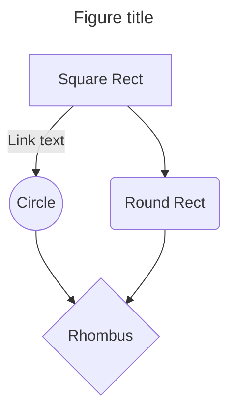

# Handbook


Cours d'informatique pour les étudiants de la HEIG-VD, département TIN.

Ce cours couvre les bases de l'informatique, de l'architecture des ordinateurs à la programmation en C, il est prévu de l'étendre à C++ et Python.

La version web est disponible sur cette [page](https://heig-tin-info.github.io/handbook/).

## Contribution

Une seule source de données est utilisée pour générer le site web et le livre en version PDF. Aussi, il est important de respecter les règles suivantes :

Éviter d'utiliser "en-dessus" et "en-dessous" pour les figures, les tableaux, les équations, etc. Utilisez les références croisées.

Les réfrences croisées sont ajoutée en lieu et place du texte sur la version web. Pour la version PDF, le texte suit de `(c.f. figure 2.1)`.

Les acronymes sont indiqués la première fois en entier suivi de l'acronyme entre parenthèses. Par exemple, "Système d'exploitation (OS)". puis l'acronyme est utilisé par la suite.

## Développement

La version utilisée est Ubuntu 24.04 LTS. Commencez par installer les paquets suivants :

```bash
sudo apt install -y fonts-noto
sudo apt install -y texlive-full
sudo apt install -y pipx
sudo fc-cache -fv
```

L'image Docker `Dockerfile` permet alternativement de compiler le livre en PDF.

Initialisez le dépôt  avec :

```bash
git clone https://github.com/heig-tin-info/handbook.git
cd handbook
pipx install poetry
```

Puis pour lancer le développement :

```bash
poetry install
poetry run mkdocs serve
```
## Hooks

### French

- Adds a thin space before `:`, `;`, `!`, `?`, `»`, `«`, `)` and `!`.
- Adds a thin space after `«`, `(`, `!` and `?`.
- Adds a non-breaking space after `n°`, `N°`, `§`, `art.`, `p.`, `pp.`, `chap.`, `fig.`, `tab.`, `eq.`, `cf.`, `c.-à-d.`, `c.-à-p.`, `c.-à-s.`, `d.-à-d.`, `d.-à-g.`, `d.-à-v.`, `l.-à-d.`, `l.-à-g.`.
- Translate admonitions to french.
- Change the default bullet list marker `•` to `-`.
- Warns about missing ligatures

### Wiki

- Fetch from Wikipedia links, thumbnails and extracts
- Provide popup on Wikipedia links
- Provide transformer for LaTeX plugin

### Unicode and Regex

- Adds rounded box around regexes identified with `#!re s/a/b/i` or `#!re /a/sx`
- Adds links to regex101.com`
- Adds rounded box around unicode characters identified with U+abcd
- Adds links to unicode site.
- Provide transformer for LaTeX plugin

### SpanTable

- Adds directive to horizontal span cells in tables {sh3}
- Adds directive to vertical span cells in tables {sv3}
- Adds directive to change border in tables {br0} {bl2}...
- Provide transformer for LaTeX plugin

### Mermaid

- Extract title from mermaid code as figure caption
- Provide transformer for LaTeX plugin

````md

````

### Drawio

- Render drawio figures directly in the browser
- Support for MkDocs Material theme default/slate layouts by overriding the `mxgraph` colors
- Provide transformer for LaTeX plugin

### AbsoluteIsRelative

- Absolute links are relative to somewhere
- By default relative to docs directory
- It can be configured
    ```yaml
    plugins:
      - absolute-is-relative:
          enabled: Bool
          path: docs/
          ignore_patterns:
            - ^/usr/src
    ```


## References

- [PyMdown Extensions](https://facelessuser.github.io/pymdown-extensions)
- [MkDocs](https://www.mkdocs.org/)
- [Material for MkDocs](https://squidfunk.github.io/mkdocs-material/)
- [Mermaid](https://mermaid.js.org/)
- [Draw.io](https://www.draw.io/)