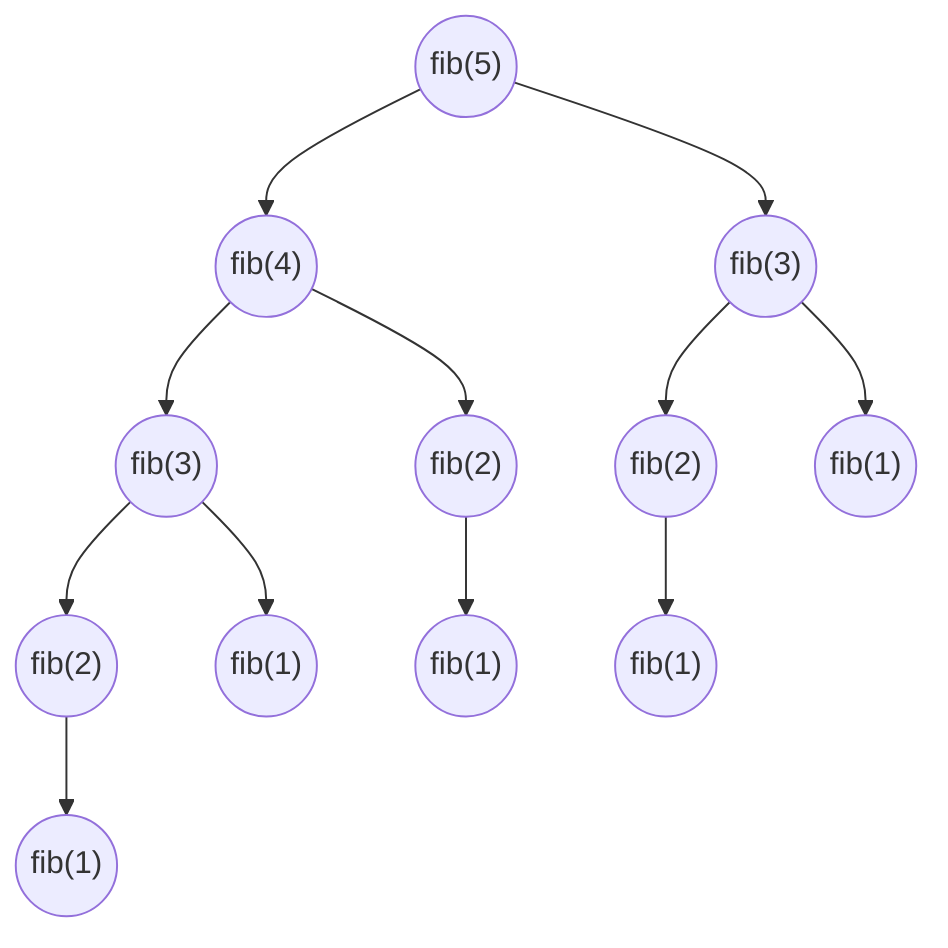

# Récursivité

La [récursivité](https://fr.wikipedia.org/wiki/R%C3%A9cursivit%C3%A9) est une technique de programmation dans laquelle une fonction s'appelle elle-même pour résoudre un problème. Cela signifie que la fonction résout une partie du problème et appelle ensuite la fonction elle-même pour résoudre le reste du problème.

La récursivité est utilisée pour résoudre des problèmes qui peuvent être décomposés en problèmes plus petits de la même nature. Par exemple, la factorielle d'un nombre est le produit de tous les entiers positifs inférieurs ou égaux à ce nombre. La factorielle d'un nombre `n` est `n! = n * (n-1)!`.

Au chapitre sur les fonctions, nous avions donné l'[exemple du calcul de la somme de la suite de Fibonacci](#fib-iterative) jusqu'à `n` :

```c
int fib(int n)
{
    int sum = 0;
    int t1 = 0, t2 = 1;
    int next_term;
    for (int i = 1; i <= n; i++)
    {
        sum += t1;
        next_term = t1 + t2;
        t1 = t2;
        t2 = next_term;
    }
    return sum;
}
```

Il peut sembler plus logique de raisonner de façon récursive. Quelle que soit l'itération à laquelle l'on soit, l'assertion suivante est valable :

$$fib(n) == fib(n - 1) + fib(n - 2)$$

Donc pourquoi ne pas réécrire cette fonction en employant ce caractère récursif ?

```c
int fib(int n)
{
    if (n < 2) return 1;
    return fib(n - 1) + fib(n - 2);
}
```

Le code est beaucoup plus simple à écrire, et même à lire. Néanmoins cet algorithme est notoirement connu pour être très mauvais en termes de performance. Calculer `fib(5)` revient à la chaîne d'appel suivant.

Cette chaîne d'appel représente le nombre de fois que `fib` est appelé et à quel niveau elle est appelée. Par exemple `fib(4)` est appelé dans `fib(5)` :



Au final, `fib(1)` est appelé 5 fois, `fib(2)` 3 fois, `fib(3)` 2 fois, `fib(4)` et `fib(5)` 1 fois. Ce sont donc 12 appels à la fonction `fib` pour calculer `fib(5)`.

| Calcul | Appels |
|--------|--------|
| fib(1) | 1      |
| fib(2) | 2      |
| fib(3) | 4      |
| fib(4) | 7      |
| fib(5) | 12     |
| fib(6) | 20     |
| fib(7) | 33     |
| fib(8) | 54     |
| fib(9) | 88     |
| fib(10)| 143    |
| ...    | ...    |
| fib(30)| 2'178'308 |
| fib(40)| 267'914'295 |
| fib(50)| 32'951'280'098 |
| fib(100)| 927'372'692'193'078'999'175 |

Il s'agit de la suite [A000071](https://oeis.org/A000071) de l'OEIS. On constate que le nombre d'appels est exponentiel. Pour `fib(100)` il faudra neuf cent vingt-sept quintillions trois cent soixante-douze quadrillions six cent quatre-vingt-douze trillions cent quatre-vingt-treize milliards soixante-dix-huit millions neuf cent quatre-vingt-dix-neuf mille cent soixante-quinze appels à la fonction `fib`. Pour un processeur capable de calculer 100 GFLOPS (milliards d'opérations par seconde), il faudra tout de même 294 ans. C'est un peu long...

La complexité algorithmique de cette fonction est dite $O(2^n)$. C'est-à-dire que le nombre d'appels suit une relation exponentielle. La réelle complexité est donnée par la relation :

En revanche, dans l'approche itérative, on constate qu'une seule boucle `for`. C'est-à-dire qu'il faudra seulement 100 itérations pour calculer la somme.

Généralement les algorithmes récursifs (s'appelant eux-mêmes) sont moins performants que les algorithmes itératifs (utilisant des boucles). Néanmoins il est parfois plus facile d'écrire un algorithme récursif.

Notons que tout algorithme récursif peut être écrit en un algorithme itératif, mais ce n'est pas toujours facile.

## Les tours de Hanoï

Les [tours de Hanoï](https://fr.wikipedia.org/wiki/Tours_de_Hano%C3%AF) est un jeu de réflexion inventé par le mathématicien français Édouard Lucas en 1889 et publié dans le tome 3 de ses Récréations mathématiques. Le jeu est composé de trois tiges et d'un certain nombre de disques de diamètres différents qui peuvent être empilés sur une tige. Le but du jeu est de déplacer tous les disques d'une tige à une autre, en respectant les règles suivantes :

1. On ne peut déplacer qu'un seul disque à la fois.
2. Un disque ne peut être placé que sur un disque plus grand que lui ou sur une tige vide.


Ce problème se prête très bien à une résolution récursive. En effet, pour déplacer `n` disques de la tige `A` à la tige `C`, il suffit de déplacer `n-1` disques de la tige `A` à la tige `B`, puis de déplacer le disque restant de la tige `A` à la tige `C`, et enfin de déplacer les `n-1` disques de la tige `B` à la tige `C`.

=== "Algorithme Récursif"

    ```c
    --8<-- "../../src/hanoi.c"
    ```

=== "Algorithme Itératif"

    ```c
    --8<-- "../../src/hanoi-iterative.c"
    ```

Ce qui donne le résultat suivant :

```text
Déplacer le disque 1 de A à C
Déplacer le disque 2 de A à B
Déplacer le disque 1 de C à B
Déplacer le disque 3 de A à C
Déplacer le disque 1 de B à A
Déplacer le disque 2 de B à C
Déplacer le disque 1 de A à C
```

On voit que l'implémentation itérative est bien plus complexe que l'implémentation récursive. C'est pourquoi il est souvent plus simple d'écrire un algorithme récursif, mais pas nécessairement plus performant.

## Utilisation du stack

En C, la récursivité est gérée par le stack. Chaque appel de fonction est empilé sur le stack. Lorsque la fonction retourne, elle est dépilée du stack. Il est important de noter que le stack a une taille limitée. Par défaut, sous Linux la taille du stack est de 8 Mio (donné par la commande `ulimit -s`), sous Windows c'est 1 Mio. Si la récursivité est trop profonde, il y a un risque de stack overflow.

D'autre part, une fonction récursive qui utilise beaucoup de variables locales et beaucoup de paramètres seront tous empilés sur le stack. Cela peut rapidement saturer la mémoire.

Prenons l'exemple suivant d'une fonction récursive qui déclare un tableau de 1Mio de caractères :

```c
--8<-- "../../assets/src/stack-overflow.c"
```

À l'exécution, on obtient :

```text
used stack: 0 kiB
used stack: 1024 kiB
used stack: 2048 kiB
used stack: 3072 kiB
used stack: 4096 kiB
used stack: 5120 kiB
used stack: 6144 kiB
Segmentation fault (stack overflow)
```

!!! attention "Attention"
    Avant d'implémenter une fonction récursive, il est important de vérifier que la profondeur de la récursivité ne dépasse pas la taille du stack.

    Limitez l'utilisation du stack en utilisant soit des variables globales, soit des variables statiques, soit des allocations dynamiques.

## Mémoïsation

En informatique la [mémoïsation](https://fr.wikipedia.org/wiki/M%C3%A9mo%C3%AFsation) est une technique d'optimisation du code souvent utilisée conjointement avec des algorithmes récursifs. Cette technique est largement utilisée en [programmation dynamique](https://fr.wikipedia.org/wiki/Programmation_dynamique).

Nous l'avons vu précédemment, l'algorithme récursif du calcul de la somme de la suite de Fibonacci n'est pas efficace du fait que les mêmes appels sont répétés un nombre inutile de fois. La parade est de mémoriser pour chaque appel de `fib`, la sortie correspondante à l'entrée.

Dans cet exemple nous utiliserons un mécanisme composé de trois fonctions :

- `int memoize(Cache *cache, int input, int output)`
- `bool memoize_has(Cache *cache, int input)`
- `int memoize_get(Cache *cache, int input)`

La première fonction mémorise la valeur de sortie `output` liée à la valeur d'entrée `input`. Pour des raisons de simplicité d'utilisation, la fonction retourne la valeur de sortie `output`.

La seconde fonction `memoize_has` vérifie si une valeur de correspondance existe pour l'entrée `input`. Elle retourne `true` en cas de correspondance et `false` sinon.

La troisième fonction `memoize_get` retourne la valeur de sortie correspondante à la valeur d'entrée `input`.

Notre fonction récursive sera ainsi modifiée comme suit :

```c
int fib(int n)
{
    if (memoize_has(n)) return memoize_get(n);
    if (n < 2) return 1;
    return memoize(n, fib(n - 1) + fib(n - 2));
}
```

Quant aux trois fonctions utilitaires, voici une proposition d'implémentation. Notons que cette implémentation est très élémentaire et n'est valable que pour des entrées inférieures à 1000. Il sera possible ultérieurement de perfectionner ces fonctions, mais nous aurons pour cela besoin de concepts qui n'ont pas encore été abordés, tels que les structures de données complexes.

```c
#define SIZE 1000

bool cache_input[SIZE] = { false };
int cache_output[SIZE];

int memoize(int input, int output) {
    cache_input[input % SIZE] = true;
    cache_output[input % SIZE] = output;
    return output;
}

bool memoize_has(int input) {
    return cache_input[input % SIZE];
}

int memoize_get(int input) {
    return cache_output[input % SIZE];
}
```

!!! exercise "La plus petite différence"

    Soit deux tableaux d'entiers, trouver la paire de valeurs (une dans chaque tableau) ayant la plus petite différence (positive).

    Exemple :

    ```c
    int a[] = {5, 3, 14, 11, 2};
    int b[] = {24, 128, 236, 20, 8};

    int diff = 3 // pair 11, 8
    ```

    1. Proposer une implémentation
    2. Quelle est la complexité de votre algorithme ?

## Programmation dynamique

La programmation dynamique est une méthode algorithmique datant des années 1950, mais devenue populaire ces dernières années. Elle permet de coupler des algorithmes récursifs avec le concept de mémoïsation.

Prenons par exemple l'algorithme de Fibonacci récursif :

```c
int fibonacci(int n) {
    if (n <= 1) return n;
    return fibonacci(n - 1) + fibonacci(n - 2);
}
```

Le problème de cet algorithme est sa performance. Appeler `fibonacci(50)` demandera de calculer `fibonacci(49)` et `fibonacci(48)` mais pour calculer `fibonacci(49)` il faudra recalculer `fibonacci(48)`. On voit qu'on effectue du travail à double. En réalité c'est bien pire que ça. La complexité est de $O(2^n)$. Donc pour calculer la valeur `50` il faudra effectuer $1 125 899 906 842 624$ opérations. Avec un ordinateur capable de calculer 1 milliard d'opérations par seconde, il faudra tout de même plus d'un million de secondes. Cet algorithme est donc très mauvais !

En revanche, si l'on est capable de mémoriser dans une table les résultats précédents des appels de Fibonacci, les performances seront bien meilleures.

Voici l'algorithme modifié :

```c
int fibonacci(int n) {
    static int memo[1000] = {0};
    if (memo[n]) return memo[n];
    if (n <= 1) return n;
    return memo[n] = fibonacci(n - 1) + fibonacci(n - 2);
}
```

Sa complexité est ainsi réduite à $O(2\cdot n)$ et donc $O(n)$. En revanche, l'approche dynamique demande un espace mémoire supplémentaire. On n'a rien sans rien et l'éternel dilemme mémoire versus performance s'applique toujours.
