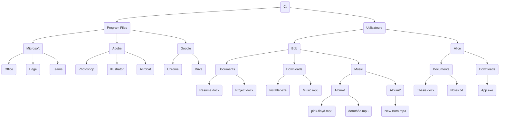
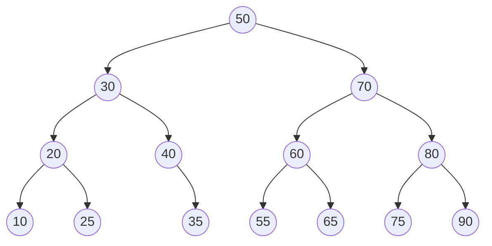
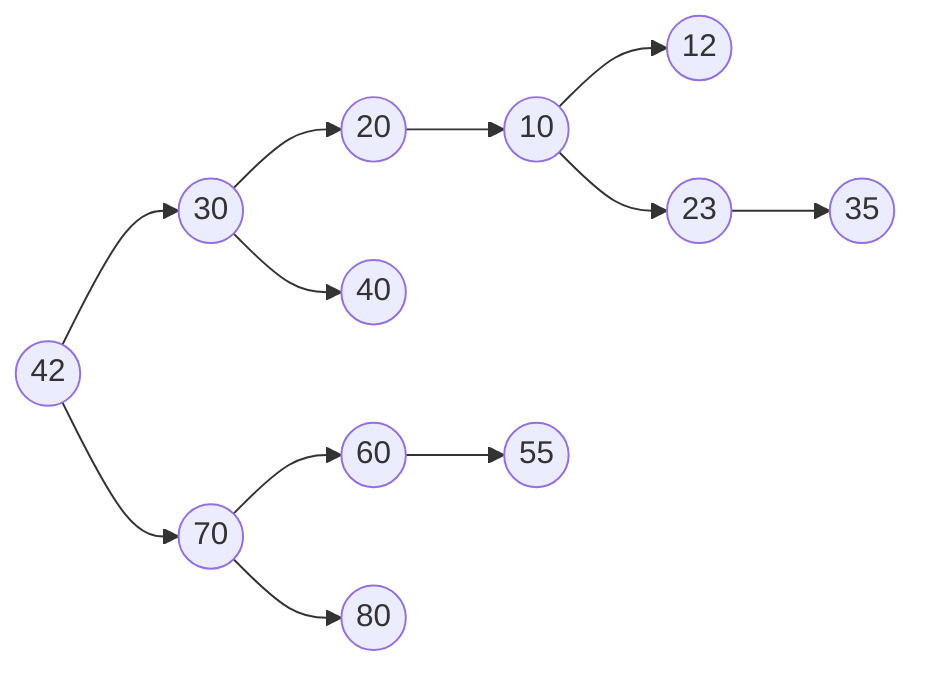
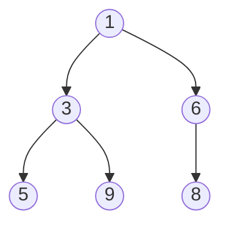
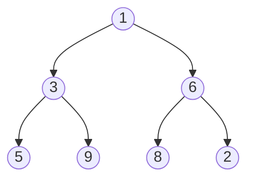
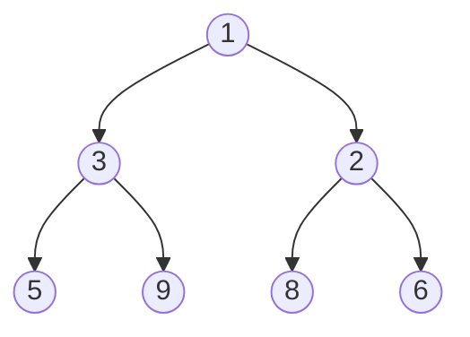

# Arbres


Les arbres sont des structures de données non linéaires qui sont composées de nœuds. Chaque nœud a un ou plusieurs enfants, sauf pour le nœud racine qui n'a pas de parent. Les arbres sont souvent utilisés pour représenter des hiérarchies, comme les systèmes de fichiers, les arbres généalogiques, les arbres de décision, etc.

Voici un exemple d'arbre, il représente par exemple une structure de documents stockés sur un ordinateur. En haut on voit le disque C: qui contient des dossiers et des fichiers. Chaque dossier peut contenir d'autres dossiers ou des fichiers. Il y a donc une hiérarchie entre les éléments. Chaque dossier peut contenir plusieurs éléments, mais chaque élément ne peut être contenu que dans un seul dossier.

On appelle ce type d'arbre un **arbre n-aire dirigé**. C'est-à-dire que chaque nœud peut avoir plusieurs enfants. L'arbre est dirigé car il y a un sens de la racine vers les feuilles. Il y a donc des flèches qui indiquent le sens de la hiérarchie.



## Arbre binaire

Un arbre binaire est un arbre où chaque nœud a au plus deux enfants. Les enfants sont généralement appelés le fils gauche et le fils droit. Les arbres binaires sont souvent utilisés pour implémenter des structures de données comme les arbres de recherche binaires, les tas binaires, les arbres d'expression, etc.

C'est une structure de donnée très utilisée en informatique. En pratique, il est rare d'implémenter un arbre binaire de manière explicite. On utilise plutôt des structures de données qui sont basées sur des arbres binaires.

Le C étant un langage très bas niveau, il n'y a pas de structure de données arbre binaire dans la bibliothèque standard. En C++ en revanche il y a de nombreux conteneurs qui utilisent des arbres binaires comme `std::set`, `std::map`, `std::multiset`, `std::multimap`, `std::priority_queue`, etc.

Voici l'exemple d'un arbre binaire. Chaque nœud est composé de deux enfants sauf pour les feuilles qui n'ont pas d'enfants. Le nœud `40` n'a lui que 1 enfant : l'enfant de droite.



Un arbre peut être **équilibré** ou **déséquilibré**. Un arbre est équilibré si la hauteur de ses sous-arbres gauche et droit diffère d'au plus un. Un arbre équilibré est souvent plus efficace pour les opérations de recherche, d'insertion et de suppression.

Voici l'exemple d'un arbre déséquilibré :



### Heap

La structure de donnée `heap` aussi nommée tas ne doit pas être confondue avec le tas utilisé en allocation dynamique. Il s'agit d'une forme particulière de l'arbre binaire dit "presque complet", dans lequel la différence de niveau entre les feuilles n'excède pas 1. C'est-à-dire que toutes les feuilles sont à une distance identique de la racine plus ou moins 1.

Un tas peut aisément être représenté sous forme de tableau en utilisant la règle suivante :

Table: Opération d'accès à un élément d'un heap

| Cible            | Début à 0        | Début à 1      |
| ---------------- | ---------------- | -------------- |
| Enfant de gauche | $2*k  + 1$       | $2 * k$        |
| Enfant de droite | $2*k  + 2$       | $2 * k + 1$    |
| Parent           | $floor(k-1) / 2$ | $floor(k) / 2$ |


### Min-heap

Un tas binaire est une structure de données qui permet de stocker des éléments de manière ordonnée. Un tas binaire est un arbre binaire complet où chaque nœud est **plus petit que ses enfants**. Un tas binaire est souvent utilisé pour implémenter une file de priorité.

!!! example "Implémentation en C"

    ```c title="min-heap.h"
    --8<-- "../../assets/src/heap/min-heap.h"
    ```

    ```c title="min-heap.c"
    --8<-- "../../assets/src/heap/min-heap.c"
    ```

Le tas binaire utilise un tableau dynamique pour stocker les éléments. La règle est que chaque élément voit son enfant de gauche à l'indice `2 * k + 1` et l'enfant de droite à l'indice `2 * k + 2`. Le parent d'un élément est à l'indice `(k - 1) / 2` quelque soit l'indice `k`.

La propriété principale du tas binaire est que chaque element de l'arbre est plus petit que ses enfants. Cela signifie que la racine de l'arbre est le plus petit élément. Lorsqu'on retire un élément du tas, on retire la racine et on la remplace par le dernier élément du tableau il faut ensuite manipuler le tas pour que la propriété soit respectée. On appelle cette opération *heapify*.

L'algorithme *heapify* est un algorithme récursif qui permet de rétablir la propriété du tas binaire. On part du dernier élément de l'arbre qui possède au moins un enfant. On compare la valeur de l'élément avec celle de son ou de ses enfants. Si la valeur de l'élément est plus grande que celle de ses enfants, on échange les valeurs. On continue récursivement avec les enfants jusqu'à ce que la propriété soit respectée.

Si on insert un élément dans le tableau dynamique, on l'ajoute à la fin du tableau. Puis on doit rétablir la propriété du tas binaire. On compare la valeur de l'élément avec celle de son parent. Si la valeur de l'élément est plus petite que celle de son parent, on échange les valeurs. On continue récursivement avec le parent jusqu'à ce que la propriété soit respectée, en remontant la branche.

Prenons l'exemple initial de cet arbre stocké en tableau :

```c
int a[] = {1, 3, 6, 5, 9, 8};
```



On souhaite rajouter l'élément `2`. On commence par l'ajouter à la fin:



On compare la valeur de `2` avec celle de son parent `6`. Comme `2` est plus petit que `6`, on échange les valeurs:



On continue avec le parent de `2`, `1`. Comme `2` est plus grand que `1`, on s'arrête là. Le tas binaire est maintenant rétabli.

Les utilisations les plus courantes de cette structure de donnée sont:

- [Tri par tas](https://fr.wikipedia.org/wiki/Tri_par_tas) (*Heap sort*)
- Une queue prioritaire (*Priority queue*)
- Déterminer le k-ième élément le plus petit d'une collection (*k-th smallest element*)

Voici un tableau résumant les complexités des différentes opérations dans un tas binaire minimal&npsp;:

| Opération                | Complexité           |
| ------------------------ | -------------------- |
| Insertion                | $O(log n)$           |
| Extraction du minimum    | $O(log n)$           |
| Accès au minimum         | $O(1)$               |
| Construction             | $O(n) ou O(n log n)$ |
| Suppression              | $O(log n)$           |
| Mise à jour d'un élément | $O(log n)$           |

- **Insertion** : Lorsqu'un élément est ajouté au min-heap, il est ajouté à la fin et le processus de *heapify up* (ou *bubble up*) est effectué pour rétablir la propriété du tas. Ce processus implique de comparer et potentiellement d'échanger des éléments à chaque niveau de l'arbre, ce qui prend $O(log n)$ dans le pire des cas.

- **Extraction du minimum** : L'extraction de l'élément minimum implique de retirer la racine du tas (le plus petit élément), de placer le dernier élément de l'arbre à la racine, puis d'effectuer *heapify down* (ou *sift down*) pour rétablir la propriété du tas. Cela prend $O(log n)$ car il peut nécessiter de descendre jusqu'au niveau le plus bas de l'arbre.

- **Accès au minimum** : L'accès au minimum est $O(1)$ car l'élément minimum est toujours à la racine du tas.

- **Construction** : La complexité de la construction d'un tas à partir d'une liste non triée peut être $O(n)$ en utilisant une technique appelée *heapify* (ou *build-heap*). Cependant, si vous insérez chaque élément un par un en utilisant la méthode d'insertion standard, la complexité serait $O(n log n)$.

- **Suppression** : La suppression d'un élément (autre que la racine) implique de le remplacer par le dernier élément du tas et d'effectuer *heapify up* ou *heapify down* selon le cas, ce qui prend *O(log n)*.

- **Mise à jour d'un élément** : La mise à jour d'un élément peut nécessiter soit *heapify up* soit *heapify down* pour rétablir la propriété du tas, ce qui prend $O(log n)$.

Ces complexités font des min-heaps une structure de données efficace pour les files de priorité et les algorithmes nécessitant des opérations fréquentes d'insertion et d'extraction du minimum.

### Arbre binaire de recherche

Un [arbres binaires de recherche](https://fr.wikipedia.org/wiki/Arbre_binaire_de_recherche) (*Binary Search Tree*, **BST**) est un arbre binaire dans lequel chaque nœud a une valeur et les valeurs des nœuds de l'arbre sont ordonnées. Pour chaque nœud, toutes les valeurs des nœuds du sous-arbre gauche sont inférieures à la valeur du nœud et toutes les valeurs des nœuds du sous-arbre droit sont supérieures à la valeur du nœud.

L'implémentation d'un arbre binaire est souvent implémentée avec une liste chaînée comportant deux enfants un `left` et un `right` :


Lorsqu'il est équilibré, un arbre binaire comporte autant d'éléments à gauche qu'à droite et lorsqu'il est correctement rempli, la valeur d'un élément est toujours :

- La valeur de l'enfant de gauche est inférieure à celle de son parent
- La valeur de l'enfant de droite est supérieure à celle de son parent

Cette propriété est très appréciée pour rechercher et insérer des données complexes. Admettons que l'on a un registre patient du type :

```c
struct patient {
    size_t id;
    char firstname[64];
    char lastname[64];
    uint8_t age;
}

typedef struct node {
    struct patient data;
    struct node* left;
    struct node* right;
} Node;
```

Si l'on cherche le patient numéro `612`, il suffit de parcourir l'arbre de façon dichotomique :

```c
Node* search(Node* node, size_t id)
{
    if (node == NULL)
        return NULL;

    if (node->data.id == id)
        return node;

    return search(node->data.id > id ? node->left : node->right, id);
}
```

L'insertion et la suppression d'éléments dans un arbre binaire font appel à des [rotations](https://fr.wikipedia.org/wiki/Rotation_d%27un_arbre_binaire_de_recherche), puisque les éléments doivent être insérés dans le correct ordre et que l'arbre, pour être performant, doit toujours être équilibré. Ces rotations sont donc des mécanismes de rééquilibrage de l'arbre ne sont pas triviaux, mais dont la complexité d'exécution reste simple, et donc performante.

### Queue prioritaire

Une queue prioritaire ou *priority queue*, est une queue dans laquelle les éléments sont traités par ordre de priorité. Imaginons des personnalités, toutes atteintes d'une rage de dents et qui font la queue chez un dentiste aux mœurs discutables. Ce dernier ne prendra pas ses patients par ordre d'arrivée, mais, par importance aristocratique.

```c
typedef struct Person {
   char *name;
   enum SocialStatus {
       PEON;
       WORKER;
       ENGINEER;
       DOCTOR;
       PROFESSOR;
       PRESIDENT;
       SUPERHERO;
   } status;
} Person;

int main() {
    ProrityQueue queue;
    queue_init(queue);

    for(int i = 0; i < 100; i++) {
       queue_enqueue(queue, (Person) {
          .name = random_name(),
          .status = random_status()
       });

       Person person;
       queue_dequeue(queue, &person);
       dentist_heal(person);
    }
}
```

La queue prioritaire dispose donc aussi des méthodes `enqueue` et `dequeue` mais le `dequeue` retournera l'élément le plus prioritaire de la liste. Ceci se traduit par trier la file d'attente à chaque opération `enqueue` ou `dequeue`. L'une de ces deux opérations pourrait donc avoir une complexité de $O(n log n)$. Heureusement, il existe des méthodes de tris performantes si un tableau est déjà trié et qu'un seul nouvel élément y est ajouté.

L'implémentation de ce type de structure de donnée s'appuie le plus souvent sur un *heap*, soit construite à partir d'un tableau statique, soit un tableau dynamique.

### Arbre AVL

Un arbre AVL est un arbre binaire de recherche équilibré. Il est équilibré car la hauteur de ses sous-arbres gauche et droit diffère d'au plus un. Cela signifie que la hauteur de l'arbre est en $O(log n)$, ce qui rend les opérations de recherche, d'insertion et de suppression en $O(log n)$.

AVL tire son nom de ses inventeurs *Adelson-Velsky and Landis*. C'est une structure de données très utilisée en informatique pour implémenter des dictionnaires, des bases de données, des compilateurs, etc.

Son implémentation complète sort du cadre de ce cours mais il est intéressant de comprendre comment il fonctionne. L'arbre AVL est un arbre binaire de recherche où chaque nœud a un **facteur d'équilibre** qui est la différence entre la hauteur de son sous-arbre gauche et la hauteur de son sous-arbre droit. Si le facteur d'équilibre d'un nœud est supérieur à $1$ ou inférieur à $-1$, l'arbre est déséquilibré et il faut le rééquilibrer. Cela donne un critère de rééquilibrage en fonction du facteur d'équilibre.

L'opération d'insertion dans un arbre AVL est similaire à celle d'un arbre binaire de recherche. On insère le nœud à la bonne place dans l'arbre. Puis on met à jour le facteur d'équilibre de chaque nœud sur le chemin de la racine. Si le facteur d'équilibre d'un nœud est supérieur à $1$ ou inférieur à $-1$, on rééquilibre l'arbre en effectuant des rotations.

C'est cette opération de rotation qui est la plus complexe dans un arbre AVL. Il existe plusieurs types de rotations en fonction du facteur d'équilibre du nœud. Il y a les rotations simples et les rotations doubles. Les rotations simples sont les rotations droite et gauche. Les rotations doubles sont les rotations gauche-droite et droite-gauche.

### Arbre rouge-noir

Un arbre rouge-noir est un arbre binaire de recherche équilibré. Il est équilibré car la hauteur de ses sous-arbres gauche et droit diffère d'au plus deux. Cela signifie que la hauteur de l'arbre est en $O(log n)$, ce qui rend les opérations de recherche, d'insertion et de suppression en $O(log n)$.

Contrairement à l'arbre AVL, l'arbre rouge-noir est plus simple à implémenter. Il utilise un **bit de couleur** pour chaque nœud pour indiquer si le nœud est rouge ou noir. L'arbre rouge-noir a cinq propriétés :

1. Chaque nœud est soit rouge, soit noir.
2. La racine est noire.
3. Toutes les feuilles (nœuds NULL) sont noires.
4. Si un nœud est rouge, alors ses deux enfants sont noirs. (Pas de deux rouges consécutifs sur un chemin vers une feuille)
5. Tout chemin simple d'un nœud donné à ses feuilles descendantes contient le même nombre de nœuds noirs.

De la même manière que l'arbre AVL, il y a des opérations de rotation pour rééquilibrer l'arbre rouge-noir. Les rotations sont plus simples que dans un arbre AVL car il n'y a que deux types de rotations : la rotation gauche et la rotation droite.

## Trie

Un *trie* est une structure de données qui stocke un ensemble de chaînes de caractères. Il est souvent utilisé pour stocker des mots dans un dictionnaire ou pour rechercher des mots dans un texte. Un trie est donc un arbre où chaque nœud est associé à une lettre et un marqueur de fin de mot. Un noeud peut avoir de 1 à 26 enfants, un pour chaque lettre de l'alphabet (si on se limite à l'alphabet latin minuscule).

Prenons l'exemple des mots suivants :

```c
char *words[] = {
    "cadeaux", "le", "car", "cette", "cadre", "cause",
    "carte", "comme", "car", "ce", "caduc", "cadet",
    "la", "la", "les"};
```

On peut construire le trie suivant :


En vert, les nœuds qui marquent la fin d'un mot. En orange la racine de l'arbre. La structure de données de chaque noeud pourrait être la suivante :

```c
typedef struct Node {
    int occurences;  // Number of occurences of the word
    struct Node *children[26];  // Children nodes
} Node;
```

!!! exercise "Implémentation"

    Vous avez un texte connu et vous voulez permettre de compter les occurences de chaque mot. Une fois que le trie est construit, il est en lecture seule.
    Comment allez-vous implémenter le trie ?

    - [ ] Comme une liste chaînée, chaque noeud est alloué dynamiquement sur le *heap*.
    - [ ] Un tableau statique sur la pile ou chaque élément est un noeud.
    - [ ] Un tableau dynamique sur le *heap*, l'allocation est amortie et chaque noeud contient un tableau de pointeurs sur ses enfants.
    - [x] Un tableau dynamique sur le *heap*, l'allocation est amortie et chaque noeud contient non pas un pointeur des enfants mais l'indice de l'enfant dans le tableau.
    - [ ] Par chunks d'éléments, chaque chunk est alloué dynamiquement sur le *heap*.

Discutons de plusieurs implémentations possibles d'un noeud d'un trie :

- **Liste chaînée** : Chaque noeud est alloué dynamiquement sur le *heap*. C'est une solution simple mais qui peut être coûteuse en mémoire et en temps d'allocation. Néanmoins le noeud peut prendre un tableau flexible pour les enfants. Ce qui permet de ne pas allouer de mémoire inutile.

    ```c
    typedef struct Node {
        int occurences;  // Number of occurences of the word
        struct Node *children[];  // Children nodes, variable size
    } Node;
    ```

- **Tableau dynamique** : En stoquant tous les éléments dans le tableau dynamique, on ne peut plus utiliser de pointeurs car si le tableau est réalloué, les pointeurs ne sont plus valides. On utilise donc des indices pour accéder aux enfants, car ces derniers sont relatifs à l'adresse de début du tableau. En revanche, on ne peut plus utiliser de tableau flexible pour les enfants car la taille de la structure doit être connue à la compilation. Ceci implique une utilisation de mémoire plus importante.

    ```c
    typedef struct Node {
        int occurences;  // Number of occurences of the word
        size_t children_id[26];  // Children nodes
    } Node;
    ```

- **Chunks** : Chaque chunk contient un certain nombre de noeuds. Un chaunk d'une taille donnée est réservée. Lorsque le chunk est plein, un nouveau chunk est alloué. Cela permet de réduire le nombre d'appels à `malloc` et de réduire la fragmentation de la mémoire. Cette méthode permet de réduire le nombre d'appels à `malloc` et de réduire la fragmentation de la mémoire. Elle résoud aussi le problème de la taille fixe du tableau des enfants en autorisant à nouveau un tableau flexible.

    ```c
    typedef struct Node {
        int occurences;  // Number of occurences of the word
        struct Node *children[];  // Children nodes
    } Node;

    typedef struct Chunk {
        char *data[1024];
        size_t used_bytes;
        struct Chunk *next;
    } Chunk;
    ```


Exemple d'implémentation:

```c
--8<-- "../../assets/src/trie/trie.c"
```

!!! exercise "Regroupement ?"

    On peut se demander si il ne serait pas préférable de regrouper les noeuds communs ensembles comme la figure suivante :

    

    Est-ce une bonne idée ? Pourquoi ?

    ??? solution

        Non, ce n'est pas une bonne idée. D'une part la figure n'est plus un arbre mais un graphe. Un graph peut avoir des cycles et donc des boucles infinies. Ensuite, regrouper les éléments communs ne peut être fait qu'à la fin de la construction du trie, lorsqu'elle est déjà allouée en mémoire. La complexité de l'optimisation n'est pas à négliger. Si la contrainte est l'utilisation de la mémoire, il est préférable d'utiliser une autre structure de donnée comme un *radix trie*.

## Radix Trie

On l'a vu l'implémentation d'un trie est simple mais elle peut conduire à une utilisation excessive de la mémoire. En effet, chaque noeud contient un tableau de 26 éléments, même si un mot ne contient que quelques lettres. Pour réduire la consommation de mémoire, on peut utiliser un [radix trie](https://fr.wikipedia.org/wiki/Arbre_radix). Cet arbre est également nommé *PATRICIA trie* pour *Practical Algorithm to Retrieve Information Coded in Alphanumeric*.

Plutôt que de stocker une seule lettre par noeud, on stocke un préfixe commun à plusieurs mots. On peut alors réduire le nombre de noeuds et donc la consommation de mémoire.

## Navigation dans un arbre

La navigation dans un arbre binaire est une opération courante. Il existe plusieurs façons de parcourir un arbre binaire :

- **Parcours en profondeur** (DFS pour *Depth First Search*) On commence par la racine, puis on visite le sous-arbre gauche, puis le sous-arbre droit. On peut faire un parcours en profondeur en pré-ordre, en in-ordre ou en post-ordre.
- **Parcours en largeur** (BFS pour *Breadth First Search*) On visite les nœuds de l'arbre de haut en bas et de gauche à droite. On utilise une file pour stocker les nœuds à visiter.

### Parcours en profondeur

Le parcours en profondeur est une méthode de parcours d'un arbre binaire qui commence par la racine, puis visite le sous-arbre gauche, puis le sous-arbre droit. Il existe trois façons de parcourir un arbre en profondeur :

- **Pré-ordre** : On visite d'abord la racine, puis le sous-arbre gauche, puis le sous-arbre droit.
- **In-ordre** : On visite d'abord le sous-arbre gauche, puis la racine, puis le sous-arbre droit.
- **Post-ordre** : On visite d'abord le sous-arbre gauche, puis le sous-arbre droit, puis la racine.

L'implémentation peut se faire de manière récursive ou itérative. Voici un exemple d'implémentation récursive en C :

```c
int dfs(Node* node, (void)(*visit)(Node*))
{
    if (node == NULL)
        return;

    visit(node);
    dfs(node->left, visit);
    dfs(node->right, visit);
}
```

L'implémentation itérative utilise une pile pour stocker les nœuds à visiter. Voici un exemple d'implémentation itérative en C :

```c
int dfs(Node* node, (void)(*visit)(Node*))
{
    Stack stack;
    stack_init(stack);
    stack_push(stack, node);

    while (!stack_empty(stack)) {
        Node* current = stack_pop(stack);
        visit(current);

        if (current->right != NULL)
            stack_push(stack, current->right);

        if (current->left != NULL)
            stack_push(stack, current->left);
    }
}
```
