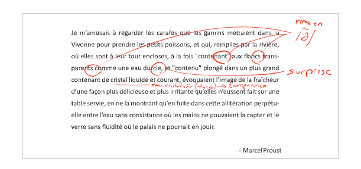

# Généralités du langage

Ce chapitre traite des éléments constitutifs et fondamentaux du langage C. Il traite des généralités propres au langage, mais aussi des notions élémentaires permettant d'interpréter du code source. Notons que ce chapitre est transversal, à la sa première lecture, le profane ne pourra tout comprendre sans savoir lu et maîtrisé les chapitres suivants, néanmoins il retrouvera ici les aspects fondamentaux du langage.

## L'alphabet

Fort heureusement pour nous occidentaux, l'alphabet de C est composé des 52 caractères latins et de 10 [chiffres indo-arabes](https://fr.wikipedia.org/wiki/Chiffres_arabes) :

```text
A B C D E F G H I J K L M N O P Q R S T U V W X Y Z
a b c d e f g h i j k l m n o p q r s t u v w x y z
0 1 2 3 4 5 6 7 8 9
```

La séparation des symboles est assurée par [une espace](<https://fr.wikipedia.org/wiki/Espace_(typographie)>), une tabulation horizontale, une tabulation verticale, et un caractère de retour à la ligne. Ces caractères ne sont pas imprimables, c'est-à-dire qu'ils ne sont pas directement visibles ni à l'écran ni à l'impression. Microsoft Word et d'autres éditeurs utilisent généralement le [pied-de-mouche](https://fr.wikipedia.org/wiki/Pied-de-mouche) `¶` pour indiquer les fins de paragraphes qui sont également des caractères non imprimables.

On nomme les caractères non imprimables soit par leur acronyme `LF` pour *Line Feed* ou soit par leur convention C échappée par un *backslash* `\n`:

Table: Caractères non imprimables

| Acronyme | Échappé | Description            |
| -------- | ------- | ---------------------- |
| LF       | `\n`    | Retour à la ligne      |
| VT       | `\v`    | Tabulation verticale   |
| FF       | `\f`    | Nouvelle page          |
| TAB      | `\t`    | Tabulation horizontale |
| CR       | `\r`    | Retour charriot        |
| SPACE    | `\040`  | Espace                 |
| NUL      | `\0`    | Caractère nul          |


La ponctuation utilise les 29 symboles graphiques suivants :

```text
! # % ^ & * ( _ ) - + = ~ [ ] ' | \ ; : " { } , . < > / ?
```

Un fait historique intéressant est que les premiers ordinateurs ne disposaient pas d'un clavier ayant tous ces symboles et la commission responsable de standardiser C a intégré au standard les **trigraphes** et plus tard les **digraphes** qui sont des combinaisons de caractères de base qui remplacent les caractères impossibles à saisir directement. Ainsi `<:` est le digraphe de `[` et `??<` est le trigraphe de `{`. Néanmoins vous conviendrez cher lecteur que ces alternatives ne devraient être utilisées que dans des cas extrêmes et justifiables.

Retenez que C peut être un langage extrêmement cryptique tant il est permissif sur sa syntaxe. Il existe d'ailleurs un concours international d'obfuscation, le [The International Obfuscated C Code Contest](https://www.ioccc.org/) qui prime des codes les plus subtils et illisibles comme le code suivant écrit par [Chris Mills](https://www.ioccc.org/2015/mills2/prog.c). Il s'agit d'ailleurs d'un exemple qui compile parfaitement sur la plupart des compilateurs.

```c
    int I=256,l,c, o,O=3; void e(
int L){ o=0; for( l=8; L>>++l&&
16>l;                           o+=l
<<l-                            1) ;
o+=l                     *L-(l<<l-1); { ; }
if (                    pread(3,&L,3,O+o/8)<
2)/*                    */exit(0);  L>>=7&o;
L%=1                     <<l; L>>8?256-L?e(
L-1)                            ,c||
(e(c                            =L),
c=0)                            :( O
+=(-I&7)*l+o+l>>3,I=L):putchar(
    L); }int main(int l,char**o){
                for(
            /*          ////      */
            open(1[o],0); ; e(I++
            ))                    ;}
```

## Fin de lignes (EOL)


À l'instar des premières machines à écrire, les [téléscripteurs](https://fr.wikipedia.org/wiki/T%C3%A9l%C3%A9scripteur) possédaient de nombreux caractères de déplacement qui sont depuis tombés en désuétude et prêtent aujourd'hui à confusion même pour le plus aguerri des programmeurs. Maintenant que les ordinateurs possèdent des écrans, la notion originale du terme [retour chariot](https://fr.wikipedia.org/wiki/Retour_chariot) est compromise et comme il y a autant d'avis que d'ingénieurs, les premiers PC [IBM compatibles](https://fr.wikipedia.org/wiki/Compatible_PC) ont choisi qu'une nouvelle ligne dût toujours se composer de deux caractères: un retour chariot (`CR`) et une nouvelle ligne (`LF`) ou en C `\r\n`. Les premiers [Macintosh](https://fr.wikipedia.org/wiki/Macintosh) d'Apple jugeant inutile de gaspiller deux caractères pour chaque nouvelle ligne dans un fichier et ont décidé d'associer le retour chariot et la nouvelle ligne dans le caractère `\r`. Enfin, les ordinateurs UNIX ont eu le même raisonnement, mais ils ont choisi de ne garder que `\n`.

Fort heureusement depuis que Apple a migré son système sur une base [BSD](https://en.wikipedia.org/wiki/Berkeley_Software_Distribution) (UNIX), il n'existe aujourd'hui plus que deux standards de retour à la ligne :

- `LF` ou `\n` sur les ordinateurs POSIX comme Linux, Unix ou macOS
- `CRLF` ou `\r\n` sur les ordinateurs Windows.

Il n'y a pas de consensus établi sur lesquels des deux types de fin de ligne (`EOL`: *End Of Line*) il faut utiliser, faite preuve de bon sens et surtout, soyez cohérent.


## Mots clés

Le langage de programmation C tel que défini par C11 comporte environ 37 mots clés :

```c
_Bool       do        int       switch
_Complex    double    long      typedef
_Imaginary  else      register  union
auto        enum      restrict  unsigned
break       extern    return    void
case        float     short     volatile
char        for       signed    while
const       goto      sizeof
continue    if        static
default     inline    struct
```

Dans ce cours, l'usage des mots clés suivants est découragé, car leur utilisation pourrait prêter à confusion ou mener à des inélégances d'écriture.

```c
_Bool, _imaginary, auto, goto, inline, long, register, restrict, short
```

Il n'y a donc que 28 mots clés à connaître pour être un bon développeur C.

Notons que les mots clés `true` et `false` ne sont pas standardisés en C, mais ils le sont en C++.

## Identificateurs

Un identificateur est une séquence de caractères représentant une entité du programme et à laquelle il est possible de se référer. Un identificateur est défini par une grammaire régulière qui peut être exprimée comme suit :


La notation `[a-z]` signifie que l'on peut utiliser n'importe quelle lettre minuscule de l'alphabet latin, `[A-Z]` pour les lettres majuscules, `[0-9]` pour les chiffres et `_` pour le caractère souligné.

En addition de cette grammaire, voici quelques règles :

1. Un identificateur ne peut pas être l'un des mots clés du langage.
2. Les identificateurs sont sensibles à la [casse](<https://fr.wikipedia.org/wiki/Casse_(typographie)>) (majuscule/minuscule).
3. Le standard C99, se réserve l'usage de tous les identificateurs débutant par `_` suivi d'une lettre majuscule ou un autre *underscore* `_`.
4. Le standard [POSIX](https://fr.wikipedia.org/wiki/POSIX), se réserve l'usage de tous les identificateurs finissant par `_t`.

!!! tip "Expression régulière"

    Il est possible d'exprimer la syntaxe d'un identificateur à l'aide de l'expression régulière suivante :

    ```text
    ^[a-zA-Z_][a-zA-Z0-9_]*$
    ```

!!! exercise "Validité des identificateurs"

    Pour chacune des suites de caractères ci-dessous, indiquez s'il s'agit d'un identificateur valide et utilisable en C. Justifier votre réponse.

    /// html | div[class='three-column-list']

    1. `2_pi`
    2. `x_2`
    3. `x___3`
    4. `x 2`
    5. `positionRobot`
    6. `piece_presente`
    7. `_commande_vanne`
    8. `-courant_sortie`
    9. `_alarme_`
    10. `panne#2`
    11. `int`
    12. `défaillance`
    13. `f'`
    14. `INT`

    ///

    ??? solution

        Une excellente approche serait d'utiliser directement l'expression régulière fournie et d'utiliser l'outil en ligne [regex101.com](https://regex101.com/r/cmxaic/1).

        /// html | div[class='two-column-list']

        1. `2_pi` **invalide**, car commence par un chiffre
        2. `x_2` **valide**
        3. `x___3` **valide**
        4. `x 2` **invalide**, car comporte un espace
        5. `positionRobot` **valide**, notation *camelCase*
        6. `piece_presente` **valide**, notation *snake_case*
        7. `_commande_vanne` **valide**
        8. `-courant_sortie` **invalide**, un identificateur ne peut pas commencer par le signe `-`
        9. `_alarme_` **valide**
        10. `panne#2` **invalide**, le caractère `#` n'est pas autorisé
        11. `int` **invalide**, `int` est un mot réservé du langage
        12. `défaillance` **invalide**, uniquement les caractères imprimable ASCII sont autorisés
        13. `f'` **invalide** l'apostrophe n'est pas autorisée
        14. `INT` **valide**

        ///

## Variables

Une variable est un symbole qui associe un nom (**identificateur**) à une **valeur**. Comme son nom l'indique, une variable peut voir son contenu varier au cours du temps.

Une variable est définie par :

- Son **nom** (*name*), c'est-à-dire l'identificateur associé au symbole.
- Son **type** (*type*), qui est la convention d'interprétation du contenu binaire en mémoire.
- Sa **valeur** (*value*), qui est le contenu interprété connaissant son **type**.
- Son **adresse** (*address*) qui est l'emplacement mémoire ou la représentation binaire sera enregistrée.
- Sa **portée** (*scope*) qui est la portion de code ou le symbole est défini et accessible.
- Sa **visibilité** (*visibility*) qui ne peut être que *public* en C.

!!! example

    Pour mieux comprendre, imaginons la plage de Donnant à Belle-Île-en-Mer. Quelqu'un a écrit sur le sable, bien visible depuis la colline adjacente, le mot `COIN`. L'identificateur c'est `Donnant`, la valeur c'est `COIN`, le type permet de savoir comment interpréter la valeur. Cela peut s'agir d'une pièce de monnaie en anglais, du coin d'une table en français ou du lapin en neerlandais.

    L'**adresse** est l'emplacement exact de la plage où le mot a été écrit (47.32638670571° N, 3.2363350691522° W), la portée est la plage de Donnant et la visibilité est la colline adjacente.

    On voit que sans connaître le **type** de la variable, il est impossible de savoir comment interpréter sa **valeur**.

    

    En pratique l'adresse sera plutôt de la forme `0x7fffbf7f1b4c`, la valeur serait plutôt `0100001101001111010010010100111000000000` et le type serait une chaîne de caractères `char[]`.

### Déclaration

Avant de pouvoir être utilisée, une variable doit être **déclarée** afin que le compilateur puisse réserver un emplacement en mémoire pour stocker sa valeur.

Voici quelques déclarations valides :

```c
char c = '€';
int temperature = 37;
float neptune_stone_height = 376.86;
char message[] = "Jarvis, il faut parfois savoir "
                 "courir avant de savoir marcher.";
```

Il n'est pas nécessaire d'associer une valeur initiale à une variable, une déclaration peut se faire sans initialisation comme montré dans l'exemple suivant dans lequel on réserve trois variables `i`, `j`, `k`.

```c
int i, j, k;
```

!!! exercise "Affectation de variables"

    Considérons les déclarations suivantes :

    ```c
    int a, b, c;
    float x;
    ```

    Notez après chaque affectation, le contenu des différentes variables :

    | Ligne | Instruction    | `a` | `b` | `c` | `x` |
    | ----- | -------------- | --- | --- | --- | --- |
    | 1     | `a = 5;`       |     |     |     |     |
    | 2     | `b = c;`       |     |     |     |     |
    | 3     | `c = a;`       |     |     |     |     |
    | 4     | `a = a + 1;`   |     |     |     |     |
    | 5     | `x = a - ++c;` |     |     |     |     |
    | 6     | `b = c = x;`   |     |     |     |     |
    | 7     | `x + 2. = 7.;` |     |     |     |     |

    ??? solution

        | Ligne | Instruction    | `a` | `b` | `c` | `x` |
        | ----- | -------------- | --- | --- | --- | --- |
        | 1     | `a = 5;`       | 5   | ?   | ?   | ?   |
        | 2     | `b = c;`       | 5   | ?   | ?   | ?   |
        | 3     | `c = a;`       | 5   | ?   | 5   | ?   |
        | 4     | `a = a + 1;`   | 6   | ?   | 5   | ?   |
        | 5     | `x = a - ++c;` | 6   | ?   | 6   | 12  |
        | 6     | `b = c = x;`   | 6   | 12  | 12  | 12  |
        | 7     | `x + 2. = 7.;` | -   | -   | -   | -   |

### Convention de nommage


Il existe autant de conventions de nommage qu'il y a de développeurs, mais un consensus majoritaire, que l'on retrouve dans d'autres langages de programmation dit que :

- La longueur du nom d'une variable est généralement proportionnelle à sa portée et donc il est d'autant plus court que l'utilisation d'une variable est localisée.
- Le nom doit être concis et précis et ne pas laisser place à une quelconque ambiguïté.
- Le nom doit participer à l'autodocumentation du code et permettre à un lecteur de comprendre facilement le programme qu'il lit.

Selon les standards adoptés chaque société on trouve ceux qui préfèrent nommer les variables en utilisant un *underscore* (`_`) comme séparateur et ceux qui préfèrent nommer une variable en utilisant des majuscules comme séparateurs de mots.

Table: Conventions de nommage

| Convention   | Nom français     | Exemple              |
| ------------ | ---------------- | -------------------- |
| *camelcase*  | Casse de chameau | `userLoginCount`   |
| *snakecase*  | Casse de serpent | `user_login_count` |
| *pascalcase* | Casse de Pascal  | `UserLoginCount`   |
| *kebabcase*  | Casse de kebab   | `user-login-count` |

!!! note

    La casse de kebab n'est pas acceptée par le standard C car les noms formés ne sont pas des identificateurs valides. Néanmoins cette notation est beaucoup utilisée par exemple sur GitHub.

### Variable métasyntaxique

Souvent lors d'exemples donnés en programmation, on utilise des variables génériques dites [métasyntaxiques](https://fr.wikipedia.org/wiki/Variable_m%C3%A9tasyntaxique). En français les valeurs `toto`, `titi`, `tata` et `tutu` sont régulièrement utilisées tandis qu'en anglais
`foo`, `bar`, `baz` et `qux` sont régulièrement utilisés. Les valeurs `spam`, `ham` et `eggs` sont quant à elles souvent utilisée en Python, en référence au sketch [Spam](<https://en.wikipedia.org/wiki/Spam_(Monty_Python)>) des Monthy Python.

Leur usage est conseillé pour appuyer le cadre générique d'un exemple sans lui donner la consonance d'un problème plus spécifique.

On trouvera une [table](http://www.catb.org/jargon/html/M/metasyntactic-variable.html) des différents noms les plus courants utilisés dans différentes langues.

!!! note

    L'origine de `foo` et `bar` remonte à la [deuxième guerre mondiale](https://en.wikipedia.org/wiki/FUBAR) où les militaires américains utilisaient ces termes pour désigner des objets non identifiés.

    Titi et Toto sont des personnages de bande dessinée créés par [Maurice Cuvillier](https://fr.wikipedia.org/wiki/Maurice_Cuvillier) en 1931.

## Les constantes

Une constante par opposition à une variable voit son contenu **fixe** et **immuable**.

Formellement, une constante se déclare comme une variable, mais préfixée du mot-clé `const`.

```c
const double scale_factor = 12.67;
```

!!! info

    Il ne faut pas confondre la **constante** qui est une variable immuable, stockée en mémoire et une **macro** qui appartient au préprocesseur. Sur certaines plateformes, le fichier d'en-tête `math.h` définit par exemple la constante `M_PI` sous forme de macro.

    ```c
    #define M_PI 3.14159265358979323846
    ```

    Cette même constante peut être définie comme une variable constante :

    ```c
    const double pi = 3.14159265358979323846;
    ```

Les constantes seront utilisées pour :

- Éviter les erreurs de programmation en évitant de modifier une valeur qui ne devrait pas l'être.
- Indiquer au compilateur que la valeur ne changera pas et qu'il peut optimiser le code en conséquence.
- Indiquer au développeur que la valeur ne sera pas modifiée plus tard dans le programme.

## Constantes littérales

Les constantes littérales représentent des **grandeurs scalaires** numériques ou de caractères et initialisées lors de la phase de compilation.

```c
6      // Grandeur valant le nombre d'heures sur l'horloge du Palais du Quirinal à Rome
12u    // Grandeur non signée
6l     // Grandeur entière signée codée sur un entier long
42ul   // Grandeur entière non signée codée sur un entier long
010    // Grandeur octale valant 8 en décimal
0xa    // Grandeur hexadécimale valant 10 en décimal
0b111  // Grandeur binaire valant 7 en décimal
33.    // Grandeur réelle exprimée en virgule flottante
'0'    // Grandeur caractère valant 48 en décimal
```

Nous l'avons vu plus haut, le **type** d'une variable est important pour déterminer comment une valeur est stockée en mémoire.

Nous le verrons dans le chapitre sur la [numération](numeration.md), les valeurs numériques peuvent être stockées en mémoire de différentes manières. Ainsi, une valeur `48` peut être stockée sur un octet, un mot de 16 bits, un mot de 32 bits ou un mot de 64 bits. De plus, la valeur peut faire référence au caractère `0` en ASCII, mais aussi au nombre `72` s'il est exprimé en hexadécimal.

Aussi, on utilisera un préfixe devant un nombre `0x` pour indiquer qu'il est en hexadécimal, `0b` pour indiquer qu'il est en binaire et `0` pour indiquer qu'il est en octal. Sans préfixe il s'agit d'un nombre décimal (base 10).

On utilisera un suffixe `u` pour indiquer que le nombre est non signé (admettant pas de valeurs négatives) et `l` pour indiquer qu'il est long ou `ll` pour indiquer qu'il est très long.

Quant aux guillemets simples `'`, ils sont utilisés pour délimiter un caractère de la table ASCII.

!!! exercise "Constances littérales"

    Pour les entrées suivantes, indiquez lesquelles sont correctes.

    /// html | div[class='two-column-list']

    1. `12.3`
    2. `12E03`
    3. `12u`
    4. `12.0u`
    5. `1L`
    6. `1.0L`
    7. `.9`
    8. `9.`
    9. `.`
    10. `0x33`
    11. `0xefg`
    12. `0xef`
    13. `0xeF`
    14. `0x0.2`
    15. `09`
    16. `02`

    ///

## Opérateur d'affectation

Dans les exemples ci-dessus, on utilise l'opérateur d'affectation pour associer une valeur à une variable.

Historiquement, et fort malheureusement, le symbole choisi pour cet opérateur est le signe égal `=` or, l'égalité est une notion mathématique qui n'est en aucun cas reliée à l'affectation.

Pour mieux saisir la nuance, considérons le programme suivant :

```c
a = 42;
a = b;
```

Mathématiquement, la valeur de `b` devrait être égale à 42 ce qui n'est pas le cas en C où il faut lire, séquentiellement l'exécution du code, car oui, C est un langage **impératif**. Ainsi, dans l'ordre on lit :

1. J'assigne la valeur 42 à la variable symbolisée par `a`
2. Puis, j'assigne la valeur de la variable `b` au contenu de `a`.

Comme on ne connaît pas la valeur de `b`, avec cet exemple, on ne peut pas connaître la valeur de `a`.

Certains langages de programmation ont été sensibilisés à l'importance de cette distinction et dans les langages **F#**, **OCaml**, **R** ou **S**, l'opérateur d'affectation est `<-` et une affectation pourrait s'écrire par exemple: `a <- 42` ou `42 -> a`.

En C, l'opérateur d'égalité que nous verrons plus loin s'écrit `==` (deux `=` concaténés).

Remarquez ici que l'opérateur d'affectation de C agit toujours de droite à gauche c'est-à-dire que la valeur à **droite** de l'opérateur est affectée à la variable située à **gauche** de l'opérateur.

S'agissant d'un opérateur il est possible de chaîner les opérations, comme on le ferait avec l'opérateur `+` et dans l'exemple suivant il faut lire que `42` est assigné à `c`, que la valeur de `c` est ensuite assigné à `b` et enfin la valeur de `b` est assignée à `a`.

```c
a = b = c = 42;
```

Nous verrons plus tard comment l'ordre des opérations et l'associativité de chaque opérateur.

!!! exercise "Affectations simples"

    Donnez les valeurs de `x`, `n`, `p` après l'exécution des instructions ci-dessous :

    ```c
    float x;
    int n, p;

    p = 2;
    x = 15 / p;
    n = x + 0.5;
    ```

    ??? solution

        ```text
        p ≡ 2
        x ≡ 7
        n ≡ 7
        ```

!!! exercise "Trop d'égalités"

    On considère les déclarations suivantes :

    ```c
    int i, j, k;
    ```

    Donnez les valeurs des variables `i`, `j` et `k` après l'exécution de chacune des expressions ci-dessous. Qu'en pensez-vous ?

    ```c
    /* 1 */ i = (k = 2) + (j = 3);
    /* 2 */ i = (k = 2) + (j = 2) + j * 3 + k * 4;
    /* 3 */ i = (i = 3) + (k = 2) + (j = i + 1) + (k = j + 2) + (j = k - 1);
    ```

    ??? solution

        Selon la table de priorité des opérateurs, on note :

        - `()` priorité 1 associativité à droite
        - `*` priorité 3 associativité à gauche
        - `+` priorité 4 associativité à droite
        - `=` priorité 14 associativité à gauche

        En revanche rien n'est dit sur les `point de séquences <https://en.wikipedia.org/wiki/Sequence_point>`__. L'opérateur d'affectation n'est pas un point de séquence, autrement dit le standard C99 (Annexe C) ne définit pas l'ordre dans lequel les assignations sont effectuées.

        Ainsi, seul le premier point possède une solution, les deux autres sont indéterminés

        1. `i = (k = 2) + (j = 3)`

            - `i = 5`
            - `j = 3`
            - `k = 2`

        2. `i = (k = 2) + (j = 2) + j * 3 + k * 4`

            - Résultat indéterminé

        3. `i = (i = 3) + (k = 2) + (j = i + 1) + (k = j + 2) + (j = k - 1)`

            - Résultat indéterminé

## Commentaires

Comme en français et ainsi qu'illustré par la figure suivante, il est possible d'annoter un programme avec des **commentaires**. Les commentaires n'ont pas d'incidence sur le fonctionnement d'un programme et ne peuvent être lu que par le développeur qui possède le code source.



Il existe deux manières d'écrire un commentaire en C :

- Les commentaires de lignes (depuis C99)

    ```c
    // This is a single line comment.
    ```

- Les commentaires de blocs

    ```c
    /* This is a
       Multi-line comment */
    ```

Les commentaires sont parsés par le préprocesseur, aussi ils n'influencent pas le fonctionnement d'un programme, mais seulement sa lecture. Rappelons qu'un code est plus souvent lu qu'écrit, car on ne l'écrit qu'une seule fois, mais comme tout développement doit être si possible **réutilisable**,
il est plus probable qu'il soit lu part d'autres développeurs.

En conséquence, il est important de clarifier toute zone d'ombre lorsque l'on s'éloigne des consensus établis, ou lorsque le code seul n'est pas suffisant pour bien comprendre son fonctionnement.

D'une façon générale, les commentaires servent à expliquer **pourquoi** et non **comment**. Un bon programme devrait pouvoir se passer de commentaires, mais un programme sans commentaires n'est pas
nécessairement un bon programme.

### Commenter du code ?

Lorsque vous développez, vous avez souvent besoin de désactiver des portions de code pour des raisons de débogage ou de test. Il est tentant de commenter ces portions de code plutôt que de les supprimer.

Néanmoins une règle à retenir est que l'on ne commente **jamais** des portions de code, et ce pour plusieurs raisons :

1. Les outils de *refactoring* ne pourront pas accéder du code commenté
2. La syntaxe ne pourra plus être vérifiée par l'IDE
3. Les outils de gestion de configuration (e.g. Git) devraient être utilisés à cette fin

Si d'aventure vous souhaitez quand même exclure temporairement du code de la compilation, il est recommandé d'utiliser la directive de préprocesseur suivante, et n'oubliez pas d'expliquer pourquoi vous avez souhaité
désactiver cette portion de code.

```c
#if 0 // TODO: Check if divisor could still be null at this point.
if (divisor == 0) {
    return -1; // Error
}
#endif
```

### Quelques conseils

D'une manière générale l'utilisation des commentaires ne devrait pas être utilisée pour :

- Désactiver temporairement une portion de code sans l'effacer.
- Expliquer le **comment** du fonctionnement du code.
- Faire dans le dithyrambique pompeux et notarial, des phrases à rallonge bien trop romanesques.
- Créer de jolies séparations telles que `/*************************/`.

Exemple d'entête de fichier :

```c
/**
 * Short description of the translation unit.
 *
 * Author: John Doe <john@doe.com>
 *
 * Long description of the translation unit.
 *
 * NOTE: Important notes about this code
 */
```

=== "Pas bien"

    ```c
    /*****************************************************
                                               _..._
     _   _    _    ____    _                .'     '.      _
    | \ | |  / \  / ___|  / \              /    .-""-\   _/ \
    |  \| | / _ \ \___ \ / _ \          .-|   /:.   |  |   |
    | |\  |/ ___ \ ___) / ___ \         |  \  |:.   /.-'-./
    |_| \_/_/   \_\____/_/   \_\        | .-'-;:__.'    =/
                                      .'=  *=|NASA _.='
                                     /   _.  |    ;
                                    ;-.-'|    \   |
                                   /   | \    _\  _\
                                   \__/'._;.  ==' ==\
                                            \    \   |
                                     jgs    /    /   /
                                            /-._/-._/
    National Aeronautics and Space          \   `\  \
    Administration.                          `-._/._/
    *******************************************************/
    ```

=== "Bien"

    ```c
    /**
     * NASA
     */
    ```

Le format des commentaires est par essence libre au développeur, mais il est généralement souhaité que :

- Les commentaires soient concis et précis.
- Les commentaires soient écrits en anglais.

!!! exercise "Verbosité"

    Comment récririez-vous ce programme?

    ```c
    for (register unsigned int the_element_index = 0;
        the_element_index < number_of_elements; the_element_index += 1)
        array_of_elements[the_element_index] =  the_element_index;
    ```

    ??? solution

        Une règle de programmation: le nom identifieurs doit être proportionnel à leur contexte. Plus le contexte de la variable est réduit, plus le nom peut être court. Le même programme pourrait être écrit comme suit :

        ```c
        for (size_t i; i < nelems; i++)
            elem[i] = i;
        ```

        Un consensus assez bien établi est qu'une variable commençant par `n` peut signifier
        *number of*.
