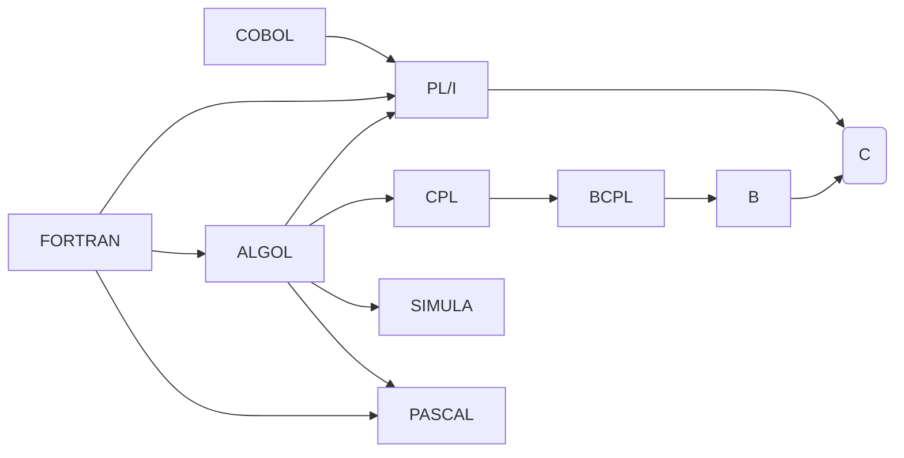

---
epigraph:
    text: "C is quirky, flawed, and an enormous success."
    source: Dennis Ritchie
---
# Le langage C

Le langage C compte parmi les tout premiers langages de programmation modernes. Proche de l’assembleur — ce langage de bas niveau exécuté directement par les processeurs — il autorise la conception d’applications d’une efficacité redoutable. On le retrouve aussi bien dans les montres connectées que dans les stimulateurs cardiaques (*pacemakers*) ou encore les [machines à café][mcu].

Même s’il est apparu en [[1972]], le C demeure largement utilisé et enseigné. Sa sobriété et sa rigueur en font un formidable outil pour assimiler les fondements de la programmation structurée.

En 2024, rares sont les alternatives aussi mûres et éprouvées que le C pour le développement d’applications embarquées hautes performances ou pour les noyaux de systèmes d’exploitation. Des langages plus récents comme [[Rust]] ou [[Zig]] gagnent en visibilité, mais ils ne se sont pas encore généralisés dans l’industrie.

[](){ #c-history }

## Historique { data-search-keyword="thompson"}

En [[1964]] naît, d'une collaboration entre les laboratoires [[Bell]] (*Bell Telephone Laboratories*), [[General Electric]] et le [[MIT]], le projet [Multics](https://fr.wikipedia.org/wiki/Multics) (*Multiplexed Information and Computing Service*), qui vise à développer un nouveau système d'exploitation.

Cependant, la fin de la décennie est marquée par des remous. Les laboratoires Bell, désillusionnés par les promesses de [[Multics]], décident de se retirer du projet pour élaborer leur propre système d'exploitation. Un groupe informel, dirigé notamment par [Ken Thompson](https://fr.wikipedia.org/wiki/Ken_Thompson) et [Dennis Ritchie](https://fr.wikipedia.org/wiki/Dennis_Ritchie), entreprend de revoir certains concepts de Multics qui leur déplaisaient, notamment le langage de programmation PL/I (*Programming Language number 1*), alors prédominant pour l’écriture de systèmes d’exploitation. Thompson développe un langage baptisé B, inspiré du BCPL, dans lequel il ne conserve que les éléments qu'il juge essentiels pour fonctionner sur de petites machines. À ce stade, B ne comporte qu’un seul type de donnée, le "mot" (*word*). [[||Ken Thompson]] [[||Dennis Ritchie]]

[[BCPL]], conçu par [[Martin Richards]] au MIT dans les années [[1960]], est l'ancêtre de B, et par extension, l'arrière-grand-père du C. Dennis Ritchie, alors collègue de Thompson, retravaille le langage B pour y ajouter la gestion des types de données.

Le système d'exploitation que Thompson et Ritchie développent aux laboratoires Bell s’appelle d'abord UNICS, par opposition à Multics, où *Multiplexed* est remplacé par *Uniplexed*. Le nom évolue ensuite pour devenir [[UNIX]], un pilier dans l'histoire de l'informatique.

Plus tard, [Brian Kernighan](https://fr.wikipedia.org/wiki/Brian_Kernighan) contribue à la diffusion du langage. Principal auteur du livre *The C Programming Language*, il laisse à Dennis Ritchie le soin de rédiger les annexes techniques.

L’évolution du C se poursuit dans les années 1980, lorsque [Bjarne Stroustrup](https://fr.wikipedia.org/wiki/Bjarne_Stroustrup) y adjoint des mécanismes de programmation orientée objet (OOP). Ce paradigme, que nous étudierons dans un autre cours, enrichit la boîte à outils des développeuses et développeurs C++. La figure suivante présente le trio fondateur du langage C. [[||Bjarne Stroustrup]]


Il faut attendre [[1989]] pour que le langage C soit normalisé par l’ANSI (*American National Standards Institute*). L’année suivante, l’ISO (*International Organization for Standardization*) ratifie le standard *ISO/IEC 9899:1990*, communément appelé **C90**. Le C s’impose alors comme un standard international et renforce sa position dominante dans l’informatique.

Les langages de programmation se nourrissent souvent les uns des autres, et le C ne fait pas exception. La figure suivante illustre quelques-unes des influences entre langages :



Cinquante ans plus tard, le C demeure l'un des langages les plus prisés par les ingénieures et ingénieurs. Sa capacité à mêler une vision de haut niveau à des manipulations de bas niveau en fait un allié précieux pour les applications embarquées sur microcontrôleurs ou pour optimiser du code critique, comme dans les noyaux de systèmes d'exploitation tels que le [[noyau]] [[Linux]] ([[Kernel]]) ou Windows.

Retenons simplement que **C** est un langage à la fois sobre et puissant : votre machine à café, votre voiture ou vos écouteurs Bluetooth ont probablement été, au moins en partie, programmés en C.

## Standardisation

Comme nous l'avons vu, le langage C a un long historique. Il a fallu attendre près de vingt ans après sa création pour qu’il fasse l’objet d’une [[normalisation]] internationale.

Le standard le plus courant en 2024 demeure [C99](http://www.open-std.org/jtc1/sc22/wg14/www/docs/n1256.pdf). [[C11]] commence à le supplanter dans certains secteurs, tandis que l’évolution se poursuit avec [[C17]], [[C18]] et [[C23]]. La figure suivante synthétise les principaux standards internationaux du C :

Table: Normes internationales du langage C

| Notation courte | Standard international                                       | Date |
| --------------- | ------------------------------------------------------------ | ---- |
| C               | n/a                                                          | 1972 |
| K&R C           | n/a                                                          | 1978 |
| C89 (ANSI C)    | ANSI X3.159-1989                                             | 1989 |
| C90             | [ISO/IEC 9899:1990](https://www.iso.org/standard/17782.html) | 1990 |
| C99             | [ISO/IEC 9899:1999](https://www.iso.org/standard/29237.html) | 1999 |
| C11             | [ISO/IEC 9899:2011](https://www.iso.org/standard/57853.html) | 2011 |
| C17/C18         | [ISO/IEC 9899:2018](https://www.iso.org/standard/74528.html) | 2018 |
| C23             | [ISO/IEC 9899:2023](https://www.iso.org/standard/82075.html) | 2023 |

En pratique, **C18** n'apporte pas de nouvelles fonctionnalités majeures au langage : il clarifie surtout les ambiguïtés laissées par **C11**, lequel introduisait déjà relativement peu de changements fondamentaux pour le développement sur microcontrôleurs.


!!! info

    Vous entendrez ou lirez souvent des références à **ANSI C** ou **K&R**. Privilégiez toutefois une compatibilité avec **C99** au minimum.

Le standard C est, il faut bien l’admettre, dense et ardu à lire. Avec ses quelque 552 pages pour C99, difficile d’y trouver un réel plaisir. Et pourtant, il faut parfois s’y plonger pour démêler des subtilités rarement explicitées dans les manuels. Face à un comportement étrange ou à un bogue mal documenté, la réponse se niche souvent dans les pages du standard.

Comme mentionné plus haut, bien que C99 soit le standard le plus utilisé en 2024, il compte déjà plus de 25 ans. Vous vous demandez peut-être pourquoi l'industrie semble si en retard. Contrairement au monde des logiciels grand public, où l’on adopte volontiers chaque mise à jour, le secteur industriel obéit à des processus de validation rigoureux. Migrer vers un nouveau standard coûte cher en tests et en démarches de conformité ; les entreprises privilégient donc des versions éprouvées plutôt que de risquer des erreurs onéreuses, notamment dans des domaines critiques comme l’aéronautique ou la médecine.

## Le C et les autres...

Si ce cours se concentre principalement sur le langage C, il n’est évidemment pas le seul langage de programmation, et vous en découvrirez bien d’autres au fil de votre parcours. La table suivante propose une liste non exhaustive de langages et de leur année de création afin d’illustrer l’évolution des usages :

Table: Langages de programmation et leur année de création

| Langage de programmation                                         | Année | Utilisation               |
| ---------------------------------------------------------------- | ----- | ------------------------- |
| [Fortran](https://fr.wikipedia.org/wiki/Fortran)                 | 1957  | Calcul scientifique       |
| [Lisp](https://fr.wikipedia.org/wiki/Lisp)                       | 1958  | Intelligence artificielle |
| [Cobol](https://fr.wikipedia.org/wiki/Cobol)                     | 1959  | Finance, banque           |
| [Basic](https://fr.wikipedia.org/wiki/Cobol)                     | 1964  | Enseignement              |
| [Pascal](https://fr.wikipedia.org/wiki/Pascal_(langage))         | 1970  | Enseignement              |
| [C](https://fr.wikipedia.org/wiki/C_(langage))                   | 1972  | Systèmes embarqués        |
| [C++](https://fr.wikipedia.org/wiki/C%2B%2B)                     | 1985  | Applications lourdes      |
| [Perl](https://fr.wikipedia.org/wiki/Perl_(langage))             | 1987  | Scripts                   |
| [Python](https://fr.wikipedia.org/wiki/Python_(langage))         | 1991  | Ingénierie, sciences      |
| [Ruby](https://fr.wikipedia.org/wiki/Ruby)                       | 1995  | Scripts, Web              |
| [Java](https://fr.wikipedia.org/wiki/Java_(langage))             | 1995  | Applications lourdes      |
| [PHP](https://fr.wikipedia.org/wiki/PHP)                         | 1995  | Web                       |
| [C#](https://fr.wikipedia.org/wiki/C_Sharp)                      | 2000  | Applications graphiques   |
| [Go](https://fr.wikipedia.org/wiki/Go_(langage))                 | 2009  | Systèmes distribués       |
| [Rust](https://fr.wikipedia.org/wiki/Rust_(langage))             | 2010  | Systèmes embarqués        |
| [Swift](https://fr.wikipedia.org/wiki/Swift_(langage_d%27Apple)) | 2014  | Applications mobiles      |
| [Zig](https://fr.wikipedia.org/wiki/Zig_(langage))               | 2016  | Systèmes embarqués        |

L'index [TIOBE](https://www.tiobe.com/tiobe-index/) constitue un excellent indicateur de la popularité des langages de programmation. Il est mis à jour mensuellement et permet de suivre l'évolution de la popularité des différents langages. En 2024, le classement des 10 langages de programmation les plus populaires est présenté dans la table suivante : [[||TIOBE]]

Table: Top 10 des langages de programmation

| Top 10 | Langage de programmation |
| ------ | ------------------------ |
| 1      | Python                   |
| 2      | C++                      |
| 3      | C                        |
| 4      | Java                     |
| 5      | C#                       |
| 6      | JavaScript               |
| 7      | Go                       |
| 8      | SQL                      |
| 9      | Visual Basic             |
| 10     | Fortran                  |

Sur le podium, [[Python]] est un langage de très haut niveau, simple à appréhender mais éloigné du matériel. [[C++]] se distingue par sa richesse orientée objet et sa puissance, au prix d’une complexité certaine. Avec la médaille d’argent, C offre un excellent compromis : il reste accessible tout en ouvrant les portes de la programmation bas niveau. C’est pour cette raison que ce cours repose sur le langage C. Ai-je réussi à vous convaincre ?

[](){#structured-text-programming}

## Programmation texte structurée

Le C, comme la plupart des langages de programmation, repose sur du texte structuré. Il est défini par un **vocabulaire**, une **grammaire** et un **alphabet**. À la différence des [langages naturels](https://fr.wikipedia.org/wiki/Langage_naturel) comme le français, un langage de programmation est un [langage formel](https://fr.wikipedia.org/wiki/Langage_formel) : sa syntaxe et son lexique ne souffrent ni exceptions ni ambiguïtés. Les **compilateurs** s’appuient sur cette grammaire épurée — par souci d’économie de mémoire et de précision — afin d’éliminer toute ambiguïté et d’accroître la productivité des personnes qui développent.

[](){ #omelette }

Pour mieux comprendre, voici un exemple sous forme de [pseudo-code](https://fr.wikipedia.org/wiki/Pseudo-code) utilisant une grammaire simple :

```text
POUR CHAQUE œuf DANS le panier :
    jaune, blanc ← CASSER(œuf)
    omelette ← MELANGER(jaune, blanc)
    omelette_cuite ← CUIRE(omelette)

SERVIR(omelette_cuite)
```

La structure de la phrase permettant de traiter tous les éléments d'un ensemble d'éléments (les œufs d'un panier) peut alors s'écrire de façon générique comme suit :

```text
POUR CHAQUE 〜 DANS 〜:
    〜
```

où les `〜` sont des marques substitutives ([placeholder](https://fr.wikipedia.org/wiki/Marque_substitutive)) qui seront remplacées par le développeur par ce qui convient.

Les grammaires des langages de programmation sont souvent formalisées à l'aide d'un métalangage, c'est-à-dire un langage qui permet de décrire un langage. On l'appelle la [grammaire][grammar] du langage C. C'est un peu le Bescherelle du C. On observe dans ce formalisme une syntaxe rigoureuse, l'utilisation de termes en majuscules, la séparation de mots par des virgules, la présence de parenthèses et de flèches (`←`). Cette syntaxe diffère d'un langage à l'autre, mais selon le paradigme du langage de grandes similarités peuvent exister.

[](){#paradigm}

## Les paradigmes de programmation

Chaque langage de programmation — C, C++, Python, Ada, COBOL ou Lisp — possède sa propre identité tout en partageant parfois de fortes similitudes avec les autres. Nous avons cité plus haut le langage B, précurseur du C (voir [thompson]{c-history}). Malgré des syntaxes distinctes, ces deux langages restent proches, à l’image de l’espagnol et de l’italien qui puisent dans une même racine latine. En programmation, on dit alors qu’ils partagent le même [paradigme de programmation](https://fr.wikipedia.org/wiki/Paradigme_(programmation)).

Certains paradigmes se prêtent mieux que d’autres à la résolution de problèmes spécifiques, et de nombreux langages sont qualifiés de **multi-paradigmes** : ils prennent en charge plusieurs approches complémentaires.

Nous évoquions plus haut C++, qui introduit la programmation orientée objet, un paradigme absent du langage C. L’essentiel à retenir est qu’un langage peut souvent en remplacer un autre dès lors qu’ils reposent sur des paradigmes similaires.

Le langage C s’inscrit dans les paradigmes suivants :

[Impératif](https://fr.wikipedia.org/wiki/Programmation_imp%C3%A9rative)

: Programmation en séquences de commandes, qui se lisent dans un ordre donné (de haut en bas).

[Structuré](https://fr.wikipedia.org/wiki/Programmation_structur%C3%A9e)

: Programmation impérative possédant des structures de décision imbriquées comme les boucles et les conditions.

[Procédural](https://fr.wikipedia.org/wiki/Programmation_proc%C3%A9durale)

: Programmation impérative possédant des appels de procédures isolées qui regroupent une séquence d'instructions.

D'autres langages, comme C++, ajoutent des paradigmes supplémentaires au C :

[Fonctionnel](https://fr.wikipedia.org/wiki/Programmation_fonctionnelle)

: Programmation basée sur l'appel de fonction. Utilisé dans les langages Lisp, Haskell, Erlang.

[Orienté objet](https://fr.wikipedia.org/wiki/Programmation_orient%C3%A9e_objet)

: Programmation basée sur la définition de classes et d'objets. Utilisé dans les langages C++, Java, Python. Une classe associe des données à des actions qui manipulent ces données.

Des langages de plus haut niveau, tels que Python ou C#, proposent encore d’autres paradigmes, comme la [programmation réflective](https://fr.wikipedia.org/wiki/R%C3%A9flexion_(informatique)) ou la [programmation événementielle](https://fr.wikipedia.org/wiki/Programmation_%C3%A9v%C3%A9nementielle).

Retenons que le langage C est à la fois **impératif** et **procédural**. Il repose sur des séquences d’instructions exécutées dans un ordre déterminé et regroupables au sein de procédures. En reprenant notre exemple d’[omelette][omelette], si nous souhaitions cette fois préparer une pâte à crêpes, nous pourrions écrire :

```text
POUR REALISER un œuf:
    CHERCHER poule
    œuf ← PONDRE(poule)

POUR REALISER du lait:
    CHERCHER vache
    lait ← TRAITRE(vache)

POUR REALISER de la farine:
    PLANTER blé
    ATTENDRE 6 mois
    moisson ← MOISSONNER(blé)
    farine ← MOUDRE(moisson)

POUR REALISER une pâte à crèpes:
    œuf ← REALISER(œuf)
    jaune, blanc ← CASSER(œuf)
    œuf-liquide ← MELANGER(jaune, blanc)
    farine ← REALISER(farine)
    lait ← REALISER(lait)
    pâte ← MELANGER(œuf-liquide, farine, lait)
```

Dans cet exemple, les séquences d'instructions ont été regroupées en procédures, c'est de la programmation procédurale. Les procédures permettent de découper un programme en morceaux plus petits, plus faciles à comprendre et à maintenir.

## Cycle de développement

Savoir écrire un programme en C n'est qu'une facette de la programmation. Il est important de comprendre que la programmation est un processus itératif qui nécessite de suivre un cycle de développement logiciel. Ce cycle de développement comprend des étapes menant de l'étude à l'analyse d'un problème jusqu'à la réalisation d'un programme informatique exécutable. Dans l'industrie, il existe de nombreux modèles comme le [Cycle en V](https://fr.wikipedia.org/wiki/Cycle_en_V) ou le [modèle en cascade](https://fr.wikipedia.org/wiki/Mod%C3%A8le_en_cascade) que nous verrons plus en détail plus tard ([Modèles de développement][development-models]). Quel que soit le modèle utilisé, il comprendra les étapes suivantes :

1. **Étude** et analyse du problème
2. Écriture d'un **cahier des charges** (spécifications)
3. Écriture de **tests** à réaliser pour tester le fonctionnement du programme
4. **Conception** d'un algorithme
5. **Transcription** de cet algorithme en utilisant le langage C
6. **Compilation** du code et génération d'un exécutable
7. **Test** de fonctionnement
8. **Vérification** que le cahier des charges est respecté
9. **Livraison** du programme

Mis à part la dernière étape où il n'y a pas de retour en arrière possible, les autres étapes sont **itératives**. Il est très rare d'écrire un programme juste du premier coup. Durant tout le cycle de développement logiciel, des itérations successives sont faites pour permettre d'optimiser le programme, de résoudre des bogues, d'affiner les spécifications, d'écrire davantage de tests pour renforcer l'assurance d'un bon fonctionnement du programme et d’éviter une [coulée de lave][lava-flow].

## Cycle de compilation

Le langage C à une particularité que d'autres langages n'ont pas, il comporte une double [grammaire][grammar]. Le processus de compilation s'effectue donc en deux étapes.

1. Le préprocesseur qui enlève les commentaires du développeur et regroupe en un fichier les différentes parties du programme.
2. La compilation à proprement parler du code source en un fichier binaire.

Vient ensuite la phase d'édition des liens ou *linkage* lors de laquelle le programme exécutable est créé à partir des fichiers binaires générés lors de la compilation. La figure suivante illustre le cycle de compilation d'un programme C.


[](){#preproc-intro}

### Préprocesseur (*pre-processing*)

La phase de *preprocessing* permet de générer un fichier intermédiaire en langage C dans lequel toutes les instructions nécessaires à la phase suivante sont présentes. Le *preprocessing* réalise le remplacement des directives du préprocesseur [de définitions][preprocessor-define] par leurs valeurs résultantes. Ce préprocesseur permet d'inclure des fichiers externes, de définir des valeurs constantes ou de conditionner l'exécution de certaines parties du code par exemple avec des options de configuration. Avec le compilateur `gcc` il est possible de demander uniquement cette étape avec l'option `-E`. Cette étape est illustrée dans la figure suivante.


Lorsque vous écrivez votre programme, vous le faites en utilisant des fichiers sources avec l'extension `.c`. Néanmoins, dans votre programme, vous vous basez sur de nombreuses bibliothèques logicielles qui donnent accès à des fonctions prédéfinies. Ces bibliothèques sont incluses dans votre programme à l'aide de la directive `#include`. Lors de la compilation, le préprocesseur va remplacer ces directives par le contenu des fichiers d'en-tête correspondants. Par exemple, la directive `#include <stdio.h>` sera remplacée par le contenu du fichier `stdio.h` qui contient les déclarations des fonctions de la bibliothèque standard d'entrées sorties. Cette procédure prend donc en entrée un fichier source et un ou plusieurs fichiers d'en-tête et le transforme en un fichier source unique.

### Compilation (*build*)

La phase de compilation consiste en une analyse syntaxique du fichier à compiler selon la grammaire du langage puis en sa traduction en langage assembleur pour le processeur cible. Le fichier généré est un fichier binaire (extension `.o` ou `.obj`) qui sera utilisé pour la phase suivante. Lors de la *compilation*, des erreurs peuvent survenir et empêcher le déroulement complet de la génération de l'exécutable final. Là encore, la correction des erreurs passe toujours par un examen minutieux des messages d'erreur.

À l'instar de l'option `-E` vue plus haut, il est aussi possible de ne demander que l'assemblage d'un code avec l'option `-S`. À partir d'un fichier pré-processé, le compilateur génère un fichier assembleur qui est un fichier texte lisible par un humain (qui connaît l'assembleur) et qui contient les instructions du processeur cible. Cette étape est illustrée dans la figure suivante.


Une fois généré le fichier assembleur, il doit encore est transformé en langage machine, c'est-à-dire en un fichier binaire. Cette étape est réalisée par un programme appelé *as* qui prend en entrée le fichier assembleur et génère un fichier binaire comme le montre la figure suivante.


### Édition de liens (*link*)

L'édition de liens permet d'assembler ensemble les différents fichiers binaires (`.o`) issus de la compilation et d'autres fichiers binaires nécessaires au programme pour former un exécutable complet. Ces autres fichiers binaires sont appelés des **bibliothèques** ou plus communément *librairies*. Elles peuvent appartenir au système d'exploitation, ou avoir été installées manuellement avec l'environnement de développement. L'édition de liens a pour rôle de résoudre les références entre les différents fichiers binaires et de générer un exécutable complet.

Imaginez un livre dont vous êtes le héros. Plusieurs auteurs différents peuvent prendre en charge des chapitres différents et lors des choix laissez des marques substitutives pour le numéro de page où le lecteur doit se rendre :

> Face à cette horde de créatures, vous avez le choix entre : attaquer le Golème qui semble être le chef, rendez-vous à la page XXX, ou fuir par la porte dérobée, rendez-vous à la page XXX.

Naturellement vous ne connaîtrez le numéro de page exact qu'une fois que tous les chapitres seront réunis. L'édition de liens est un peu comme l'assemblage de tous les chapitres pour former un livre complet, elle s'occupe de remplacer les marques substitutives par les bons numéros de pages. Cette étape est illustrée dans la figure suivante.


[](){#hello-world}

## Hello World!

Il est traditionnellement coutume depuis la publication en [[1978]] du livre [The C Programming Language](https://fr.wikipedia.org/wiki/C_(langage)) de reprendre l'exemple de [[Brian Kernighan]] comme premier programme.

```c title="hello.c"
--8<-- "docs/assets/src/hello.c"
```

Ce programme est composé de deux parties. L'inclusion de la [[bibliothèque standard]] d'entrées sorties (*STandarD Inputs Outputs*) à l'aide d'une directive préprocesseur qui définit l'existence de la fonction `printf` qui vous permet d'écrire sur le terminal. Le programme principal est nommé `main` et tout ce qui se situe à l'intérieur des accolades `{ }` appartient à ce dernier. L'ensemble que définit `main` et ses accolades est appelé une fonction, et la tâche de cette fonction est ici d'appeler une autre fonction `printf`. On prend soin de terminer chaque instruction par un point-virgule `;`. [[||hello, world]]

L'appel d'une fonction comme  `printf` peut prendre des **paramètres** comme ici le texte `Hello world!\n` dont le `\n` représente un retour à la ligne.

Une fois ce code écrit, il faut le [[compiler]]. Pour bien comprendre ce que l'on fait, utilisons la ligne de commande ; plus tard vous utiliserez votre éditeur de texte favori pour écrire vos programmes.

Pour obtenir un invité de commande, vous devez ouvrir un terminal. Comme nous avons choisi de travailler sur un système compatible [[POSIX]], sur n'importe quel système d'exploitation vous lancez un terminal et sous Windows vous devez installer WSL2. Une fois lancée la console ressemble à ceci :

```bash
$
```

C'est intimidant si l'on n’en a pas l'habitude, mais vraiment puissant, croyez-moi ! La première étape est de s'assurer que le fichier `test.c` contient bien notre programme. Pour ce faire on utilise un autre programme [cat](https://fr.wikipedia.org/wiki/Cat_(Unix)) qui ne fait rien d'autre que lire le fichier passé en argument et de l'afficher sur la console :

```bash
$ cat hello.c
#include <stdio.h>

int main()
{
    printf("hello, world");
}
```

Évidemment, vous devez avoir écrit le programme `hello.c` au préalable. Alternativement vous pouvez utiliser la commande suivante pour créer le fichier `hello.c` : [[||echo]]

```bash
echo '#include <stdio.h>\n\nint main()\n{\n  printf("hello, world");\n}' > hello.c
```

À présent on peut utiliser notre compilateur par défaut: `cc` pour *C Compiler*. Ce compilateur prend en argument un fichier C et sans autre option, il génèrera un fichier [a.out](https://fr.wikipedia.org/wiki/A.out) pour *assembler output*. C'est un fichier exécutable que l'on peut donc exécuter. [[||cc]]

Utilisez donc la commande suivante pour compiler votre programme :

```bash
$ gcc hello.c
```

Rien ne s'est affiché ? C'est une excellente nouvelle ! La philosophie POSIX veut qu'un programme soit aussi discret que possible : si tout s'est bien déroulé, il n'est pas nécessaire d'en informer l'utilisateur. Toutefois, cela ne signifie pas que la commande n'a eu aucun effet. En réalité, vous devriez maintenant trouver dans le répertoire courant votre fichier source ainsi que le résultat de la compilation, à savoir le fichier `a.out`. Pour vérifier cela, nous allons utiliser le programme [ls](https://fr.wikipedia.org/wiki/Ls), qui liste les fichiers présents dans un répertoire : [[||ls]]

```bash
$ ls
hello.c       a.out
```

Parfait, nous avons bien les deux fichiers. Maintenant, exécutons le programme en prenant soin de préfixer le nom par `./`, car les programmes générés localement, comme `a.out`, ne peuvent pas être lancés directement par leur nom pour des raisons de sécurité. En effet, imaginez qu'un pirate malintentionné crée un programme nommé `ls` dans ce répertoire, qui effacerait toutes vos données. Si vous exécutez la commande `ls` pour voir le contenu du répertoire, vous lanceriez involontairement ce programme malveillant avec des conséquences désastreuses. Pour éviter ce type de problème, tout programme local doit être explicitement préfixé par `./` pour pouvoir être exécuté. À vous de jouer :

```console
$ ./a.out
hello, world
```

Félicitations, le programme s'est exécuté correctement ! Mais à présent, nous pouvons en apprendre davantage sur ce fichier. Par exemple, nous pourrions examiner la date de création du programme ainsi que l'espace qu'il occupe sur votre disque. Encore une fois, `ls` nous sera utile, cette fois-ci avec l'option `l` :

```console
$ ls -l a.out
-rwxr-xr-- 1 ycr iai 8.2K Jul 24 09:50 a.out*
```

Voyons ensemble le détail de ce charabia lu de gauche à droite :

```console
-             Il s'agit d'un fichier
rwx           Lisible (r), Éditable (w) et Exécutable (x) par le propriétaire
r-x           Lisible (r) et Exécutable (x) par le groupe
r--           Lisible (r) par les autres utilisateurs
1             Nombre de liens matériels pour ce fichier
ycr           Nom du propriétaire
iai           Nom du groupe
8.2K          Taille du fichier, soit 8200 bytes soit 65'600 bits
Jul 24 09:50  Date de création du fichier
a.out         Nom du fichier
```

!!! note "hello, world"

    Les puristes peuvent se demander s'il est préférable d'écrire `hello, world`, `hello, world!` ou `Hello, world!\n`. Dans son livre, Brian Kernighan a opté pour `hello, world\n`, et c'est cette version que nous avons reprise ici.

    Au-delà de ce souci du détail, il est important de souligner que la casse des caractères a une grande importance en informatique. `Hello` n'est pas équivalent à `hello`, car le stockage en mémoire diffère, et par conséquent, le résultat de l'exécution d'un programme peut varier.

    Il est donc primordial de prêter attention à ces subtilités. Vous le constaterez au fil du temps : vous développerez une aisance naturelle pour repérer les `;` manquants, les `{}` mal placées ou encore les `==` qui auraient dû être `=`.

    Cependant, ce qui prime avant tout, c'est la cohérence de l'ensemble. Si vous choisissez d'écrire `Hello, World!`, veillez à le faire de manière uniforme, que ce soit dans vos exemples, vos commentaires ou l'ensemble de votre documentation.

## Conclusion

Le langage C, inventé dans les années 70 par des pionniers de l'informatique, reste aujourd'hui un pilier fondamental dans le monde de la programmation, notamment pour le développement d'applications embarquées et de systèmes d'exploitation. Son efficacité, sa proximité avec le matériel, et sa capacité à offrir un contrôle précis des ressources en font un langage toujours pertinent, malgré l'émergence de concurrents modernes comme [[Rust]] ou [[Zig]].

Son histoire, riche et marquée par des figures emblématiques telles que Dennis Ritchie et Ken Thompson, ainsi que son influence sur de nombreux autres langages, témoigne de sa longévité et de son importance. Apprendre le C, c'est non seulement saisir les bases de la programmation, mais aussi acquérir des compétences indispensables pour tout développeur désireux de maîtriser les rouages du matériel et des systèmes informatiques.

Le développement en C suit un cycle rigoureux, comportant plusieurs étapes que chaque développeur doit comprendre. Maintenant que vous avez réussi à compiler votre premier programme, vous êtes prêt pour la suite...

## Exercices de Révision

!!! exercise

    Ouvrez le standard [C99](http://www.open-std.org/jtc1/sc22/wg14/www/docs/n1256.pdf) et cherchez la valeur maximale possible de la constante `ULLONG_MAX`. Que vaut-elle ?

    ??? solution

        Au paragraphe §5.2.4.2.1-1 on peut lire que `ULLONG_MAX` est encodé sur 64-bits et donc que sa valeur est $2^{64}-1$ donc `18'446'744'073'709'551'615`.

!!! exercise "Hello World"

    Pouvez-vous écrire, puis compiler votre premier programme en C ? Rédiger le programme `hello.c` qui affiche `Hello, World!` à l'écran.

    Exécutez le programme et vérifiez que le message s'affiche bien.

!!! exercise "Auteurs"

    Qui a inventé le C ?

    - [x] Ken Thompson
    - [ ] Brian Kernighan
    - [ ] Bjarne Stroustrup
    - [ ] Linus Torvalds
    - [x] Dennis Ritchie
    - [ ] Guido van Rossum

!!! exercise "Standard International"

    Quel est le standard C à utiliser dans l'industrie en 2024 et pourquoi ?

    - [ ] C89
    - [ ] C99
    - [ ] C11
    - [x] C17
    - [ ] C23

    ??? solution

        Le standard industriel, malgré que nous soyons en 2024 est toujours
        **ISO/IEC 9899:2017**, car peu de changements majeurs ont été apportés
        au langage depuis et les entreprises préfèrent migrer sur C++ plutôt
        que d'adopter un standard plus récent qui n'apporte que peu de changements.

!!! exercise "Paradigmes"

    Quels est le paradigme de programmation supportés par C ?

    - [ ] Fonctionnel
    - [ ] Orienté objet
    - [ ] Réflectif
    - [x] Impératif
    - [ ] Déclaratif

    ??? solution

        C supporte les paradigmes impératifs, structurés et procédural.

!!! exercise "Langage impératif"

    Pourriez-vous définir ce qu'est la programmation impérative ?

    ??? solution

        La programmation impérative consiste en des séquences de commandes ordonnées.
        C'est-à-dire que les séquences sont exécutées dans un ordre définis les unes à la suite d’autres.

!!! exercise "Coulée de lave"

    Qu'est-ce qu'une coulée de lave en informatique ?

    ??? solution

        Lorsqu'un code immature est mis en production, l'industriel qui le publie risque un retour de flamme dû aux bogues et mécontentement des clients. Afin d'éviter une *coulée de lave*
        il est important qu'un programme soit testé et soumis à une équipe de *beta-testing* qui
        s'assure qu'outre le respect des spécifications initiales, le programme soit utilisable
        facilement par le public cible. Il s'agit aussi d'étudier l'ergonomie du programme.

        Un programme peut respecter le cahier des charges, être convenablement testé, fonctionner parfaitement, mais être difficile à l'utilisation, car certaines fonctionnalités sont peu ou pas documentées. La surcharge du service de support par des clients perdus peut également être assimilée à une coulée de lave.

!!! exercise "Cat"

    Qu'est-ce que `cat`?

    - [ ] Un programme de chat
    - [ ] Un programme de compilation
    - [x] Un programme d'affichage de fichiers
    - [ ] Un programme de copie de fichiers
    - [ ] Un programme de recherche de fichiers

    ??? solution

        `cat` est un programme normalisé POSIX prenant en entrée un fichier et l'affichant à l'écran. Il est utilisé notamment dans cet ouvrage pour montrer que le contenu du fichier `hello.c` est bel et bien celui attendu.
