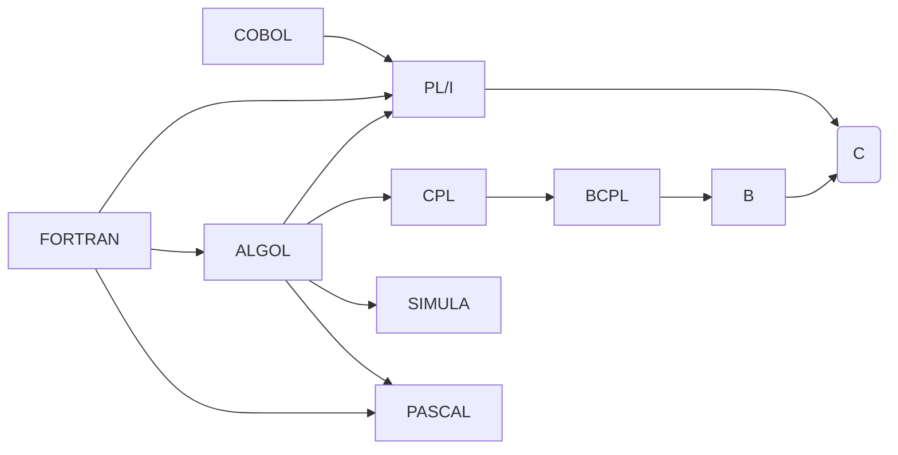

---
epigraph:
    text: "C is quirky, flawed, and an enormous success."
    source: Dennis Ritchie
---
# Le langage C

Le langage C est l'un des premiers langages de programmation dit de haut niveau. Il est très proche de l'assembleur: le langage de bas niveau des processeurs. Le C permet de programmer des applications très performantes. Il est utilisé dans de nombreux domaines de l'informatique, de l'embarqué à la programmation de système complexe à la simple [machine à café][mcu].

Même s'il est très ancien (1972), il continue d'être utilisé et enseigné, car il est très efficace et permet de comprendre les bases de la programmation.

À vrai dire, en 2024, il n'y a pas d'alternative viable au C pour programmer des applications embarquées, des systèmes d'exploitation ou des applications nécessitant des performances élevées.

[](){ #c-history }

## Historique { data-search-keyword="thompson"}

En 1964 naît, d'une collaboration avec les laboratoires Bell (*Bell Telephone Laboratories*), General Electric et le MIT, le projet [Multics](wiki:multics) (*Multiplexed Information and Computing Service*), qui vise le développement d'un nouveau système d'exploitation.

Malheureusement, la fin de la décennie est assez tumultueuse car les laboratoires Bell, ne croyant plus aux promesses de Multics, décidèrent de se retirer du projet pour créer leur propre système d'exploitation. Un groupe informel, dirigé notamment par [Ken Thompson](wiki:ken-thompson) et [Dennis Ritchie](wiki:dennis-ritchie), souhaitait revoir et améliorer certains concepts de Multics qu'ils n'appréciaient pas. Notamment le langage de programmation PL/I (*Programming Language number 1*), pourtant alors dominant pour l'écriture de systèmes d'exploitation. Ken Thompson avait développé le langage B, largement inspiré de BCPL, mais dans lequel il supprima tout ce qu'il ne pensait pas être essentiel pour pouvoir être utilisé sur de petits ordinateurs. L'un comme l'autre n'avaient qu'un seul type de donnée, à savoir le "mot" (*word*).

BCPL, qui fut conçu par Martin Richards au milieu des années 1960 pendant qu'il était en visite au MIT, n'est autre que le grand-père de B et l'arrière-grand-père de C. Dennis Ritchie, alors collègue de Ken Thompson, retravailla B pour y ajouter la gestion des types de données.

Ce système d'exploitation que Ken Thompson et Dennis Ritchie développaient au sein des laboratoires Bell se nommait initialement UNICS, en contradiction de Multics, là où *Multiplexed* fut remplacé par *Uniplexed*. Le nom fut ensuite modifié en UNIX, qui fut central dans l'histoire de l'informatique.

Par la suite, [Brian Kernighan](wiki:brian-kernighan) aida à populariser ce nouveau langage. Il est le principal auteur du livre "The C Programming Language", tandis que Dennis Ritchie s'est davantage occupé des annexes.

Les évolutions continuerons plus tard avec [Bjarne Stroustrup](wiki:bjarne-stroustrup) qui décidera d'étendre C en apportant une saveur nouvelle: la programmation orientée objet (OOP), qui fait l'objet d'un autre cours.


Il faut attendre 1989 pour que le langage C fasse l'objet d'une normalisation par l'ANSI (*American National Standards Institute*). L'année suivante le comité ISO (*International Organization for Standardization*) ratifie le standard *ISO/IEC 9899:1990* communément appelé **C90**. Dès lors, le langage C est devenu un standard international et devient le langage dominant dans le monde de l'informatique.


Les années se succèdent et le standard évolue pour soit corriger certaines de ses faiblesses soit pour apporter de nouvelles fonctionnalités.

Cinquante ans plus tard, C est toujours l'un des langages de programmation les plus utilisés par les ingénieurs, car il allie une bonne vision de haut niveau tout en permettant des manipulations de très bas niveau, de fait il est un langage de choix pour les applications embarquées à microcontrôleurs, ou lorsque l'optimisation du code est nécessaire pour obtenir de bonnes performances telles que les noyaux des systèmes d'exploitation comme le noyau Linux (Kernel) ou le noyau Windows.

Il faut retenir que **C** est un langage simple et efficace. Votre machine à café, votre voiture, vos écouteurs Bluetooth ont très probablement été programmés en C.

## Standardisation

Le langage C possède un grand historique, et il a fallu attendre près de 20 ans après sa création pour voir apparaître la première standardisation internationale.

Le standard le plus couramment utilisé en 2024 est encore [C99](http://www.open-std.org/jtc1/sc22/wg14/www/docs/n1256.pdf). C11 le remplace peu à peu dans l'industrie, mais la saga continue avec C17, C18 et C23 qui sont des évolutions.

Table: Normes internationales du langage C

| Notation courte | Standard international                                       | Date |
| --------------- | ------------------------------------------------------------ | ---- |
| C               | n/a                                                          | 1972 |
| K&R C           | n/a                                                          | 1978 |
| C89 (ANSI C)    | ANSI X3.159-1989                                             | 1989 |
| C90             | [ISO/IEC 9899:1990](https://www.iso.org/standard/17782.html) | 1990 |
| C99             | [ISO/IEC 9899:1999](https://www.iso.org/standard/29237.html) | 1999 |
| C11             | [ISO/IEC 9899:2011](https://www.iso.org/standard/57853.html) | 2011 |
| C17/C18         | [ISO/IEC 9899:2018](https://www.iso.org/standard/74528.html) | 2018 |
| C23             | [ISO/IEC 9899:2023](https://www.iso.org/standard/82075.html) | 2023 |

En substance, **C18** n'apporte pas de nouvelles fonctionnalités au langage, mais vise à clarifier de nombreuses zones d'ombres laissées par **C11**.

**C11** apporte peu de grands changements fondamentaux pour le développement sur microcontrôleur.

!!! info

    Vous entendrez ou lirez souvent des références à **ANSI C** ou **K&R**, préférez plutôt une compatibilité avec **C99** au minimum.

Le standard est lourd, difficile à lire et avec 552 pages pour C99, vous n'aurez probablement jamais le moindre plaisir à y plonger les yeux qui se rempliront de larmes à chaque lecture.

Armez-vous de mouchoirs, car l'investissement est pourtant parfois nécessaire pour comprendre certaines subtilités du langage qui sont rarement expliquées dans les livres. Pourquoi diable écrire un livre qui détaille l'implémentation C alors qu'il existe déjà ?

Vous vous demandez probablement : "pourquoi l'industrie a-t-elle autant de retard sur le dernier standard?" Lorsque Apple annonce sa dernière mouture d'iOS, chacun s'empresse de l'installer. En revanche, dans le milieu industriel, les machines et les processus sont réglés par des validations strictes qui décrivent les standards utilisés. Migrer vers un standard plus récent est une aventure. Il faut mettre à jour le code, faire des tests, encore et tests, et toujours plus de tests pour s'assurer que la fusée qu'on enverra sur Mars n'aura pas d'issue fatale. Ces validations sont longues et fastidieuses autant administrativement que techniquement. Ce qui est long est cher et bien souvent, les entreprises préfèrent rester fidèles à un ancien standard.

!!! exercise

    Ouvrez le standard [C99](http://www.open-std.org/jtc1/sc22/wg14/www/docs/n1256.pdf) et cherchez la valeur maximale possible de la constante `ULLONG_MAX`. Que vaut-elle ?

    ??? solution

        Au paragraphe §5.2.4.2.1-1 on peut lire que `ULLONG_MAX` est encodé sur 64-bits et donc que sa valeur est $2^{64}-1$ donc `18'446'744'073'709'551'615`.

## Le C et les autres...

Si ce cours se concentre sur le C, ce n'est pas le seul langage de programmation et surtout ce n'est certainement pas le seul que vous apprendrez.

Voici une liste non exhaustive de langages de programmation et de leur année de création. Cette liste est intéressante pour comprendre l'évolution des langages de programmation et leur utilisation:

Table: Langages de programmation et leur année de création

| Langage de programmation     | Année | Utilisation               |
| ---------------------------- | ----- | ------------------------- |
| [Fortran](wiki:fortran-lang) | 1957  | Calcul scientifique       |
| [Lisp](wiki:lisp-lang)       | 1958  | Intelligence artificielle |
| [Cobol](wiki:cobol-lang)     | 1959  | Finance, banque           |
| [Basic](wiki:basic-lang)     | 1964  | Enseignement              |
| [Pascal](wiki:pascal-lang)   | 1970  | Enseignement              |
| [C](wiki:c-lang)             | 1972  | Systèmes embarqués        |
| [C++](wiki:cpp-lang)         | 1985  | Applications lourdes      |
| [Perl](wiki:perl-lang)       | 1987  | Scripts                   |
| [Python](wiki:python-lang)   | 1991  | Ingénierie, sciences      |
| [Ruby](wiki:ruby-lang)       | 1995  | Scripts, Web              |
| [Java](wiki:java-lang)       | 1995  | Applications lourdes      |
| [PHP](wiki:php-lang)         | 1995  | Web                       |
| [C#](wiki:c-sharp)           | 2000  | Applications graphiques   |
| [Go](wiki:go-lang)           | 2009  | Systèmes distribués       |
| [Rust](wiki:rust-lang)       | 2010  | Systèmes embarqués        |
| [Swift](wiki:swift-lang)     | 2014  | Applications mobiles      |
| [Zig](wiki:zig-lang)         | 2016  | Systèmes embarqués        |

L'index [TIOBE](https://www.tiobe.com/tiobe-index/) est un bon indicateur de la popularité des langages de programmation. Il est mis à jour chaque mois et permet de suivre l'évolution de la popularité des langages de programmation.

En 2024, le top 10 des langages de programmation les plus populaires est le suivant :

Table: Top 10 des langages de programmation en 2024

| Top 10 | Langage de programmation |
| ------ | ------------------------ |
| 1      | Python                   |
| 2      | C++                      |
| 3      | C                        |
| 4      | Java                     |
| 5      | C#                       |
| 6      | JavaScript               |
| 7      | Go                       |
| 8      | SQL                      |
| 9      | Visual Basic             |
| 10     | Fortran                  |

Python est un langage de très haut niveau, simple à apprendre, mais éloigné du matériel. C++ est un langage de programmation orientée objet, très puissant, mais complexe à apprendre. C est un excellent compromis entre les deux, il est simple, mais permet de comprendre les bases de la programmation et de la manipulation du matériel. C'est pour cela que ce cours est basé sur le langage C. J'espère avoir réussi à vous convaincre.

[](){#structured-text-programming}

## Programmation texte structurée

Le C comme la plupart des langages de programmation utilise du texte structuré, c'est-à-dire que le langage peut être défini par un **vocabulaire**, une **grammaire** et se compose d'un **alphabet**.

À l'inverse des [langages naturels](https://en.wikipedia.org/wiki/Natural_language) comme le Français, un langage de programmation est un [langage formel](https://fr.wikipedia.org/wiki/Langage_formel) et se veut exact dans sa grammaire et son vocabulaire, il n'y a pas de cas particuliers ni d'ambiguïtés possibles dans l'écriture.

Les **compilateurs** sont ainsi construits autour d'une grammaire du langage qui est réduite au minimum par souci d'économie de mémoire, pour taire les ambiguïtés et accroître la productivité du développeur.

[](){ #omelette }

L'exemple suivant est un [pseudo-code](https://fr.wikipedia.org/wiki/Pseudo-code) utilisant une grammaire simple :

```text
POUR CHAQUE oeuf DANS le panier :
    jaune, blanc 🠔 CASSER(oeuf)
    omelette 🠔 MELANGER(jaune, blanc)
    omelette_cuite 🠔 CUIRE(omelette)

SERVIR(omelette_cuite)
```

La structure de la phrase permettant de traiter tous les éléments d'un ensemble d'éléments peut alors s'écrire :

```text
POUR CHAQUE 〜 DANS 〜:
    〜
```

Où les `〜` sont des marques substitutives ([placeholder](https://fr.wikipedia.org/wiki/Marque_substitutive)) qui seront remplacées par le développeur par ce qui convient.

Les grammaires des langages de programmation sont souvent formalisées à l'aide d'un métalangage, c'est-à-dire un langage qui permet de décrire un langage. La [grammaire][grammar] du langage C utilisé dans ce cours peut ainsi s'exprimer en utilisant la forme Backus-Naur ou **BNF** disponible en annexe.

[](){#paradigm}

## Les paradigmes de programmation

Chaque langage de programmation que ce soit C, C++, Python, ADA, COBOL et Lisp sont d'une manière générale assez proche les uns des autres. Nous citions par exemple le langage B, précurseur du C (c.f. [thompson]{c-history}). Ces deux langages, et bien que leurs syntaxes soient différentes, ils demeurent assez proches, comme l'espagnol et l'italien qui partagent des racines latines. En programmation on dit que ces langages partagent le même [paradigme de programmation](https://fr.wikipedia.org/wiki/Paradigme_(programmation)).

Certains paradigmes sont plus adaptés que d'autres à la résolution de certains problèmes et de nombreux langages de programmation sont dit **multi-paradigmes**, c'est-à-dire qu'ils supportent différents paradigmes.

Nous citions plus haut le C++ qui permet la programmation orientée objet, laquelle est un paradigme de programmation qui n'existe pas en C.

Ce qu'il est essentiel de retenir c'est qu'un langage de programmation peut aisément être substitué par un autre pour autant qu'ils s'appuient sur les mêmes paradigmes.

Le langage C répond aux paradigmes suivants :

[Impératif](https://fr.wikipedia.org/wiki/Programmation_imp%C3%A9rative)

: programmation en séquences de commandes, qui se lisent de haut en bas.

[Structuré](https://fr.wikipedia.org/wiki/Programmation_structur%C3%A9e)

: programmation impérative avec des structures de contrôle imbriquées, comme les boucles et les conditions.

[Procédural](https://fr.wikipedia.org/wiki/Programmation_proc%C3%A9durale)

: programmation impérative avec appels de procédures qui regroupent des instructions.

Le C++ quant à lui apporte les paradigmes suivants à C :

[Fonctionnel](https://fr.wikipedia.org/wiki/Programmation_fonctionnelle)

: programmation basée sur l'appel de fonction. Utilisé dans les langages Lisp, Haskell, Erlang.

[Orienté objet](https://fr.wikipedia.org/wiki/Programmation_orient%C3%A9e_objet)

: programmation basée sur la définition de classes et d'objets. Utilisé dans les langages C++, Java, Python. Une classe associe des données a des actions qui manipulent ces données.

Des langages de plus haut niveau comme Python ou C# apportent davantage de paradigmes comme la [programmation réflective](https://fr.wikipedia.org/wiki/R%C3%A9flexion_(informatique)).

Ce que nous devons retenir c'est que le langage C est impératif et procédural, c'est-à-dire qu'il est basé sur des séquences d'instructions qui se lisent de haut en bas, lesquelles peuvent être regroupées en procédures. Si nous reprenons notre exemple de l'[omelette][omelette], si nous souhaitons réaliser une pâte à crêpes nous pourrions écrire :

```text
POUR REALISER un oeuf:
    CHERCHER poule
    oeuf 🠔 PONDRE(poule)

POUR REALISER du lait:
    CHERCHER vache
    lait 🠔 TRAITRE(vache)

POUR REALISER de la farine:
    PLANTER blé
    ATTENDRE 6 mois
    moisson 🠔 MOISSONNER(blé)
    farine 🠔 MOUDRE(moisson)

POUR REALISER une pâte à crèpes:
    oeuf 🠔 REALISER(oeuf)
    jaune, blanc 🠔 CASSER(oeuf)
    oeuf-liquide 🠔 MELANGER(jaune, blanc)
    farine 🠔 REALISER(farine)
    lait 🠔 REALISER(lait)
    pâte 🠔 MELANGER(oeuf-liquide, farine, lait)
```

On a regroupé des instructions en procédures pour réaliser une pâte à crêpes. C'est ce que l'on appelle la programmation procédurale.

## Cycle de développement

Le cycle de développement logiciel comprend la suite des étapes menant de l'étude et l'analyse d'un problème jusqu'à la réalisation d'un programme informatique exécutable. Dans l'industrie, il existe de nombreux modèles comme le [Cycle en V](https://fr.wikipedia.org/wiki/Cycle_en_V) ou le [modèle en cascade](https://fr.wikipedia.org/wiki/Mod%C3%A8le_en_cascade). Quel que soit le modèle utilisé, il comprendra les étapes suivantes :

1. **Étude** et analyse du problème
2. Écriture d'un **cahier des charges** (spécifications)
3. Écriture de **tests** à réaliser pour tester le fonctionnement du programme
4. **Conception** d'un algorithme
5. **Transcription** de cet algorithme en utilisant le langage C
6. **Compilation** du code et génération d'un exécutable
7. **Test** de fonctionnement
8. **Vérification** que le cahier des charges est respecté
9. **Livraison** du programme

Mis à part la dernière étape où il n'y a pas de retour en arrière possible, les autres étapes sont **itératives**. Il est très rare d'écrire un programme juste du premier coup. Durant tout le cycle de développement logiciel, des itérations successives sont faites pour permettre d'optimiser le programme, de résoudre des bogues, d'affiner les spécifications, d'écrire davantage de tests pour renforcer l'assurance d'un bon fonctionnement du programme et éviter une coulée de lave [](){#code_smell}.

Le modèle en cascade suivant résume le cycle de développement d'un programme. Il s'agit d'un modèle simple, mais qu'il faut garder à l'esprit que ce soit pour le développement d'un produit logiciel que durant les travaux pratiques liés à ce cours.


## Cycle de compilation

Le langage C à une particularité que d'autres langages n'ont pas, c'est-à-dire qu'il comporte une double [grammaire][grammar]. Le processus de compilation s'effectue donc en deux passes.

1. Préprocesseur qui enlève les commentaires et inclut les fichiers nécessaires.
2. Compilation du code source en fichiers objet.

Vient ensuite la phase d'édition des liens ou *linkage* lors de laquelle l'exécutable binaire est créé.


Voyons plus en détail chacune de ces étapes.

### Préprocesseur (*pre-processing*)

La phase de *preprocessing* permet de générer un fichier intermédiaire en langage C dans lequel toutes les instructions nécessaires à la phase suivante sont présentes. Le *preprocessing* réalise :

- Le remplacement des [définitions][preprocessor-define] par leurs valeurs (`#define`),
- Le remplacement des [fichiers inclus][preprocessor-include] par leurs contenus (`#include`),
- La conservation ou la suppression des zones de compilation conditionnelles (`#if`, `#ifdef`, `#elif`, `#else`, `#endif`).
- La suppression des commentaires (`#!c /* ... */`, `#!c // ...`)

Avec `gcc` il est possible de demander que l'exécution du préprocesseur en utilisant l'option `-E`.


### Compilation (*build*)

La phase de compilation consiste en une analyse syntaxique du fichier à compiler puis en sa traduction en langage assembleur pour le processeur cible. Le fichier généré est un fichier binaire (extension `.o` ou `.obj`) qui sera utilisé pour la phase suivante. Lors de la *compilation*, des erreurs peuvent survenir et empêcher le déroulement complet de la génération de l'exécutable final. Là encore, la correction des erreurs passe toujours par un examen minutieux des messages d'erreur, en commençant toujours par le premier.

Avec `gcc` il est possible de ne demander que l'assemblage d'un code avec l'option `-S`.


### Édition de liens (*link*)

La phase d'édition de liens permet de rassembler le fichier binaire issu de la compilation et les autres fichiers binaires nécessaires au programme pour former un exécutable complet. Les autres fichiers binaires sont appelés des **librairies**. Elles peuvent appartenir au système (installée avec l'environnement de développement) ou provenir d'autres applications avec lesquelles votre programme doit interagir. Lors de l'édition de liens, des erreurs peuvent survenir et empêcher le
déroulement complet de génération de l'exécutable final. Là encore, la correction des erreurs passe toujours par un examen minutieux des messages d'erreur, en commençant toujours par le premier.


[](){#hello-world}

## Hello World!

Il est traditionnellement coutume depuis la publication en 1978 du livre [The C Programming Language](https://en.wikipedia.org/wiki/The_C_Programming_Language) de reprendre l'exemple de Brian Kernighan comme premier programme.

```c title="hello.c"
--8<-- "docs/assets/src/hello.c"
```

Ce programme est composé de deux parties. L'inclusion de la *library* standard d'entrées sorties (*STandarD Inputs Outputs*) qui définit la fonction `printf`, et le programme principal nommé `main`. Tout ce qui se situe à l'intérieur des accolades `{ }` appartient au programme `main`.

L'ensemble que définit `main` et ses accolades est appelé une fonction, et la tâche de cette fonction est ici d'appeler une autre fonction `printf` dont le nom vient de *print formatted*.

L'appel de `printf` prend en **paramètre** le texte `Hello world!\n` dont le `\n` représente un retour à la ligne.

Une fois le code écrit, il faut le compiler. Pour bien comprendre ce que l'on fait, utilisons la ligne de commande ; plus tard, l'IDE se chargera de l'opération automatiquement.

Une console lancée ressemble à ceci, c'est intimidant si l'on n’en a pas l'habitude, mais vraiment puissant.

```bash
$
```

La première étape est de s'assurer que le fichier `test.c` contient bien notre programme. Pour ce faire on utilise un autre programme [cat]https://fr.wikipedia.org/wiki/Cat_(Unix)) qui ne fait rien d'autre que lire le fichier passé en argument et de l'afficher sur la console :

```bash
$ cat hello.c
#include <stdio.h>

int main( )
{
    printf("hello, world");
}
```

À présent on peut utiliser notre compilateur par défaut: `cc` pour *C Compiler*. Ce compilateur prend en argument un fichier C et sans autre option, il génèrera un fichier [a.out](https://fr.wikipedia.org/wiki/A.out) pour *assembler output*. C'est un fichier exécutable que l'on peut donc exécuter.

```bash
$ gcc hello.c
```

Il ne s'est rien passé, c'est une bonne nouvelle. La philosophie Unix est qu'un programme soit le plus discret possible, comme tout s'est bien passé, inutile d'informer l'utilisateur.


On s'attend donc à trouver dans le répertoire courant, notre fichier source ainsi que le résultat de la compilation. Utilisons le programme [ls](https://fr.wikipedia.org/wiki/Ls) pour le vérifier.

```bash
$ ls
hello.c       a.out
```

Très bien ! À présent, exécutons le programme en prenant soin de préfixer le nom par, `./` car étant un programme local `a.out` ne peut pas être accédé directement. Imaginons qu'un fourbe hackeur ait décidé de créer dans ce répertoire un programme nommé `ls` qui efface toutes vos données. La ligne de commande ci-dessus aurait eu un effet désastreux. Pour remédier à ce problème de sécurité, tout programme local doit être explicitement nommé.

```console
$ ./a.out
hello, world
```

Félicitations, le programme s'est exécuté.

Pouvons-nous en savoir plus sur ce programme ? On pourrait s'intéresser à la date de création de ce programme ainsi qu'à sa taille sur le disque. Une fois de plus `ls` nous sera utile, mais cette fois-ci avec l'option `l`:

```console
$ ls -l a.out
-rwxr-xr-- 1 ycr iai 8.2K Jul 24 09:50 a.out*
```

Décortiquons tout cela:

```console
-             Il s'agit d'un fichier
rwx           Lisible (r), Éditable (w) et Exécutable (x) par le propriétaire
r-x           Lisible (r) et Exécutable (x) par le groupe
r--           Lisible (r) par les autres utilisateurs
1             Nombre de liens matériels pour ce fichier
ycr           Nom du propriétaire
iai           Nom du groupe
8.2K          Taille du fichier, soit 8200 bytes soit 65'600 bits
Jul 24 09:50  Date de création du fichier
a.out         Nom du fichier
```

!!! note

    Les puristes peuvent se demander s'il faut écrire `hello, world`, `hello, world!` ou `Hello, world!\n`. Dans son livre, Brian Kernighan a choisi `hello, world\n` et c'est ce que nous avons repris ici.

    Outre le caractère pinailleur de cette remarque qui prête attention aux détails, il peut être noté que la casse des caractères est importante en informatique. `Hello` n'est pas la même chose que `hello`, le stockage en mémoire n'est pas le même, et donc le résultat de l'exécution d'un programme peut être différent.

    Il est donc essentiel d'avoir l'oeil sur ces détails, vous le verrez par la suite, vous développerez une certaine facilité à repérer les `;` manquants, les `{}` mal placées, les `==` qui devraient être `=`, etc.

    Mais avant tout, c'est la cohérence de l'ensemble qui doit primer. Si vous avez choisi d'écrire `Hello, World!`, alors écrivez-le partout de la même manière, dans tous vos exemples, dans tous vos commentaires, dans toute votre documentation.

## Exercices de Révision

!!! exercise "Hello World"

    Pouvez-vous écrire, puis compiler votre premier programme en C ? Rédiger le programme `hello.c` qui affiche `Hello, World!` à l'écran.

    Exécutez le programme et vérifiez que le message s'affiche bien.

!!! exercise "Auteurs"

    Qui a inventé le C ?

    - [x] Ken Thompson
    - [ ] Brian Kernighan
    - [ ] Bjarne Stroustrup
    - [ ] Linus Torvalds
    - [x] Dennis Ritchie
    - [ ] Guido van Rossum

!!! exercise "Standardisation"

    Quel est le standard C à utiliser dans l'industrie en 2024 et pourquoi ?

    - [ ] C89
    - [ ] C99
    - [ ] C11
    - [x] C17
    - [ ] C23

    ??? solution

        Le standard industriel, malgré que nous soyons en 2024 est toujours
        **ISO/IEC 9899:2017**, car peu de changements majeurs ont été apportés
        au langage depuis et les entreprises préfèrent migrer sur C++ plutôt
        que d'adopter un standard plus récent qui n'apporte que peu de changements.

!!! exercise "Paradigmes"

    Quels est le paradigme de programmation supportés par C ?

    - [ ] Fonctionnel
    - [ ] Orienté objet
    - [ ] Réflectif
    - [x] Impératif
    - [ ] Déclaratif

    ??? solution

        C supporte les paradigmes impératifs, structurés et procédural.

!!! exercise "Langage impératif"

    Pourriez-vous définir ce qu'est la programmation impérative ?

    ??? solution

        La programmation impérative consiste en des séquences de commandes ordonnées.
        C'est-à-dire que les séquences sont exécutées dans un ordre définis les unes à la suite d’autres.

!!! exercise "Coulée de lave"

    Qu'est-ce qu'une coulée de lave en informatique ?

    ??? solution

        Lorsqu'un code immature est mis en production, l'industriel qui le publie risque un retour de flamme dû aux bogues et mécontentement des clients. Afin d'éviter une *coulée de lave*
        il est important qu'un programme soit testé et soumis à une équipe de *beta-testing* qui
        s'assure qu'outre le respect des spécifications initiales, le programme soit utilisable
        facilement par le public cible. Il s'agit aussi d'étudier l'ergonomie du programme.

        Un programme peut respecter le cahier des charges, être convenablement testé, fonctionner parfaitement, mais être difficile à l'utilisation, car certaines fonctionnalités sont peu ou pas documentées. La surcharge du service de support par des clients perdus peut également être assimilée à une coulée de lave.

!!! exercise "Cat"

    Qu'est-ce que `cat`?

    - [ ] Un programme de chat
    - [ ] Un programme de compilation
    - [x] Un programme d'affichage de fichiers
    - [ ] Un programme de copie de fichiers
    - [ ] Un programme de recherche de fichiers

    ??? solution

        `cat` est un programme normalisé POSIX prenant en entrée un fichier et l'affichant à l'écran. Il est utilisé notamment dans cet ouvrage pour montrer que le contenu du fichier `hello.c` est bel et bien celui attendu.
