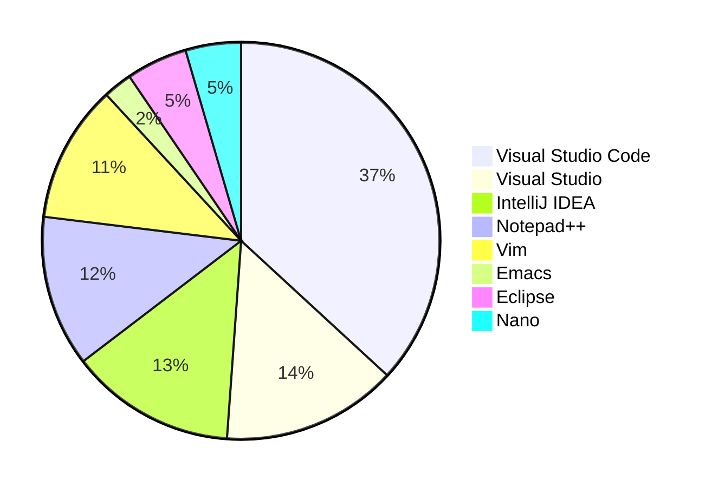

# Mon ordinateur et moi

Vous êtes devant votre ordinateur, vous avez en théorie un clavier devant vous, une souris à droite de votre clavier, et un ou plusieurs écrans devant vous. Votre ordinateur démarre et vous verrez apparaître très probablement soit :

- une pomme croquée (Apple);
- une fenêtre à carreaux (Windows);
- un manchot Adélie (Linux).

C'est votre système d'exploitation et peu importe lequel vous avez, la bonne nouvelle c'est que vous pourrez écrire vos premiers programmes avec n'importe lequel de ces systèmes.

## Système d'exploitation

Dans cet ouvrage, la plupart des exemples seront donnés sous Linux. Linux présente l'avantage d'être normalisé et de suivre les standards POSIX, lesquels sont communs, du moins en partie avec macOS. Windows, quant à lui, est un peu à part, mais il est possible d'installer un sous-système Linux pour Windows (WSL2), ce qui permet d'exécuter des programmes Linux sur Windows.

Le système d'exploitation c'est aussi un programme qui offre une couche d'abstraction entre le matériel et les autres programmes. On peut le voir comme le chef d'orchestre de votre ordinateur. Il permet de gérer les ressources matérielles, de lancer des programmes, de gérer les fichiers, de gérer les utilisateurs, etc.

## Éditeur de code source

Pour écrire un programme, vous aurez besoin d'un *éditeur de code*, c'est un programme (oui, lui aussi) qui vous permet d'écrire du texte et de le sauvegarder dans un fichier. Il en existe des centaines !

Si vous prenez une Doloréane munie d'un convecteur temporel, et que vous dépassez les 88 miles à l'heure, avec une énergie de 2.21 Gigot-Watt vous pouvez vous rendre en 1973 et utiliser un éditeur de code qui s'appelle `ed` (prononcé "idi") écrit par Ken Thompson (un des créateurs d'Unix et du langage C, mais nous reviendrons sur lui).

C'est un éditeur qui a été écrit à l'époque des [télétypes][teletype] et qui, curieusement a traversé les âges car il est encore intégré au standard POSIX. Il est par conséquent toujours disponible sur nos systèmes d'exploitation modernes. Il faut noter qu'à cette époque il n'y avait pas d'écran, et que l'on utilisait des imprimantes pour afficher le texte. L'éditeur n'est donc pas très interactif, mais il a le mérite d'exister.

C'est un des premier éditeur modale, son utilisation est assez déroutante car il n'y a pas de retour visuel immédiat. Il faut taper des commandes pour écrire du texte, pour sauvegarder, pour quitter, etc. Voici l'exemple pour éditer `hello.c` :

```text
$ ed
a
void main() {
    printf("hello, world"); }
.
1
void main() {
s/void/int/
1i
#include <stdio.h>
.
w hello.c
62
q
```

Dans les étapes ci-dessus, nous avons : (1) lancé l'éditeur `ed`, (2) écrit `a` pour passer en mode édition, (3) écrit le code, puis (4) saisi `.` pour revenir en mode commande. Nous avons (5) entré `1` pour afficher la première ligne (qui comporte une erreur) puis (6) saisi `s/void/int/` pour remplacer `void` par `int`. Nous avons (7) tapé `1i` pour insérer une ligne avant la première ligne puis (8) écrit `#include <stdio.h>` que l'on a oublié et (9) entré `.` pour revenir en mode commande. Enfin (10) écrit `w hello.c` pour sauvegarder le fichier et (11) `q` pour quitter l'éditeur.

Rappelons que ce programme est écrit en C. Donc le plus amusant, c'est que vous pouvez le compiler, le modifier et même ajouter des fonctionnalités. On trouve bien entendu le code source sur [GitHub](https://raw.githubusercontent.com/yves-chevallier/ed/master/main_loop.c).

Trève de plaisanteries, vous n'allez probablement pas utiliser `ed` mais connaître son existence permet de mieux saisir le contexte général. Je vous propose de continuer un peu notre voyage spatio-temporel...

En 1991 naît un éditeur de code qui va révolutionner le monde de la programmation, il s'appelle `vim`. C'est un éditeur de code qui est très puissant, mais qui a une courbe d'apprentissage assez velue. Il est toujours très utilisé de nos jours, et il est disponible sur tous les systèmes d'exploitation. Vous seriez surpris de constater le nombre de programmeurs qui l'utilisent encore. Comme `ed`, c'est un éditeur modal: un mode pour écrire du texte, un mode pour éditer du texte, un mode pour naviguer dans le texte, etc.

Puisque nous nommons Vim, nous devons aussi nommer Emacs. Le rival de Vim. Emacs est un éditeur de code qui est aussi très puissant mais il semble moins utilisé de nos jours. Vim comme Emacs sont disponibles sur tous les systèmes d'exploitation.


Nous ferons l'impasse sur d'autres éditeurs qui ont été populaires en leurs temps, mais qui sont technologiquement dépassés : TextPad, UltraEdit, Sublime Text, Atom, NotePad++... Le grand gagnant de ces dernières années est Visual Studio Code, un éditeur de code qui est très puissant, qui est très utilisé de nos jours, et qui est aussi disponible sur tous les systèmes d'exploitation.

Le résultat de l'étude annuelle 2023 de [Stackoverflow](https://survey.stackoverflow.co/2023/#overview) donne une idée de la popularité des éditeurs et IDE les plus utilisés par les développeurs :



### Fonctionnalités attendues

Coloration Synatxique (*syntax highlighting*)

: L'éditeur de code colore les mots-clés du langage de programmation que vous utilisez. Cela permet de mieux visualiser la structure du code.

Correspondance des parenthèses (*brace matching*)

: L'éditeur de code vous permet de voir la correspondance des parenthèses, accolades, crochets, etc. Cela permet de voir en un tournemain si vous avez oublié une parenthèse.

Indentation automatique (*auto-indent*)

: L'éditeur de code vous permet d'indenter automatiquement votre code. Cela permet de voir la structure du code. Il est consensuellement admis qu' une région de code sélectionnée peut être indentée avec ++tab++ et désindentée avec ++shift+tab++.

Repli de code (*code folding*)

: L'éditeur de code vous permet de replier le code. En cliquant sur une petite flèche à gauche du code, vous pouvez replier le code pour ne voir que les en-têtes des fonctions, des boucles, des conditions, etc.

Structure du code (*outline*)

: L'éditeur de code vous permet de voir dans une fenêtre séparée les éléments de votre code. Cela permet de naviguer rapidement dans votre code.

Navigation hiérarchique (*go to definition*)

: L'éditeur de code vous permet de naviguer rapidement dans votre code. En cliquant sur un mot-clé, vous pouvez vous rendre à la définition de ce mot-clé. Habituellement ++alt+arrow-left++ vous permet de revenir en arrière là où vous étiez.

Expressions régulières (*regular expressions*)

:   L'éditeur de code vous permet de rechercher ou remplacer des éléments en utilisant des expressions régulières. Par exemple si vous voulez inverser l'ordre des mots écrits, vous activez le mode regex (▪⃰ dans vscode). Vous pouvez alors utiliser l'expression régulière suivante :

    ```text
    /(M.|Mme.)\s+([^ ]+)\s+([^ ]+)/\1 \3 \2/

    Qui permet d'inverser le prénom et le nom.

    M. Yves Chevallier` --> M. Chevallier Yves
    ```

Multicurseurs (*multi-cursor*)

: L'éditeur de code vous permet de placer plusieurs curseurs dans votre code. Cela permet de modifier plusieurs lignes en même temps.

Complétion automatique (*auto-completion*)

: L'éditeur de code vous permet de compléter automatiquement le code en utilisant la touche ++tab++. Il utilise une technologie nommée *IntelliSense* qui, en ayant connaissance des mots-clés du langage de programmation et de ce que vous avez déjà écrit, vous propose les possibilités de complétion.

Intelligence artificielle (*AI*)

: L'éditeur de code vous permet de compléter automatiquement le code en utilisant une intelligence artificielle.

Gestion d'extensions (*extensions*)

: L'éditeur de code vous permet d'ajouter des extensions permettant d'ajouter des fonctionnalités à votre éditeur de code.

Intégration du terminal (*terminal integration*)

: L'éditeur de code vous permet d'intégrer un terminal (TTY) dans votre éditeur de code pour lancer directement des commandes.

Intégration de Git (*git integration*)

: L'éditeur de code vous permet d'intégrer Git dans votre éditeur de code pour gérer les versions de votre code.

## Compilateur

Un **compilateur** est un programme qui permet de transformer un programme écrit dans un langage de programmation en un programme exécutable. Il existe de nombreux compilateurs, et chaque langage de programmation a son propre compilateur.

En C, les compilateurs les plus populaires et qui respectent les normes sont GCC et CLANG.

[GCC](https://gcc.gnu.org/)

: Un **compilateur** *open-source* utilisé sous Linux et macOS. Il est sous licence GPL.

[CLANG](https://clang.llvm.org/)

: Un **compilateur** *open-source* gagnant en popularité, une alternative à GCC. Il est sous licence Apache et utilise la bibliothèque LLVM.

## IDE

Un **IDE** est un *Integrated Development Environment*, c'est un environnement de développement intégré. C'est un programme qui vous permet d'écrire du code, de le compiler, de le déboguer, de le tester, de le déployer, etc.

Tous les éditeurs ne sont pas des IDE, mais tous les IDE sont des éditeurs. En fin de compte, un IDE est un éditeur qui a des fonctionnalités supplémentaires telles que:

- Un compilateur
- Un débogueur avec des points d'arrêt
- Gestion de paramètres par projet
- Gestion de dépendances logicielles
- Gestion de versions

Un autre composant essentiel de l'environnement de développement est le **compilateur**. Il s'agit généralement d'un ensemble de programmes qui permettent de convertir le **code** écrit en un programme exécutable. Ce programme peut-être par la suite intégré dans un *smartphone*, dans un système embarqué sur un satellite, sur des cartes de prototypage comme un Raspberry PI, ou encore sur un ordinateur personnel.

L'ensemble des outils nécessaire à créer un produit logiciel est appelé chaîne de compilation, plus communément appelée [toolchain](https://fr.wikipedia.org/wiki/Cha%C3%AEne_de_compilation).

Figure: Représentation graphique des notions de compilateur, IDE, toolchain...


!!! exercise "Eclipse"

    Un ami vous parle d'un outil utilisé pour le développement logiciel nommé **Eclipse**. De quel type d'outil s'agit-il ?

    ??? solution

        [Eclipse](https://www.eclipse.org/ide/) est un IDE. Il n'intègre donc pas de chaîne de compilation et donc aucun compilateur.

!!! exercise "Stack Overflow"

    Combien y a-t-il eu de questions posées en C sur le site Stack Overflow?

    ??? solution

        Il suffit pour cela de se rendre sur le site de [Stackoverflow](https://stackoverflow.com/tags/c) et d'accéder à la liste des tags. En 2019/07 il y eut 307'669 questions posées.

        Seriez-vous capable de répondre à une question posée?
