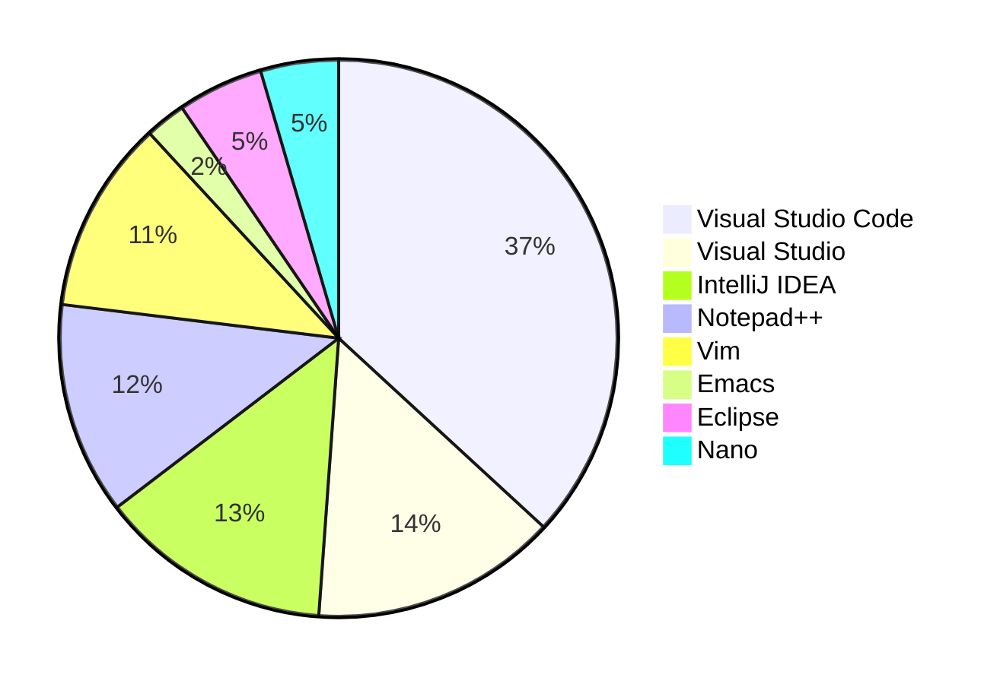

# Mon ordinateur et moi

Vous êtes devant votre ordinateur, probablement équipé d’un clavier, d’une souris et d’un ou plusieurs écrans. Au démarrage apparaissent généralement :

- une pomme croquée (:fontawesome-brands-apple: Apple);
- une fenêtre à carreaux (:fontawesome-brands-windows: Windows);
- un manchot Adélie (:fontawesome-brands-linux: Linux).

Le responsable de cet écran de démarrage est votre système d’exploitation. Peu importe celui que vous utilisez : la bonne nouvelle, c’est que vous pourrez écrire vos premiers programmes.

Prenons donc un moment pour mieux apprivoiser la machine.

## Système d'exploitation

Dans cet ouvrage, la plupart des exemples seront présentés sous Linux. Ce n’est pas uniquement un choix de cœur : Linux est largement normalisé et respecte en grande partie le standard POSIX, comme le fait d’ailleurs Apple macOS. Sous Windows, il est même possible d’installer un sous-système Linux nommé WSL2 (*Windows Subsystem for Linux*), qui facilite l’exécution de programmes Linux dans un environnement Windows. Quelle que soit votre obédience *geeko-spirituelle*, vous pourrez donc suivre les exemples du cours.

Rappelons qu’un système d’exploitation n’est, en essence, qu’un programme sophistiqué faisant l’intermédiaire entre le matériel et les autres logiciels. On peut le comparer à un ou une cheffe d’orchestre qui coordonne les ressources de l’ordinateur, lance les programmes, gère les fichiers et supervise les utilisatrices et utilisateurs. C’est une **couche d’abstraction** qui permet à la machine de fonctionner harmonieusement tout en masquant la complexité du matériel. Inutile de vous soucier des milliards de changements d’état électroniques par seconde dans le processeur ou des millions de pixels de l’écran capables d’afficher seize millions de couleurs, soixante fois par seconde.

Votre système d’exploitation constitue ainsi votre interface humain-machine cohérente et conviviale.

## Éditeur de code source

Pour écrire un programme, vous aurez besoin d’un **éditeur de code**, lui aussi un logiciel, qui vous permet de saisir du texte et de le sauvegarder dans un fichier. Il en existe des centaines, certains plus aboutis que d’autres.

Si vous trouvez une [DeLorean DMC-12](https://fr.wikipedia.org/wiki/DeLorean_(Retour_vers_le_futur)) munie d’un convecteur temporel et que vous dépassez les 88 miles à l’heure avec 2,21 gigowatts d’énergie, vous pourriez vous retrouver en 1973 et utiliser `ed`, un éditeur de code prononcé « idi », écrit par Ken Thompson (l’un des créateurs d’Unix et du langage C, que nous évoquerons plus loin).

C’est un éditeur de texte né à l’époque des [télétypes][teletype] et qui, curieusement, a traversé les âges puisqu’il est toujours intégré au standard POSIX. Il reste donc disponible sur nos systèmes d’exploitation modernes. Toutefois, à cette époque, les écrans n’existaient pas et l’on utilisait des imprimantes pour afficher les résultats ; cet éditeur primitif n’était donc guère interactif.

Autre fait notable : `ed` est l’un des premiers éditeurs dits *modaux*. Son utilisation peut sembler déroutante, car il n’offre aucun retour visuel immédiat — rassurez-vous, on n’imprimait pas chaque lettre tapée ! Pour saisir du texte, il fallait donc exécuter des commandes : certaines pour sauvegarder, d’autres pour quitter, rechercher ou remplacer. Un exemple vaut mieux qu’un long discours. Imaginons que nous voulions saisir le poème « L’Albatros » de Charles Baudelaire dans un fichier nommé `albatros.txt`. Voici comment procéder :

[](){#ed}

```text
$ ed
a
Souvent, pour s'amuser, les homes d'équipage
Prennent des albatros,
vastes oiseaux des mers,
Le navire glissant sur les gouffres amers.
.
i
Qui suivent, indolents compagnons de voyage,
.
2,3j
,p
Souvent, pour s'amuser, les homes d'équipage
%s/homes/hommes/g
w albatros.txt
164
q
```

Dans les étapes ci-dessus, nous avons lancé l’éditeur `ed`, puis basculé en mode insertion avec la commande `a` pour ajouter du texte. Faute de retour visuel, il est difficile de s’assurer de l’orthographe. À la fin de la saisie, on revient au mode commande avec `.` puis on insère une nouvelle ligne grâce à `i`. Passons ensuite aux corrections : nous savons qu’un retour à la ligne superflu s’est glissé entre les lignes 2 et 3 ; la commande `2,3j` (*joindre les lignes 2 et 3*) les fusionne. Nous imprimons ensuite la première ligne avec `1p` (*print ligne 1*). Constatant l’erreur, nous remplaçons `homes` par `hommes` avec `%s/homes/hommes/g`. Enfin, nous sauvegardons le fichier avec `w albatros.txt`, ce qui retourne (toujours sur l’imprimante) le nombre de caractères enregistrés, soit `164`. Ce petit exercice s’achève par la commande `q` qui permet de quitter `ed`.

Trêve de plaisanteries : vous n’utiliserez sans doute jamais `ed` au quotidien. Connaître son existence aide toutefois à mieux comprendre l’histoire de nos outils. Continuons donc notre petit voyage spatio-temporel…

En 1991 naît un éditeur de code qui révolutionne le monde de la programmation : `vim` (*Vi Improved*). Puissant et versatile, il s’accompagne d’une courbe d’apprentissage assez… velue. Il demeure très utilisé aujourd’hui et est disponible sur tous les systèmes d’exploitation. De plus, la plupart des éditeurs modernes proposent une extension qui émule, au moins partiellement, les comportements de `vim`. Comme `ed`, c’est un éditeur modal : un mode pour écrire, un autre pour éditer, un pour naviguer, un pour saisir des commandes, etc.

Puisque nous évoquons Vim, mentionnons aussi son rival historique : Emacs. Inventé par Richard Stallman, figure fondatrice du logiciel libre, Emacs est lui aussi incroyablement puissant, même s’il semble un peu moins utilisé aujourd’hui. Si je souligne leur rivalité, c’est parce que leurs adeptes sont très passionné·es et défendent âprement leur éditeur favori. Le sujet nourrit même bon nombre de blagues d’informaticiennes et d’informaticiens :


Je passe rapidement sur d’autres éditeurs qui ont connu leur heure de gloire mais paraissent aujourd’hui dépassés : TextPad, UltraEdit, Sublime Text, Atom, Notepad++… L’Usain Bolt — ou le Michael Phelps — des éditeurs actuels, c’est Visual Studio Code, l’outil phare de Microsoft qui a conquis les doigts agiles des développeuses et développeurs du monde entier. Gratuit, open source et disponible sur tous les systèmes d’exploitation, il s’enrichit d’innombrables extensions (notamment l’extension Vim utilisée par plus de 6,7 millions de personnes et l’extension Emacs par 55 000 personnes). Rapide, puissant et bien intégré aux outils que nous utiliserons, il reste l’éditeur que je vous recommande… jusqu’à la prochaine révolution.

Pour être plus factuel, l’enquête annuelle 2023 de [Stack Overflow](https://survey.stackoverflow.co/2023/#overview) donne une idée assez fidèle de la popularité des éditeurs et environnements de développement intégrés les plus utilisés par les personnes qui programment :



### Fonctionnalités attendues

Les éditeurs modernes, contrairement à des outils basiques comme *Notepad* sous Windows, regorgent de fonctionnalités qui facilitent la vie des développeuses et développeurs. Voici quelques exemples :

Coloration syntaxique (*syntax highlighting*)

: L’éditeur de code colorise les mots-clés du langage utilisé, les parenthèses ou encore les erreurs. Cette mise en couleur facilite la compréhension de la structure.

Correspondance des parenthèses (*brace matching*)

: L’éditeur de code vous montre les paires de parenthèses, accolades ou crochets, ce qui permet de repérer immédiatement une parenthèse fermante oubliée.

Indentation automatique (*auto-indent*)

: L’éditeur de code ajuste automatiquement l’indentation, ce qui met en évidence la structure du programme. Il est d’usage qu’une zone sélectionnée s’indente avec ++tab++ et se désindente avec ++shift+tab++.

Repli de code (*code folding*)

: L’éditeur permet de replier certaines sections. En cliquant sur une petite flèche, vous regroupez les éléments hiérarchiques pour mieux percevoir la structure.

Structure du code (*outline*)

: Une fenêtre dédiée affiche les éléments clés de votre programme, ce qui facilite une navigation rapide.

Navigation hiérarchique (*go to definition*)

: L’éditeur vous aide à naviguer rapidement entre différents fichiers. Un clic sur un symbole vous conduit à sa définition ailleurs dans le projet, et ++alt+arrow-left++ permet généralement de revenir en arrière.

Expressions régulières (*regular expressions*)

:   L’éditeur vous permet d’effectuer des recherches ou remplacements grâce aux expressions régulières. Par exemple, pour inverser l’ordre des mots, activez le mode *regex* (▪⃰ dans VS Code) et utilisez l’expression suivante :

    ```text
    /(M.|Mme.)\s+([^ ]+)\s+([^ ]+)/\1 \3 \2/

    qui inverse le prénom et le nom :

    `M. Yves Chevallier` → `M. Chevallier Yves`
    ```

Multicurseurs (*multi-cursor*)

: L’éditeur vous permet de placer plusieurs curseurs pour modifier plusieurs lignes ou mots en même temps. Dans VS Code, vous ajoutez un curseur avec ++alt++ et vous sélectionnez le prochain mot identique avec ++ctrl+d++.

Complétion automatique (*auto-completion*)

: L’éditeur propose la complétion automatique du code via ++tab++. Grâce à la technologie *IntelliSense*, qui connaît les mots-clés du langage et ce que vous avez déjà écrit, il suggère des complétions pertinentes.

Intelligence artificielle (*AI*)

: Certains éditeurs s’appuient désormais sur une intelligence artificielle, comme [GitHub Copilot](https://copilot.github.com/), pour compléter automatiquement le code. L’outil suggère des extraits pertinents en se basant sur ce que vous avez déjà écrit et sur des millions de programmes open source disponibles en ligne.

Gestion d’extensions (*extensions*)

: Les extensions enrichissent l’éditeur de fonctionnalités supplémentaires : mode `Vim` ou `Emacs`, intégration de `GitHub Copilot`, prise en charge du langage `C`, etc.

Intégration du terminal (*terminal integration*)

: L’éditeur peut intégrer un terminal (TTY) pour lancer directement des commandes. Vous exécutez ainsi vos programmes dans la même interface et récupérez immédiatement les résultats.

Gestion de version (*git integration*)

: L’éditeur s’intègre à Git, l’outil de référence pour suivre les différentes versions de votre programme.

## Compilateur

Un **compilateur** est un programme qui transforme un code source en un **programme exécutable**. Il en existe de nombreux, souvent propres à chaque langage dès lors qu’il n’est pas interprété (contrairement à Python, Ruby, JavaScript, etc.).

Parmi quelques compilateurs populaires, on peut citer :

[GCC](https://gcc.gnu.org/)

: Un **compilateur** *open-source* utilisé sous Linux et macOS. Il est sous licence GPL.

[Clang](https://clang.llvm.org/)

: Un **compilateur** *open source* en pleine ascension, alternative à GCC. Il est sous licence Apache et s’appuie sur la bibliothèque LLVM.

[IAR](https://www.iar.com/)

: Un **compilateur** propriétaire assez onéreux utilisé pour les systèmes médicaux, ou les systèmes embarqués critiques.

## IDE

Un **IDE** est un *Integrated Development Environment*, c'est un environnement de développement intégré. C'est un programme qui vous permet d'écrire du code, de le compiler, de le déboguer, de le tester, de le déployer, etc.

Tous les éditeurs ne sont pas des IDE, mais tous les IDE sont des éditeurs. En fin de compte, un IDE est un éditeur qui possède des fonctionnalités supplémentaires telles que:

- un compilateur pour générer un programme exécutable ;
- un débogueur avec des points d'arrêt pour exécuter le programme ligne par ligne ;
- une gestion de paramètres par projet pour compiler le programme avec des options spécifiques ;
- une gestion de dépendances logicielles pour inclure des ressources externes développées par d'autres développeurs ;
- une gestion de versions pour suivre l'évolution du code et collaborer avec d'autres développeurs.

La figure suivante illustre les relations entre les différents outils que nous avons évoqués jusqu'à présent.

Figure: Représentation graphique des notions de compilateur, IDE, toolchain...


Parmi les plus connus on peut citer IntelliJ IDEA, Eclipse, Visual Studio, Visual Studio Code, Xcode, etc.

On notera que l'ensemble des outils nécessaires à créer un logiciel exécutable est appelé chaîne de compilation, plus communément appelée [toolchain](https://fr.wikipedia.org/wiki/Cha%C3%AEne_de_compilation). Cette dernière est communément associée à une SDK (*Software Development Kit*), un ensemble d'outils logiciels permettant de développer des logiciels pour une cible donnée (microcontrôleur, Raspberry Pi, smartphones, etc.).

## Exercices de révision

!!! exercise "Norme"

    {{posix}} est la norme respectée par la plupart systèmes d'exploitation modernes sauf Windows? Elle unifie les systèmes d'exploitation en définissant une interface standardisée pour les programmes.

    ??? solution

        La norme POSIX (*Portable Operating System Interface*) est une norme qui définit une interface standardisée pour les systèmes d'exploitation. Elle est respectée en grande partie par Unix, Linux, Solaris, BSD, macOS, Android, QNX, Cygwin, Haiku, VxWorks, RTEMS, etc.

        Hélas, Windows ne respecte pas cette norme ce qui le positionne en marge des autres systèmes d'exploitation.

!!! exercise "Eclipse"

    Un ami vous parle d'un outil utilisé pour le développement logiciel nommé **Eclipse**. De quel type d'outil s'agit-il ?

    ??? solution

        [Eclipse](https://www.eclipse.org/ide/) est un IDE. Il n'intègre donc pas de chaîne de compilation et donc aucun compilateur.

!!! exercise "Stack Overflow"

    Combien y a-t-il eu de questions posées en C sur le site Stack Overflow?

    ??? solution

        Il suffit pour cela de se rendre sur le site de [Stackoverflow](https://stackoverflow.com/tags/c) et d'accéder à la liste des tags. En 2019/07 il y eut 307'669 questions posées.

        Seriez-vous capable de répondre à une question posée?

!!! exercise "Quel système d'exploitation ?"

    Quel système d'exploitation doit-on utiliser pour exécuter un programme écrit en C ?

    - [ ] Windows
    - [ ] Linux
    - [ ] macOS
    - [x] N'imorte lequel

!!! exercise "Copilot"

    Qu'est-ce que Copilot ?

    - [x] Une intelligence artificielle
    - [ ] Un éditeur de code
    - [ ] Un compilateur
    - [ ] Un IDE

!!! exercise "POSIX sous Windows ?"

    Si je souhaite pouvoir développer des programmes en C sous Windows compatibles avec la norme POSIX, que dois-je faire ?

    - [ ] Rien, Windows est compatible POSIX
    - [x] Installer un sous-système Linux comme WSL2
    - [ ] Installer un compilateur GCC
    - [ ] Installer un IDE
    - [ ] Changer de système d'exploitation
