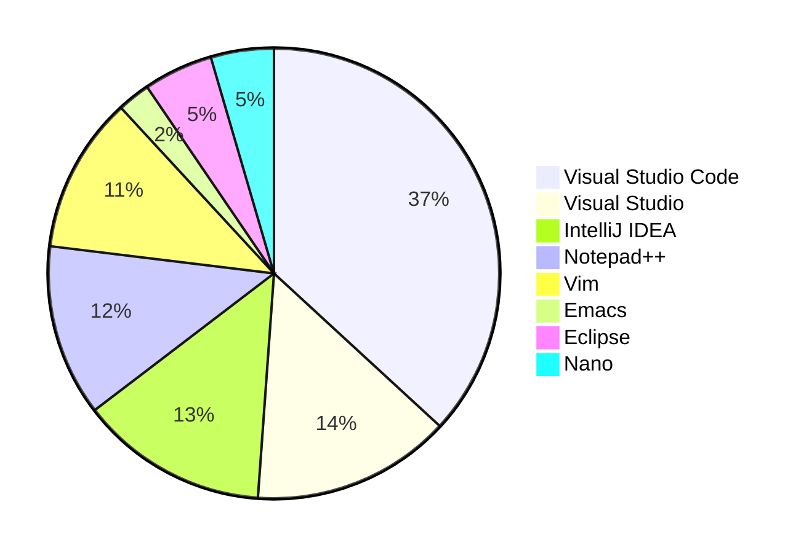

# Mon ordinateur et moi

Vous êtes devant votre ordinateur, vous avez certainement devant vous un clavier, une souris à droite de votre clavier, et un ou plusieurs écrans. Votre ordinateur démarre et vous voyez apparaître soit :

- une pomme croquée (:fontawesome-brands-apple: Apple);
- une fenêtre à carreaux (:fontawesome-brands-windows: Windows);
- un manchot Adélie (:fontawesome-brands-linux: Linux).

Le responsable de cet écran de démarrage, c'est votre système d'exploitation et peu importe lequel vous utilisez, la bonne nouvelle c'est que vous pourrez écrire vos premiers programmes.

Familiarisons-nous un peu avec l'ordinateur, le voulez-vous bien ?

## Système d'exploitation

Dans cet ouvrage, la plupart des exemples seront présentés sous Linux. C'est un choix dogmatique parce que je préfère Linux à Windows, mais c'est aussi pour des raisons objectives et respectables. D'une part, Linux a l'avantage d'être normalisé. Il respecte en grande partie le standard POSIX, comme d'ailleurs Apple macOS. D'autre part, même sous Windows, il est possible à tout utilisateur d'installer d'un sous-système Linux nommé WSL2 (*Windows Subsystem for Linux*), facilitant ainsi l'exécution de programmes Linux sur un environnement Windows. Aussi quelque soient votre obédience *geeko-spirituelle*, vous aurez toujours la possibilité de suivre les exemples de ce cours.

Notons qu'un système d'exploitation en lui-même n'est rien d'autre qu'un programme sophistiqué qui sert d'intermédiaire entre le matériel et les autres logiciels. On peut le comparer à un chef d'orchestre, coordonnant les ressources de votre ordinateur, lançant les programmes, gérant les fichiers, et supervisant les utilisateurs. C'est une **couche d'abstraction** qui permet à votre machine de fonctionner harmonieusement, en masquant la complexité du matériel. Vous n'avez pas à vous soucier des milliards de changements d'états électroniques par seconde survenant dans le processeur ou des quelque deux millions de pixels de votre écran qui peuvent être configurés selon 16 millions de couleurs différentes environ soixante fois par seconde.

Votre système d'exploitation c'est votre interface cohérente et conviviale humain-machine.

## Éditeur de code source

Pour écrire un programme, vous aurez besoin d'un **éditeur de code**, c'est un programme (oui, lui aussi) qui vous permet d'écrire du texte et de le sauvegarder dans un fichier ; il en existe des centaines, certains plus aboutis que d'autres.

Si vous trouvez une [Doloréane](https://fr.wikipedia.org/wiki/DeLorean_(Retour_vers_le_futur)) munie d'un convecteur temporel, et que vous dépassez les 88 miles à l'heure, avec une énergie de 2.21 Gigot-Watt vous pouvez vous rendre en 1973 et utiliser un éditeur de code qui s'appelle `ed` (prononcé "idi") écrit par Ken Thompson (un des créateurs d'Unix et du langage C, mais nous reviendrons sur lui plus tard).

C'est un éditeur de texte qui a été écrit à l'époque des [télétypes][teletype] et qui curieusement a traversé les âges, car il est encore intégré au standard POSIX. Il est par conséquent toujours disponible sur nos systèmes d'exploitation modernes. Toutefois à cette époque, il n'y avait pas d'écran, et nos homologues de cette époque utilisaient des imprimantes pour afficher un résultat. Cet éditeur primitif n'était donc pas très interactif.

Autre fait notable c'est que `ed` est l'un des premiers éditeurs dit *modale*. En effet, son utilisation étant assez déroutante puisqu'il n'y a pas de retour visuel immédiat (n'imaginez tout de même pas qu'à cette époque nous imprimions chaque lettre frappée au clavier sur du papier), donc pour saisir du texte il fallait entrer taper des commandes, certaines pour sauvegarder, pour quitter, pour rechercher et remplacer, etc. Un exemple vaut mieux qu'un long discours. Imaginons que nous voulions saisir le poème "L'albatros" de Charles Baudelaire dans un fichier nommé `albatros.txt`. Voici comment nous pourrions procéder :

[](){#ed}

```text
$ ed
a
Souvent, pour s'amuser, les homes d'équipage
Prennent des albatros,
vastes oiseaux des mers,
Le navire glissant sur les gouffres amers.
.
i
Qui suivent, indolents compagnons de voyage,
.
2,3j
,p
Souvent, pour s'amuser, les homes d'équipage
%s/homes/hommes/g
w albatros.txt
164
q
```

Dans les étapes ci-dessus, nous avons lancé l'éditeur `ed` puis basculé en mode d'insertion avec la commande `a` pour ajouter du texte. Nous avons ensuite ajouté un texte, mais comme il n'y a pas de retour visuel, nous ne sommes pas certains d'avoir orthographié juste tous les mots. À la fin de la saisie, on revient en mode commande avec `.` puis nous décidons de poursuivre en insérant une nouvelle ligne `i`. Passons maintenant à la correction. On sait déjà que l'on a ajouté un retour à la ligne en trop entre la ligne 2 et 3. Nous pouvons les joindre avec `2,3j` (*joindre lignes 2 et 3*). Enfin, nous imprimons (physiquement sur une imprimante) la première ligne avec `1p` (*print ligne 1*). Constatant l'erreur, nous remplaçons `homes` par `hommes` avec `%s/homes/hommes/g`. Enfin, on sauvegarde le fichier avec `w albatros.txt`, la commande retourne (sur l'imprimante) le nombre de caractères sauvegardés, soit `164`. À la fin de ce laborieux exercice, nous quittons `ed` avec la commande `q`.

Trêve de plaisanteries, je vous rassure, vous n'allez probablement pas utiliser `ed` au quotidien, ni probablement même jamais. Cependant connaître son existence permet de mieux comprendre le contexte général. Aussi, je vous propose de continuer un peu notre voyage spatio-temporel...

En 1991 naît un éditeur de code qui va révolutionner le monde de la programmation, il s'appelle `vim` (*Vi Improved*). C'est un éditeur de code qui est ultra puissant, mais dont la courbe d'apprentissage assez *velue*. Il est toujours très utilisé de nos jours, et il est disponible sur tous les systèmes d'exploitation. En outre, la plupart des éditeurs modernes disposent d'une extension pour émuler, du moins en partie `vim`. Comme `ed`, c'est un éditeur modal: un mode pour écrire du texte, un mode pour éditer du texte, un mode pour naviguer dans le texte, un mode pour saisir des commandes, etc.

Puisque nous nommons Vim, je dois aussi nommer son plus féroce concurrent: Emacs. Emacs est un éditeur de code inventé par Richard Stallman, le père fondateur de l'open source. Rival de Vim depuis des décennies, Emacs est un éditeur qui est aussi incroyablement puissant, mais il semble un peu moins utilisé de nos jours. Si je prends le soin de mentionner les deux éditeurs, c'est que leurs utilisateurs sont souvent très passionnés et très engagés dans leur choix d'éditeurs. Il y a même des blagues d'informaticiens sur le sujet :


Je fais volontiers l'impasse sur d'autres éditeurs qui ont aussi été populaires en leurs temps, mais qui me semblent technologiquement dépassés : TextPad, UltraEdit, Sublime Text, Atom, NotePad++... L'Usain Bolt, le Michael Phelps des éditeurs c'est Visual Studio Code, l'éditeur phare de Microsoft qui a conquis le les doigts agiles des développeurs du monde entier. Il est gratuit, open source, et il est disponible sur tous les systèmes d'exploitation. Il dispose de nombreuses extensions (notamment l'extension Vim utilisée par 6'700'000 personnes et l'extension Emacs utilisée par 55'000 personnes). Il est très rapide, très puissant, et il est très bien intégré la plupart des outils tiers que nous utiliserons dans ce cours. Il est donc l'éditeur que je vous recommande jusqu'à la prochaine révolution.

De manière plus factuelle, le résultat de l'étude annuelle 2023 de [Stackoverflow](https://survey.stackoverflow.co/2023/#overview) donne une idée généralement assez bonne de la popularité des éditeurs et environnements de développement intégrés les plus utilisés par les développeurs de logiciels :



### Fonctionnalités attendues

Les éditeurs de code modernes contrairement à des outils comme *notepad* sous Windows, disposent de nombreuses fonctionnalités qui facilitent la vie des développeurs. Voici quelques-unes des fonctionnalités que vous pouvez attendre d'un éditeur de code moderne :

Coloration Synatxique (*syntax highlighting*)

: L'éditeur de code colorise les mots-clés du langage de programmation que vous utilisez, les parenthèses, les erreurs. Cela permet de mieux visualiser la structure du code.

Correspondance des parenthèses (*brace matching*)

: L'éditeur de code vous permet de voir la correspondance des parenthèses, accolades, crochets, etc. Cela permet de voir en un tournemain si vous avez oublié une parenthèse fermante.

Indentation automatique (*auto-indent*)

: L'éditeur de code vous permet d'indenter automatiquement votre code. Cela permet de voir la structure du code. Il est consensuellement admis qu'une région de code sélectionnée peut être indentée avec ++tab++ et désindentée avec ++shift+tab++.

Repli de code (*code folding*)

: L'éditeur de code vous permet de replier le code. En cliquant sur une petite flèche à gauche du code, vous pouvez regrouper les éléments hiérarchiques de votre code pour mieux visualiser la structure.

Structure du code (*outline*)

: L'éditeur de code vous permet de voir dans une fenêtre séparée les éléments clé de votre programme. Cela permet de naviguer plus rapidement.

Navigation hiérarchique (*go to definition*)

: L'éditeur de code vous permet de naviguer rapidement entre différents fichiers. En cliquant sur un mot-clé, vous pouvez vous rendre à la définition de ce mot-clé située ailleurs dans un projet. Habituellement ++alt+arrow-left++ vous permet de revenir en arrière là où vous étiez.

Expressions régulières (*regular expressions*)

:   L'éditeur de code vous permet de rechercher ou remplacer des éléments en utilisant des expressions régulières. Par exemple, si vous voulez inverser l'ordre des mots écrits, vous activez le mode *regex* (▪⃰ dans vscode). Vous pouvez alors utiliser l'expression régulière suivante :

    ```text
    /(M.|Mme.)\s+([^ ]+)\s+([^ ]+)/\1 \3 \2/

    Qui permet d'inverser le prénom et le nom.

    M. Yves Chevallier` --> M. Chevallier Yves
    ```

Multicurseurs (*multi-cursor*)

: L'éditeur de code vous permet de placer plusieurs curseurs dans votre code. Cela permet de modifier plusieurs lignes ou mots en même temps. Dans vscode vous pouvez ajouter un curseur avec la touche ++alt++. Vous pouvez aussi sélectionner le prochain mot identique avec ++ctrl+d++.

Complétion automatique (*auto-completion*)

: L'éditeur de code vous permet de compléter automatiquement le code en utilisant la touche ++tab++. Il utilise une technologie nommée *IntelliSense* qui, ayant connaissance des mots-clés du langage de programmation et de ce que vous avez déjà écrit, vous propose les possibilités de complétion.

Intelligence artificielle (*AI*)

: L'éditeur de code vous permet de compléter automatiquement le code en utilisant une intelligence artificielle comme [GitHub Copilot](https://copilot.github.com/). Cette technologie propose des suggestions de code en fonction de ce que vous avez déjà écrit basé sur des millions programmes open-source disponibles sur internet.

Gestion d'extensions (*extensions*)

: L'éditeur de code vous permet d'ajouter des extensions permettant d'ajouter des fonctionnalités à votre éditeur de code tel que l'extension `Vim` ou `Emacs`, celle de `GitHub Copilot`, ou encore celle pour développer en langage `C`.

Intégration du terminal (*terminal integration*)

: L'éditeur de code vous permet d'intégrer un terminal (TTY) dans votre éditeur de code pour lancer directement des commandes. Cela permet d'exécuter votre programme dans la même interface et récupérer les résultats produits.

Gestion de version (*git integration*)

: L'éditeur de code vous permet d'intégrer Git, l'outil dominant pour gérer les différentes versions de votre programme.

## Compilateur

Un **compilateur** est un programme qui permet de transformer un programme écrit dans un langage de programmation en un **programme exécutable**. Il existe de nombreux compilateurs, et chaque langage de programmation a son propre compilateur pour autant qu'il ne soit pas interprété (comme Python, Ruby, JavaScript, etc.).

Parmi quelques compilateurs populaires, on peut citer :

[GCC](https://gcc.gnu.org/)

: Un **compilateur** *open-source* utilisé sous Linux et macOS. Il est sous licence GPL.

[CLANG](https://clang.llvm.org/)

: Un **compilateur** *open-source* gagnant en popularité, une alternative à GCC. Il est sous licence Apache et utilise la bibliothèque LLVM.

[IAR](https://www.iar.com/)

: Un **compilateur** propriétaire assez onéreux utilisé pour les systèmes médicaux, ou les systèmes embarqués critiques.

## IDE

Un **IDE** est un *Integrated Development Environment*, c'est un environnement de développement intégré. C'est un programme qui vous permet d'écrire du code, de le compiler, de le déboguer, de le tester, de le déployer, etc.

Tous les éditeurs ne sont pas des IDE, mais tous les IDE sont des éditeurs. En fin de compte, un IDE est un éditeur qui possède des fonctionnalités supplémentaires telles que:

- un compilateur pour générer un programme exécutable ;
- un débogueur avec des points d'arrêt pour exécuter le programme ligne par ligne ;
- une gestion de paramètres par projet pour compiler le programme avec des options spécifiques ;
- une gestion de dépendances logicielles pour inclure des ressources externes développées par d'autres développeurs ;
- une gestion de versions pour suivre l'évolution du code et collaborer avec d'autres développeurs.

La figure suivante illustre les relations entre les différents outils que nous avons évoqués jusqu'à présent.

Figure: Représentation graphique des notions de compilateur, IDE, toolchain...


Parmi les plus connus on peut citer IntelliJ IDEA, Eclipse, Visual Studio, Visual Studio Code, Xcode, etc.

On notera que l'ensemble des outils nécessaires à créer un logiciel exécutable est appelé chaîne de compilation, plus communément appelée [toolchain](https://fr.wikipedia.org/wiki/Cha%C3%AEne_de_compilation). Cette dernière est communément associée à une SDK (*Software Development Kit*), un ensemble d'outils logiciels permettant de développer des logiciels pour une cible donnée (microcontroller, Raspberry Pi, smartphones, etc.).

## Exercices de révision

!!! exercise "Norme"

    {{posix}} est la norme respectée par la plupart systèmes d'exploitation modernes sauf Windows? Elle unifie les systèmes d'exploitation en définissant une interface standardisée pour les programmes.

    ??? solution

        La norme POSIX (*Portable Operating System Interface*) est une norme qui définit une interface standardisée pour les systèmes d'exploitation. Elle est respectée en grande partie par Unix, Linux, Solaris, BSD, macOS, Android, QNX, Cygwin, Haiku, VxWorks, RTEMS, etc.

        Hélas, Windows ne respecte pas cette norme ce qui le positionne en marge des autres systèmes d'exploitation.

!!! exercise "Eclipse"

    Un ami vous parle d'un outil utilisé pour le développement logiciel nommé **Eclipse**. De quel type d'outil s'agit-il ?

    ??? solution

        [Eclipse](https://www.eclipse.org/ide/) est un IDE. Il n'intègre donc pas de chaîne de compilation et donc aucun compilateur.

!!! exercise "Stack Overflow"

    Combien y a-t-il eu de questions posées en C sur le site Stack Overflow?

    ??? solution

        Il suffit pour cela de se rendre sur le site de [Stackoverflow](https://stackoverflow.com/tags/c) et d'accéder à la liste des tags. En 2019/07 il y eut 307'669 questions posées.

        Seriez-vous capable de répondre à une question posée?

!!! exercise "Quel système d'exploitation ?"

    Quel système d'exploitation doit-on utiliser pour exécuter un programme écrit en C ?

    - [ ] Windows
    - [ ] Linux
    - [ ] macOS
    - [x] N'imorte lequel

!!! exercise "Copilot"

    Qu'est-ce que Copilot ?

    - [x] Une intelligence artificielle
    - [ ] Un éditeur de code
    - [ ] Un compilateur
    - [ ] Un IDE

!!! exercise "POSIX sous Windows ?"

    Si je souhaite pouvoir développer des programmes en C sous Windows compatibles avec la norme POSIX, que dois-je faire ?

    - [ ] Rien, Windows est compatible POSIX
    - [x] Installer un sous-système Linux comme WSL2
    - [ ] Installer un compilateur GCC
    - [ ] Installer un IDE
    - [ ] Changer de système d'exploitation
