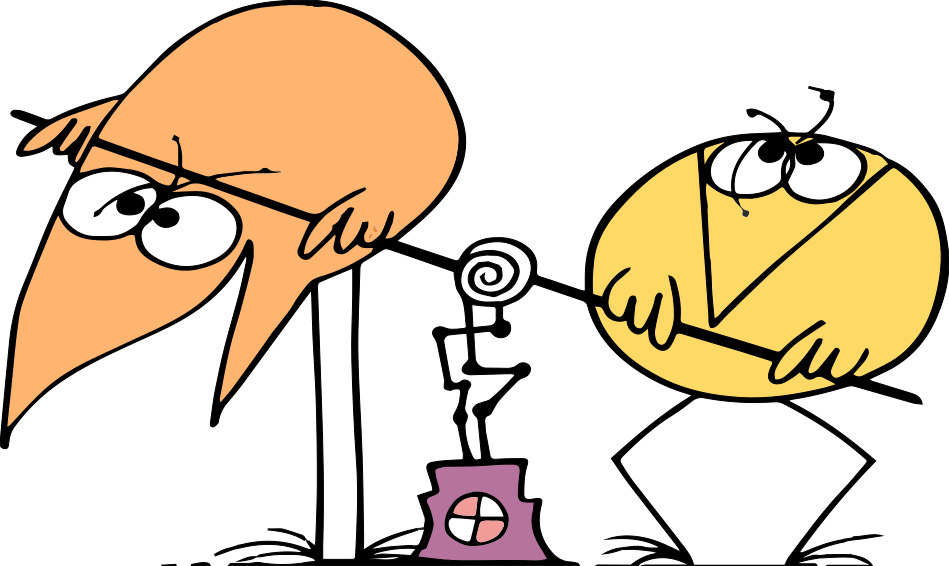

# Bases

Une base désigne la valeur dont les puissances successives interviennent dans l'écriture des nombres dans la numération positionnelle, laquelle est un procédé par lequel l'écriture des nombres est composée de chiffres ou symboles reliés à leur position voisine par un multiplicateur, appelé base du système de numération.

Sans cette connaissance à priori du système de numération utilisé, il vous est impossible d'interpréter ces nombres :

```
69128
11027
j4b12
>>!!0
九千十八
九千 零十八
```

Outre la position des symboles (l'ordre dans lequel ils apparaissent de gauche à droite) la base du système de numération utilisé est essentielle pour décoder ces nombres. Cette base définit combien de symboles différents possibles peuvent être utilisés pour coder une position.

!!! exercise "Symboles binaires"

    Dans la notation binaire, composés de 1 et de 0, combien de symboles existent et combien de positions y-a-t-il dans le nombre `11001` ?

    ??? solution

        Le nombre `11001` est composé de 5 positions et de deux symboles possibles par position : `1` et `0`. La quantité d'information est donc e 5 bits.

## Système décimal

Le système décimal est le système de numération utilisant la base **dix** et le plus utilisé par les humains au vingt et unième siècle, ce qui n'a pas toujours été le cas. Par exemple, les anciennes civilisations de Mésopotamie (Sumer ou Babylone) utilisaient un système positionnel de base sexagésimale (60), la civilisation maya utilisait un système de base 20 de même que certaines langues celtiques dont il reste aujourd'hui quelques traces en français avec la dénomination *quatre-vingts*.

L'exemple suivant montre l'écriture de 1506 en écriture hiéroglyphique de :

$$ 1000+100+100+100+100+100+1+1+1+1+1+1$$

Il s'agit d'une numération additive.

{width="20%"}

Notre système de représentation des nombres décimaux est le système de numération indo-arabe qui emploie une notation positionnelle et dix chiffres (ou symboles) allant de zéro à neuf :

```c
0 1 2 3 4 5 6 7 8 9
```

Un nombre peut être décomposé en puissance successive :

$$
1506_{10} = 1 \cdot 10^{3} + 5 \cdot 10^{2} + 0 \cdot 10^{1} + 6 \cdot 10^{0}
$$

La base dix n'est pas utilisée dans les ordinateurs, car elle nécessite la manipulation de dix états, ce qui est difficile avec les systèmes logiques à deux états; le stockage d'un bit en mémoire étant généralement assuré par des transistors.

!!! exercise "Deux mains"

    Un dessin représentant deux mains humaines (composées chacune de cinq doigts) est utilisé pour représenter un chiffre. Les doigts peuvent être soit levés, soit baissés mais un seul doigt peut être levé. Quelle est la base utilisée ?

    ??? solution

        Deux mains de cinq doigts forment une paire composée de 10 doigts. Il existe donc dix possibilités, la base est donc décimale : 10.

        Si plusieurs doigts peuvent être levés à la fois, il faut réduire le système à l'unité de base "le doigt" pouvant prendre deux états : levé ou baissé. Avec dix doigts (dix positions) et 2 symboles par doigts, un ombre binaire est ainsi représenté.

## Système binaire

Le système binaire est similaire au système décimal, mais utilise la base deux. Les symboles utilisés pour exprimer ces deux états possibles sont d'ailleurs empruntés au système indo-arabe :

$$
\begin{bmatrix}
0\\
1
\end{bmatrix} =
\begin{bmatrix}
\text{true}\\
\text{false}
\end{bmatrix} =
\begin{bmatrix}
T\\
F
\end{bmatrix}
$$

En termes techniques ces états sont le plus souvent représentés par des signaux électriques dont souvent l'un des deux états est dit récessif tandis que l'autre est dit dominant. Par exemple si l'état `0` est symbolisé par un verre vide et l'état `1` par un verre contenant du liquide. L'état dominant est l'état `1`. En effet, si le verre contient déjà du liquide, en rajouter ne changera pas l'état actuel, il y aura juste plus de liquide dans le verre.

Un nombre binaire peut être également décomposé en puissance successive :

$$
1101_{2} = 1 \cdot 2^{3} + 1 \cdot 2^{2} + 0 \cdot 2^{1} + 1 \cdot 2^{0}
$$

Le nombre de possibilités pour un nombre de positions $E$ et une quantité de symboles (ou base) $b$ de 2 est simplement exprimé par :

$$
N = b^E
$$

Avec un seul `bit` il est donc possible d'exprimer 2 valeurs distinctes.

!!! exercise "Base 2"

    Combien de valeurs décimales peuvent être représentées avec 10-bits ?

    ??? solution

        Avec une base binaire 2 et 10 bits, le total représentable est :

        $$2^10 = 1024$$

       Soit les nombres de 0 à 1023.

## Système octal

Inventé par [Charles XII de Suède](https://fr.wikipedia.org/wiki/Charles_XII) , le système de numération octal utilise 8 symboles empruntés au système indo-arabe. Ce système pourrait avoir été utilisé par l'homme en comptant soit les jointures des phalanges proximales (trous entre les doigts), ou les doigts différents des pouces.

```text
0 1 2 3 4 5 6 7
```

Notons que l'utilisation des 8 premiers symboles du système indo-arabe est une convention d'usage bien pratique, car tout humain occidental est familier de ces symboles. L'inconvénient est qu'un nombre écrit en octal pourrait être confondu avec un nombre écrit en décimal.

Comme pour le système décimal, un nombre octal peut également être décomposé en puissance successive :

$$
1607_{8} = 1 \cdot 8^{3} + 6 \cdot 8^{2} + 0 \cdot 8^{1} + 7 \cdot 8^{0}
$$

Au début de l'informatique, la base octale fut très utilisée, car il est très facile de la construire à partir de la numération binaire, en regroupant les chiffres par triplets :

```text
010'111'100'001₂ = 2741₈
```

En C, un nombre octal est écrit en préfixant la valeur à représenter d'un zéro. Attention donc à ne pas confondre :

``` { .c .annotate }
int octal = 042; // (1)!
int decimal = 42;

assert(octal != decimal);
```

1. La valeur `042` est un nombre octal, soit $4 \cdot 8^1 + 2 \cdot 8^0 = 34$ en décimal. En C un nombre octal est préfixé par un zéro.

Il est également possible de faire référence à un caractère en utilisant l'échappement octal dans une chaîne de caractère :

```c
char cr = '\015';
char msg = "Hell\0157\040World!";
```

!!! important

    N'essayez pas de préfixer vos nombres avec des zéros lorsque vous programmer car ces nombres seraient alors interprétés en octal et non en écimal.

## Système hexadécimal

Ce système de numération positionnel en base 16 est le plus utilisé en informatique pour exprimer des grandeurs binaires. Il utilise les dix symboles du système indo-arabe, plus les lettres de A à F. Il n'y a pas de réel consensus quant à la casse des lettres qui peuvent être soit majuscules ou minuscules. Veillez néanmoins à respecter une certaine cohérence, ne mélangez pas les casses dans un même projet.

```text
0 1 2 3 4 5 6 7 8 9 A B C D E F
```

L'écriture peut également être décomposée en puissance successive :

$$
1AC7_{16} = (1 \cdot 16^{3} + 10 \cdot 16^{2} + 12 \cdot 16^{1} + 7 \cdot 16^{0})_{10} = 41415_{10}
$$

Il est très pratique en électronique et en informatique d'utiliser ce système de représentation ou chaque chiffre hexadécimal représente un quadruplet, soit deux caractères hexadécimaux par octet (n'est-ce pas élégant?):

```text
0101'1110'0001₂ = 5E1₁₆
```

L'ingénieur qui se respecte doit connaître par cœur la correspondance hexadécimale de tous les quadruplets aussi bien que ses tables de multiplication (qu'il connaît d'ailleurs parfaitement, n'est-ce pas ?)

Table: Correspondance binaire, octale, hexadécimale

| Binaire    | Hexadécimal | Octal  | Décimal |
|------------|-------------|--------|---------|
| `0b0000` | `0x0`     | `00` | `0`   |
| `0b0001` | `0x1`     | `01` | `1`   |
| `0b0010` | `0x2`     | `02` | `2`   |
| `0b0011` | `0x3`     | `03` | `3`   |
| `0b0100` | `0x4`     | `04` | `4`   |
| `0b0101` | `0x5`     | `05` | `5`   |
| `0b0110` | `0x6`     | `06` | `6`   |
| `0b0111` | `0x7`     | `07` | `7`   |
| `0b1000` | `0x8`     | `10` | `8`   |
| `0b1001` | `0x9`     | `11` | `0`   |
| `0b1010` | `0xA`     | `12` | `10`  |
| `0b1011` | `0xB`     | `13` | `11`  |
| `0b1100` | `0xC`     | `14` | `12`  |
| `0b1101` | `0xD`     | `15` | `13`  |
| `0b1110` | `0xE`     | `16` | `14`  |
| `0b1111` | `0xF`     | `17` | `15`  |


Le fichier `albatros.txt` contient un extrait du poème de Baudelaire, l'ingénieur en proie à un bogue lié à de l'encodage de caractère cherche à comprendre et utilise le programme `hexdump`
pour lister le contenu hexadécimal de son fichier et il obtient la sortie suivante sur son terminal :

```text
$ hexdump -C albatros.txt
00000000  53 6f 75 76 65 6e 74 2c  20 70 6f 75 72 20 73 27  |Souvent, pour s'|
00000010  61 6d 75 73 65 72 2c 20  6c 65 73 20 68 6f 6d 6d  |amuser, les homm|
00000020  65 73 20 64 27 c3 a9 71  75 69 70 61 67 65 0d 0a  |es d'..quipage..|
00000030  50 72 65 6e 6e 65 6e 74  20 64 65 73 20 61 6c 62  |Prennent des alb|
00000040  61 74 72 6f 73 2c 20 76  61 73 74 65 73 20 6f 69  |atros, vastes oi|
00000050  73 65 61 75 78 20 64 65  73 20 6d 65 72 73 2c 0d  |seaux des mers,.|
00000060  0a 51 75 69 20 73 75 69  76 65 6e 74 2c 20 69 6e  |.Qui suivent, in|
00000070  64 6f 6c 65 6e 74 73 20  63 6f 6d 70 61 67 6e 6f  |dolents compagno|
00000080  6e 73 20 64 65 20 76 6f  79 61 67 65 2c 0d 0a 4c  |ns de voyage,..L|
00000090  65 20 6e 61 76 69 72 65  20 67 6c 69 73 73 61 6e  |e navire glissan|
000000a0  74 20 73 75 72 20 6c 65  73 20 67 6f 75 66 66 72  |t sur les gouffr|
000000b0  65 73 20 61 6d 65 72 73  2e 0d 0a 0d 0a 2e 2e 2e  |es amers........|
000000c0  0d 0a 0d 0a 43 65 20 76  6f 79 61 67 65 75 72 20  |....Ce voyageur |
000000d0  61 69 6c 65 cc 81 2c 20  63 6f 6d 6d 65 20 69 6c  |aile.., comme il|
000000e0  20 65 73 74 20 67 61 75  63 68 65 20 65 74 20 76  | est gauche et v|
000000f0  65 75 6c 65 e2 80 af 21  0d 0a 4c 75 69 2c 20 6e  |eule...!..Lui, n|
00000100  61 67 75 c3 a8 72 65 20  73 69 20 62 65 61 75 2c  |agu..re si beau,|
00000110  20 71 75 27 69 6c 20 65  73 74 20 63 6f 6d 69 71  | qu'il est comiq|
00000120  75 65 20 65 74 20 6c 61  69 64 e2 80 af 21 0d 0a  |ue et laid...!..|
00000130  4c 27 75 6e 20 61 67 61  63 65 20 73 6f 6e 20 62  |L'un agace son b|
00000140  65 63 20 61 76 65 63 20  75 6e 20 62 72 c3 bb 6c  |ec avec un br..l|
00000150  65 2d 67 75 65 75 6c 65  2c 0d 0a 4c 27 61 75 74  |e-gueule,..L'aut|
00000160  72 65 20 6d 69 6d 65 2c  20 65 6e 20 62 6f 69 74  |re mime, en boit|
00000170  61 6e 74 2c 20 6c 27 69  6e 66 69 72 6d 65 20 71  |ant, l'infirme q|
00000180  75 69 20 76 6f 6c 61 69  74 e2 80 af 21           |ui volait...!|
0000018d
```

Il lit à gauche l'offset mémoire de chaque ligne, au milieu le contenu hexadécimal, chaque caractère encodé sur 8 bits étant symbolisés par deux caractères hexadécimaux, et à droite le texte où chaque caractère non imprimable est remplacé par un point. On observe notamment ici que :

- `é` de *équipage* est encodé avec `\xc3\xa9` ce qui est le caractère Unicode U+0065
- `é` de *ailé* est encodé avec `e\xcc\x81`, soit le caractère e suivi du diacritique `´` U+0301
- Une espace fine insécable `\xe2\x80\xaf` est utilisée avant les `!`, ce qui est le caractère Unicode U+202F, conformément à la recommandation de l'Académie française.

Ce fichier est donc convenablement encodé en UTF-8 quant au bogue de notre ami ingénieur, il concerne probablement les deux manières distinctes utilisées pour encoder le `é`.

!!! exercise "Les chiffres hexadécimaux"

    Calculez la valeur décimale des nombres suivants et donnez le détail du calcul :

    ```text
    0xaaaa
    0b1100101
    0x1010
    129
    0216
    ```

    ??? solution

        ```text
        0xaaaa    ≡ 43690
        0b1100101 ≡   101
        0x1010    ≡  4112
        129       ≡   129 (n'est-ce pas ?)
        0216      ≡   142
        ```

!!! exercise "Albatros"

    Tentez de récupérer vous même le poème l'[Albatros]({assets}/src/albatros.txt) de Baudelaire et d'afficher le même résultat que ci-dessus depuis un terminal de commande Linux.

    ```bash
    $ wget https://.../albatros.txt
    $ hexdump -C albatros.txt
    ```

    Si vous n'avez pas les outils `wget` ou `hexdump`, tentez de les installer ia la commande `apt-get install wget hexdump`.

## Conversions de bases

La conversion d'une base quelconque en système décimal utilise la relation suivante :

$$
\sum_{i=0}^{n-1} h_i\cdot b^i
$$

où:

$n$

: Le nombre de chiffres (ou positions)

$b$

: La base du système d'entrée (ou nombre de symboles)

$h_i$

: La valeur du chiffre à la position $i$

Ainsi, la valeur `AP7` exprimée en base tritrigesimale (base 33) et utilisée pour représenter les plaques des véhicules à Hong Kong peut se convertir en décimales après avoir pris connaissance de la correspondance d'un symbole [tritrigesimal](https://en.wikipedia.org/wiki/List_of_numeral_systems) vers le système décimal :

```text
Tritrigesimal -> Décimal :

 0  1  2  3  4  5  6  7  8  9  A  B  C  D  E  F
 0  1  2  3  4  5  6  7  8  9 10 11 12 13 14 15

 G  H  I  K  L  M  N  P  R  S  T  U  V  W  X  Y  Z
16 17 18 19 20 21 22 23 24 25 26 27 28 29 30 31 32

Conversion :

AP7 -> 10 * pow(33, 2) + 23 * pow(33, 1) + 7 * pow(33, 0) -> 11'656
```

La conversion d'une grandeur décimale vers une base quelconque est malheureusement plus compliquée et nécessite d'appliquer un algorithme.

La conversion d'un nombre du système décimal au système binaire s'effectue simplement par une suite de divisions pour lesquelles on notera le reste.

Pour chaque division par 2, on note le reste et tant que le quotient n'est pas nul, on itère l'opération. Le résultat en binaire est la suite des restes lus dans le sens inverse :

```text
n = 209

209 / 2 == 104, 209 % 2 == 1  ^ sens de lecture des restes
104 / 2 ==  52, 104 % 2 == 0  |
 52 / 2 ==  26,  52 % 2 == 0  |
 26 / 2 ==  13,  26 % 2 == 0  |
 13 / 2 ==   6,  13 % 2 == 1  |
  6 / 2 ==   3,   6 % 2 == 0  |
  3 / 2 ==   1,   3 % 2 == 1  |
  1 / 2 ==   0,   1 % 2 == 1  |

209 == 0b11010001
```

!!! exercise "La numération Shadock"

    {height="300px"}

    Les Shadocks ne connaissent que quatre mots: `GA`, `BU`, `ZO`, `MEU`. La vidéo [Comment compter comme les Shadocks](https://www.youtube.com/watch?v=lP9PaDs2xgQ>) en explique le principe.

    Convertir `−⨼○◿○` (`BU ZO GA MEU GA`) en décimal.

    ??? solution

        Le système Shadock est un système quaternaire similaire au système du génome humain basé sur quatre bases nucléiques. Assignons donc aux symboles Shadocks les symboles du système indo-arabe que nous connaissons mieux :

        ```text
        0 ○ (GA)
        1 − (BU)
        2 ⨼ (ZO)
        3 ◿ (MEU)
        ```

        Le nombre d'entrée `−⨼O◿O` peut ainsi s'exprimer :

        ```text
        −⨼○◿○ ≡ 12030₄
        ```

        En appliquant la méthode du cours, on obtient :

        $$
            1 \cdot 4^4 + 2 \cdot 4^3 + 0 \cdot 4^2 + 3 \cdot 4^1 + 0 \cdot 4^0 = 396_{10}
        $$

        Notons que depuis un terminal Python vous pouvez simplement utiliser `int("12030", 4)`
