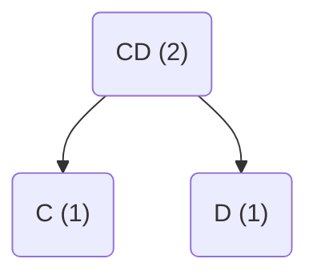
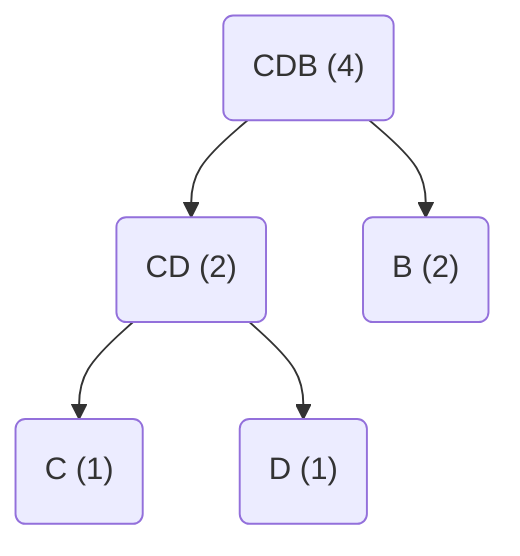
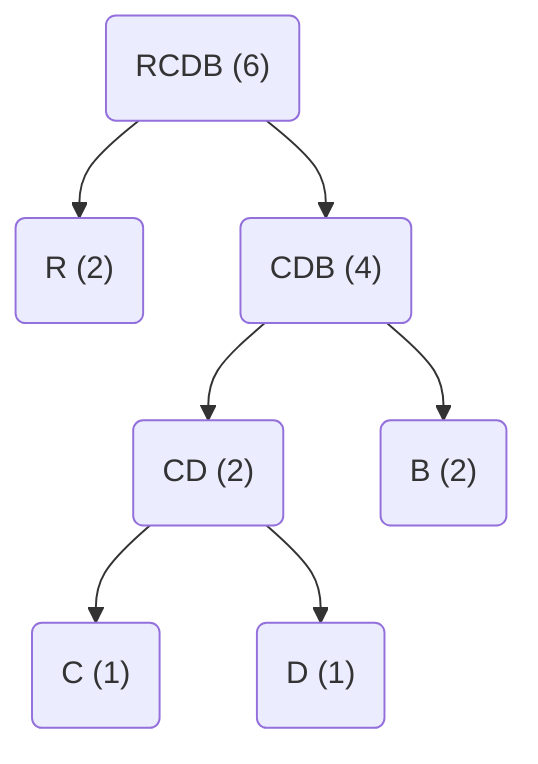
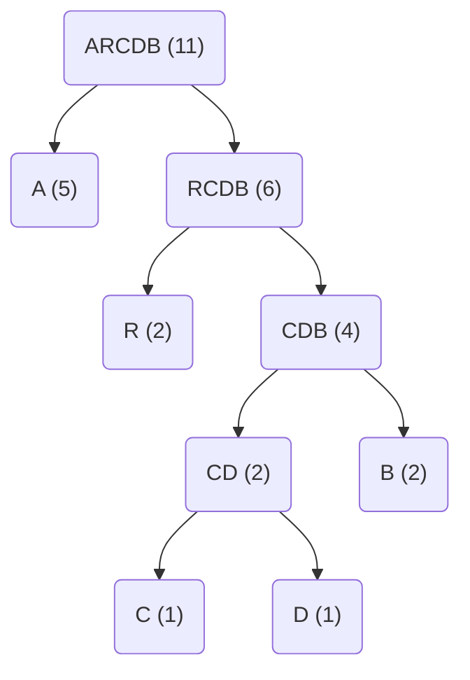

# Codage de Huffman

Le codage de Huffman est un algorithme de compression sans perte qui permet de réduire la taille des fichiers en utilisant des codes de longueur variable pour représenter les caractères. L'algorithme repose sur l'idée que les caractères les plus fréquents dans un texte peuvent être représentés par des codes plus courts, tandis que les caractères les moins fréquents sont représentés par des codes plus longs.

Il est utilisé dans de nombreux formats de fichiers comme le format [PNG](https://fr.wikipedia.org/wiki/Portable_Network_Graphics), [JPEG](https://fr.wikipedia.org/wiki/JPEG) et [MP3](https://fr.wikipedia.org/wiki/MP3).

Prenons le texte `ABRACADABRA`. Il y a des lettres qui reviennent plus souvent que d'autres et des lettres de l'alphabet qui sont absentes. Pourquoi donc représenter chaque caractère sur 1 octet ? On pourrait utiliser un code de longueur variable. Par exemple, la lettre `A` pourrait être représentée par `0`, la lettre `B` par `10` et la lettre `R` par `11`. Il faudrait également définir une table de correspondance pour décoder le texte. C'est le principe de l'abre de Huffman.

## Comment ça marche ?

Pour notre entrée `ABRACADABRA`, nous allons suivre les étapes suivantes :

### Nombre d'occurences

On commence par compter la fréquence de chaque caractère. On obtient :

Table: Fréquence de Huffman

| Caractère | Fréquence |
| --------- | --------- |
| A         | 5         |
| B         | 2         |
| R         | 2         |
| C         | 1         |
| D         | 1         |

Chaque élément est un nœud qui est placé dans une file de priorité (*min-heap*) où la priorité est la fréquence du caractère. Voici le pseudo code du tas minimum :

```text
Min-Heap : [(1, 'C'), (1, 'D'), (2, 'B'), (2, 'R'), (5, 'A')]
```

### Fusion

On va fusionner les deux nœuds de plus faible fréquence, c'est facile parce qu'un *min-heap* nous permet de récupérer les deux éléments de plus faible fréquence en temps constant. Après fusion, on obtient une chaîne de caractère qui représente les deux nœuds fusionnés. On ajoute ce nouveau nœud à la file de priorité en prenant en compte la fréquence totale des deux nœuds fusionnés.

Notons que qu'en cas de priorité égale, on peut choisir arbitrairement l'ordre des nœuds.

Les nœuds `C` et `D` sont les deux nœuds de plus faible fréquence. On les fusionne pour obtenir `CD` qui a une priorité de `2`.

```text
Min-Heap : [(2, 'CD'), (2, 'B'), (2, 'R'), (5, 'A')]
```



Il nous reste des noeuuds à fusionner. On fusionne les nœuds `CD` et `B` pour obtenir `CDB` qui a une priorité de `4`.

```text
Min-Heap : [(2, 'R'), (4, 'CDB'), (5, 'A')]
```



On continue car il nous reste des nœuds à fusionner. On fusionne les nœuds `CDB` et `R` pour obtenir `CDBR` qui a une priorité de `6`.

```text
Min-Heap : [(5, 'A'), (6, 'RCDB')]
```



Enfin, on fusionne les nœuds `RCDB` et `A` pour obtenir `ACDBR` qui a une priorité de `11`.

```text
Min-Heap : [(11, 'ARCDB')]
```



### Génération des codes

Pour générer les codes, on parcourt l'arbre de Huffman en partant de la racine. On ajoute un `0` à chaque fois qu'on descend à gauche et un `1` à chaque fois qu'on descend à droite. Les nœuds fusionnés sont des nœuds internes, on ne les prend pas en compte.

| Caractère | Code |
| --------- | ---- |
| A         | 0    |
| R         | 10   |
| B         | 111  |
| C         | 1100 |
| D         | 1101 |

### Encodage du texte

Une fois les codes générés, on peut encoder le texte en remplaçant chaque caractère par son code.

```text
A B   R  A C    A C    A B   R  A
0 111 10 0 1100 0 1100 0 111 10 0
```

Comme les données sont nécessairement alignées sur des octets en mémoire, il est possible que le dernier octet contienne des bits inutilisés, on les remplace par des zéros.

```text
01111001'10001100'01111000
                         - Remplissage (padding)
```

Bien entendu il est nécessaire d'encoder également la table de Huffmann pour pouvoir décoder le texte. Une méthode courante est d'encoder directement la table de Huffmann dans le fichier compressé.
