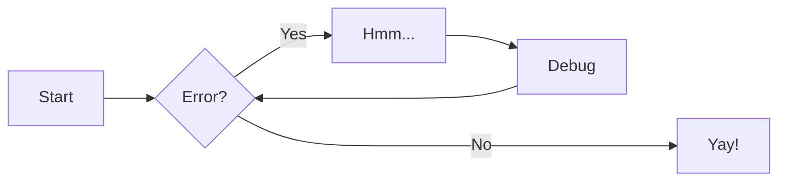

# All Markdown Features

## Headers

Here are some headers

### H3

I am a paragraph

#### H4

I am a paragraph

##### H5

I am a paragraph

###### H6

I am a paragraph

## Lists

### Unordered list

- Nulla et rhoncus turpis. Mauris ultricies elementum leo. Duis efficitur
  accumsan nibh eu mattis. Vivamus tempus velit eros, porttitor placerat nibh
  lacinia sed. Aenean in finibus diam.

    * Duis mollis est eget nibh volutpat, fermentum aliquet dui mollis.
    * Nam vulputate tincidunt fringilla.
    * Nullam dignissim ultrices urna non auctor.

### Ordered list

1.  Vivamus id mi enim. Integer id turpis sapien. Ut condimentum lobortis
    sagittis. Aliquam purus tellus, faucibus eget urna at, iaculis venenatis
    nulla. Vivamus a pharetra leo.

    1.  Vivamus venenatis porttitor tortor sit amet rutrum. Pellentesque aliquet
        quam enim, eu volutpat urna rutrum a. Nam vehicula nunc mauris, a
        ultricies libero efficitur sed.

    2.  Morbi eget dapibus felis. Vivamus venenatis porttitor tortor sit amet
        rutrum. Pellentesque aliquet quam enim, eu volutpat urna rutrum a.

        1.  Mauris dictum mi lacus
        2.  Ut sit amet placerat ante
        3.  Suspendisse ac eros arcu

### Definition list

`Lorem ipsum dolor sit amet`

:   Sed sagittis eleifend rutrum. Donec vitae suscipit est. Nullam tempus
    tellus non sem sollicitudin, quis rutrum leo facilisis.

`Cras arcu libero`

:   Aliquam metus eros, pretium sed nulla venenatis, faucibus auctor ex. Proin
    ut eros sed sapien ullamcorper consequat. Nunc ligula ante.

    Duis mollis est eget nibh volutpat, fermentum aliquet dui mollis.
    Nam vulputate tincidunt fringilla.
    Nullam dignissim ultrices urna non auctor.

### Task list

- [x] Lorem ipsum dolor sit amet, consectetur adipiscing elit
- [ ] Vestibulum convallis sit amet nisi a tincidunt
    * [x] In hac habitasse platea dictumst
    * [x] In scelerisque nibh non dolor mollis congue sed et metus
    * [ ] Praesent sed risus massa
- [ ] Aenean pretium efficitur erat, donec pharetra, ligula non scelerisque

## Math

The homomorphism $f$ is injective if and only if its kernel is only the
singleton set $e_G$, because otherwise $\exists a,b\in G$ with $a\neq b$ such
that $f(a)=f(b)$.

$$ x_{1,2} = \frac{-b \pm \sqrt{b^2 - 4ac}}{2a} $$

## Abbreviations

The HTML specification is maintained by the W3C.

*[HTML]: HyperText Markup Language
*[W3C]:  World Wide Web Consortium

We can treat abbreviations as glossaries entries.

```latex
\documentclass{article}
\usepackage[utf8]{inputenc}
\usepackage[acronym]{glossaries}

% Should be generated at the end of all files
\makeglossaries
\newacronym{gcd}{GCD}{Greatest Common Divisor}

\begin{document}
\acrshort{gcd} % replace with \gls{gcd} for long form
\clearpage
\printglossary[type=\acronymtype]
\printglossary
\end{document}
```

## Code

Some Python Code:

```python
print("Hello, World!")
```

Code with a title:

```c title="hello.c"
#include <stdio.h>

int main() {
    printf("Hello, World!\n");
    return 0;
}
```

Code with line numbers:

```lisp linenums="1"
(defun hello-world ()
  (format t "Hello, World!~%"))
```

Code with highlighting:

```python hl_lines="1 2"
def bubble_sort(items):
    for i in range(len(items)):
        for j in range(len(items) - 1 - i):
            if items[j] > items[j + 1]:
                items[j], items[j + 1] = items[j + 1], items[j]
```

The `#!python range()` function is used to generate a sequence of numbers, also the `:::c printf()` function is used to print a formatted string.

Embedding external files

```c
--8<-- "docs/assets/src/hello.c"
```

## Links

You can go to [Wikipédia](https://www.wikipedia.org/){#anchor} for more information.

## Figure

Here a nice figure:


## Table

This is a table:

| This | is   |
|:-----|-----:|
|   a  | table|

## Admonitions

!!! note

    This is a note

!!! warning "Warning"

    This is a warning with a title

??? question "Question"

    This is a collapsible question

???+ question "Question"

    This is a collapsible question expanded

!!! info inline end "Lorem"

    This is an inline note

## Content tabs

=== "Tab 1"

    Foobar

=== "Tab 2"

    Foobar


## Annotations

One should replace Annotations with footnotes.

Lorem ipsum dolor sit amet, (1) consectetur adipiscing elit.
{ .annotate }

1.  :man_raising_hand: I'm an annotation! I can contain `code`, __formatted
    text__, images, ... basically anything that can be expressed in Markdown.

!!! note annotate "Phasellus posuere in sem ut cursus (1)"

    Lorem ipsum dolor sit amet, (2) consectetur adipiscing elit. Nulla et
    euismod nulla. Curabitur feugiat, tortor non consequat finibus, justo
    purus auctor massa, nec semper lorem quam in massa.

1.  :man_raising_hand: I'm an annotation!
2.  :woman_raising_hand: I'm an annotation as well!


=== "Tab 1"

    Lorem ipsum dolor sit amet, (1) consectetur adipiscing elit.
    { .annotate }

    1.  :man_raising_hand: I'm an annotation!

=== "Tab 2"

    Phasellus posuere in sem ut cursus (1)
    { .annotate }

    1.  :woman_raising_hand: I'm an annotation as well!

``` { .yaml .annotate }
Code block annotations are also possible
```

## Icons

One method is to parse with MkDocs all the icons, get the svg, include them in place in the latex.

```latex
Lorem \includegraphics[height=1em]{icon-material-check.pdf} ipsum
```

| Method      | Description                          |
| ----------- | ------------------------------------ |
| `GET`       | :material-check:     Fetch resource  |
| `PUT`       | :material-check-all: Update resource |
| `DELETE`    | :material-close:     Delete resource |

## Mermaid charts

You should install mermaid on you system

```bash
docker pull minlag/mermaid-cli
docker run --rm -u `id -u`:`id -g` -v /path/to/diagrams:/data minlag/mermaid-cli -i diagram.mmd -o diagram.svg
```

The best option is to convert svg into pdf using inkscape unfortunately the result doesn't work well. I currently don't know how to do it.



## Footnotes

Lorem ipsum[^1] dolor sit amet, consectetur adipiscing elit.[^2]

[^1]: Lorem ipsum dolor sit amet, consectetur adipiscing elit.
[^2]: Lorem ipsum dolor sit amet, consectetur adipiscing elit.

## Formatting

Text can be {--deleted--} and replacement text {++added++}. This can also be
combined into {~~one~>a single~~} operation. {==Highlighting==} is also
possible {>>and comments can be added inline<<}.

{==

Formatting can also be applied to blocks by putting the opening and closing
tags on separate lines and adding new lines between the tags and the content.

==}

- ==This was marked (highlight)==
- ^^This was inserted (underline)^^
- ~~This was deleted (strikethrough)~~
- H~2~O
- A^T^A

Keyboard keys such as ++ctrl+alt+del++ should be supported.

## SmartSymbols

We could use (tm), (c), (r), +/-  --> <-- <-->  1/2 1/4 3/4 1/3 2/3 1/8 3/8 5/8 7/8 1/5 2/5 3/5 4/5 1/6 5/6 1/7 1/9 1/10 from PyMdown Extensions SmartSymbols.
