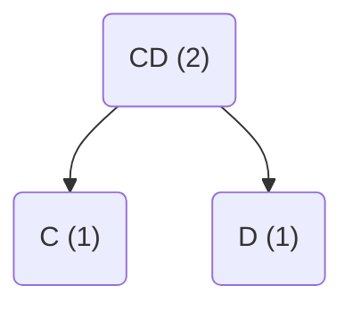

# Test

```text
                  //   a
void foo(int a) { //   ┬ b
    int b;        //   │ ┬
    ...           //   │ │
    {             //   │ │ c
       int c;     //   │ │ ┬
       ...        //   │ │ │ d
       int d;     //   │ │ │ ┬
       ...        //   │ │ │ │
    }             //   │ │ ┴ ┴
    ...           //   │ │
}                 //   ┴ ┴
```


